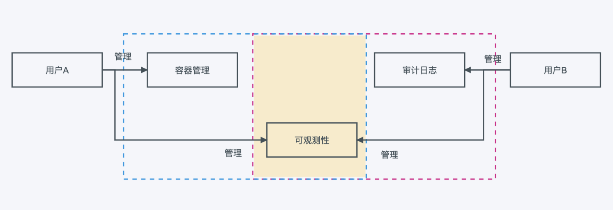

# 功能总览

此处说明全局管理的功能。

1. 用户管理

   拥有用户帐号，是用户访问 DCE 平台的前提。用户由平台管理员 Super Admin 或者用户与访问控制管理员 IAM Admin 在`全局管理` -> `用户与访问控制` -> `用户` 页面创建，或者通过 LDAP 对接而来。每位用户拥有独立的用户名和密码，通过给单个或者一组用户授予不同的权限，让不同的用户拥有不同资源的访问权限。

   

2. 用户组管理

   用户组是多个用户的集合，用户可以通过加入用户组，实现继承用户组的角色权限。通过用户组批量地给用户进行授权，可以更好地管理用户及其权限。

   

3. 角色管理

   一个角色对应一组权限。权限决定了可以对资源执行的操作。向用户授予某个角色，即授予该角色所包含的所有权限。您可以将不同模块的管理权限划分给不同的用户，比如用户 A 管理容器管理模块，用户 B 管理应用工作台模块，共同管理可观测性板块。

   

4. 工作空间

   工作空间用于管理资源，包含层级和工作空间两部分。

   层级是资源层次结构中的节点，一个层级可以包含工作空间、其他层级或两者的组合。可以将层级理解为有层次结构的部门、环境、供应商等多种概念。

   工作空间可以理解为部门下的项目，管理员通过层级和工作空间映射企业中的层级关系。

   虽然一个层级可以包含多个层级或工作空间，但是给定的层级或者工作空间只能有一个父级。

   

5. 审计日志

   审计日志完整地记录用户的各项操作行为，包括用户通过页面或 API 接口发起的操作，以及各服务内部自触发的操作。支持通过事件来源、资源类型、操作状态等多个维度进行组合查询，支持审计日志导出。

6. 平台设置

   平台设置包括账号安全设置、外观定制、邮件服务器等。当需要对账号的安全信息、平台 logo、许可证授权、邮件服务器等平台级设置进行管理时，可以通过 `平台设置` 进行操作，平台设置仅平台管理员具有管理权限。

   
