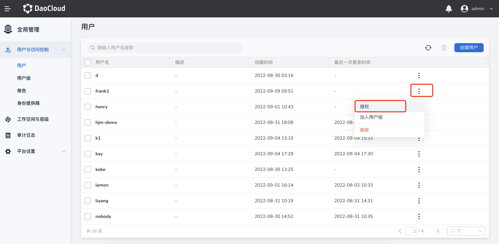
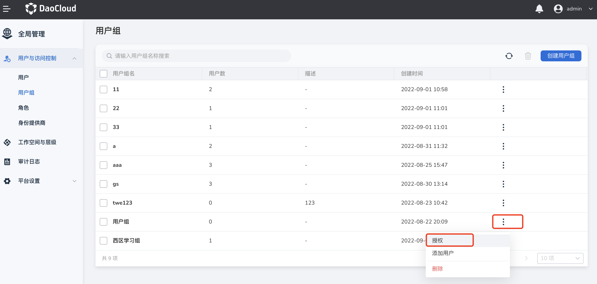
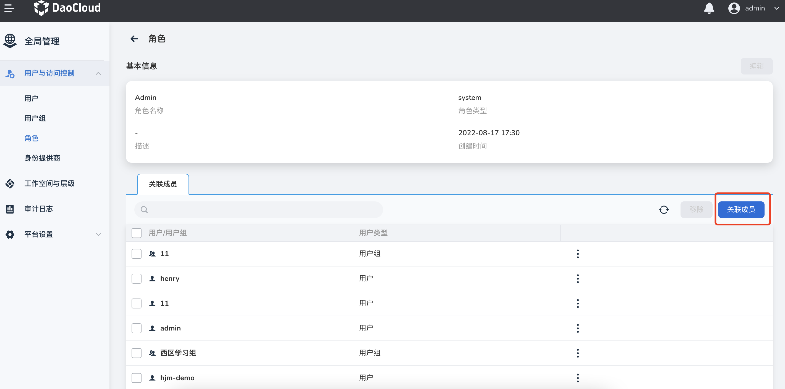

# 角色和权限管理

一个角色对应一组权限。权限决定了可以对资源执行的操作。向用户授予某角色，即授予该角色所包含的所有权限。

权限管理存在以下三种模式，能够灵活、有效地解决您在权限上的使用问题：

- 全局管理模式
- 子模块管理模式
- 基于资源的管理模式

## 全局管理模式

全局管理模式是指您在全局管理模块通过系统角色或自定义角色给用户（用户组）配置权限的方式。
DCE 平台为每个子模块预定义了一个管理员角色，用于实现对子模块的分块化管理。
比如用户与访问控制的 IAM Admin、容器管理的 Kpanda Admin 等，每个子模块管理员均拥有该模块的最高权限。
子模块管理员角色需要在全局管理模块配置，可以通过以下几种途径获得：

- 在`全局管理` -> `用户与访问控制` -> `用户`的用户列表中，找到该用户；点击 `...`，选择`授权`，为该用户赋予系统预定义的子模块管理员权限。

    

- 在`全局管理` -> `用户与访问控制` -> `用户组`的用户组列表中创建用户组，将该用户加入用户组，并给用户组授权（具体操作为：在用户组列表找到该用户组，点击 `...`，选择`授权`，为该用户组赋予系统预定义的子模块管理员权限）。

    

- 在`全局管理` -> `用户与访问控制` -> `角色`的角色列表中，找到相应的子模块管理员角色，点击角色名称进入详情，点击`关联成员` 按钮，选中该用户或用户所在的用户组，点击`确定`。

    

支持此模式的子模块：除平台设置外的所有子模块（平台设置仅平台管理员 Super Admin 能够操作）。

!!! note

    - Kpanda Admin 为容器管理模块管理员
    - Amamba Admin 为应用工作台模块管理员
    - Insight Admin 为可观测性模块管理员

## 子模块管理模式

子模块管理模式是指您可以通过子模块将不同的资源按需分配给不同的用户，同时，对于同一种资源不同的用户也可以拥有不同的使用权限。DCE 平台在子模块中为每个资源预定义了三种角色，分别是 Admin、Edit 和 View。Admin 角色对该资源具有管理权限，并且能够将该资源授权给其他人使用；Edit 角色对资源具有使用权限，能够编辑、查看资源；View 角色对资源仅具有查看权限。

比如容器管理中集群 A 下 Namespace01 的 Admin 角色能够管理、编辑、查看 Namespace01，并且能够授权给其他用户 Namespace01 的 Admin、Edit 和 View 角色。Namespace01 的 Edit 角色能够编辑、查看Namespace01。Namespace01 的 View 角色仅能够查看 Namespace01。

支持此模式的子模块：容器管理

!!! note

    本手册中 Cluster 是指集群；NS 是 namespace 的缩写，即命名空间。

## 基于资源的管理模式

基于资源的管理模式依赖于工作空间通过集中统一的访问控制策略，实现跨子模块授权用户（用户组）对于资源的访问权限。
工作空间具有两个概念：层级和工作空间。在工作空间中您可以使用层级构建企业业务层级关系，使用工作空间分组管理子模块资源，使 IAM 用户（用户组）之间共享工作空间中的资源。

资源处于工作空间层次结构的最低级层级，资源包括集群、Namespace、网关等。所有这些较低层级资源的父级只能是工作空间，而工作空间作为资源容器，是一种资源分组单位。
工作空间通常用于指代一个项目或环境，每个工作空间中的资源相对于其他工作空间中的资源是物理隔离的。您可以通过工作空间中的授权，授予 IAM 用户（用户组）同一组资源的不同访问权限。

从层次结构的底层算起，工作空间位于第一层，且包含其他资源。除共享资源外，所有资源有且仅有一个父项。所有工作空间也有且仅有一个父级层级。

层级是在工作空间基础之上的进一步分组机制，具有层级结构。一个层级可以包含工作空间、其他层级或两者的组合，能够形成树状的组织关系。
借助于层级，您可以在 DCE 上构建企业业务层级关系，按照部门对工作空间进行分组。层级不直接与资源挂钩，而是通过工作空间间接实现资源分组。
层级有且仅有一个父级层级，根层级是层次结构的最高层级，因此没有父级，层级和工作空间均映射到根层级下。

同时 IAM 用户（用户组）在层级中能够通过层级结构继承来自父项的权限。
用户在层次结构中的每个节点权限来自于直接在该节点获取的权限和继承其父项权限的组合结果，权限之间是加合关系不存在互斥。

支持此模式的子模块：容器管理、应用工作台、微服务引擎、服务网格。

!!! note

    资源（Resource）泛指 DCE 平台上通过各个子模块创建的资源，是完成授权的具体数据。通常资源描述一个或多个操作对象，每个子模块拥有其各自的资源和对应的资源定义详情。
    如集群、Namesapce、网关等。资源的拥有者是主账号 Super Admin，Super Admin 具有在各子模块创建/管理/删除资源的权限，普通用户在没有授权的情况下，不会自动拥有资源的访问权限，需要资源拥有者授权。
    通常资源拥有者将一组资源加入到某个工作空间，再通过工作空间给用户（用户组）授权是常规操作流程。
