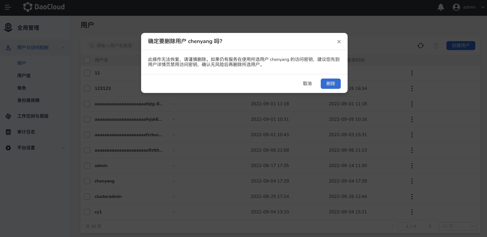

# 用户

用户指的是由平台管理员 Super Admin 或者用户与访问控制管理员 IAM Admin 在 `全局管理` -> `用户与访问控制` -> `用户` 页面创建的用户，或者通过 LDAP 对接过来的用户。用户名代表账号，用户通过用户名和密码登录 DCE 平台。

拥有一个用户账号是用户访问 DCE 平台的前提。新建的用户默认没有任何权限，例如您需要在 `用户列表` 或者 `用户详情` 给用户赋予子模块管理员角色。子模块管理员拥有该子模块的最高权限，能够创建、管理、删除该模块的所有资源。如果用户需要被授予具体资源授予有限的权限，请查看[资源授权说明](#为用户授权)。

## 操作步骤

此处介绍用户的创建、授权、禁用、启用、删除等操作。

### 创建用户

前提：拥有平台管理员 Super Admin 权限或者用户与访问控制管理员 IAM Admin 权限。

1. 管理员进入`用户与访问控制`，选择`用户`，进入用户列表，单击右上方的`创建用户`。

    

2. 在`创建用户`页面填写用户名和登录密码。如需一次性创建多个用户，可以单击`创建用户`后进行批量创建，一次性最多创建 5 个用户。根据您的实际情况确定是否设置用户在首次登录时重置密码。

    

3. 单击`确定`，创建用户成功，返回用户列表页。列表中的第一行是新创建的用户。

!!! note

    此处设置的用户名和密码将用于登录 DCE 平台。

### 为用户授权

前提：该用户已存在。

1. 管理员进入`用户与访问控制`，选择`用户`，进入用户列表，单击 `...` -> `授权`。

    

2. 在`授权`页面勾选需要的角色权限（可多选）。

    

3. 单击`确定`完成为用户的授权。

!!! note

    在用户列表中，点击某个用户，可以进入用户详情页面。

### 将用户加入用户组

1. 管理员进入`用户与访问控制`，选择`用户`，进入用户列表，单击 `...` -> `加入用户组`。

    

2. 在`加入用户组`页面勾选需要加入的用户组（可多选）。若没有可选的用户组，单击`创建用户组`创建用户组，再返回该页面单击`刷新`按钮，显示刚创建的用户组。

    

3. 单击`确定`将用户加入用户组。

!!! note

    用户会继承用户组的权限，可以在`用户详情`中查看该用户已加入的用户组。

### 启用/禁用用户

禁用用户后，该用户将无法再访问 DCE。与删除用户不同，禁用的用户可以根据需要再次启用，建议删除用户前先禁用，以确保没有关键服务在使用该用户创建的密钥。

1. 管理员进入`用户与访问控制`，选择`用户`，进入用户列表，单击一个用户名进入用户详情。

    

2. 单击右上方的`编辑`，关闭状态按钮，使按钮置灰且处于未启用状态。

    

3. 单击`确定`完成禁用用户的操作。

### 忘记密码

前提：需要设置用户邮箱，有两种方式可以设置用户邮箱。

- 管理员在该用户详情页面，单击`编辑`，在弹出框输入用户邮箱地址，单击`确定`完成邮箱设置。

    

- 用户还可以进入`个人中心`，在`安全设置`页面设置邮箱地址。

    

如果用户登录时忘记密码，请参考[重置密码](../../06Troubleshooting/password.md)。

### 删除用户

!!! warning

    删除用户后，该用户将无法再通过任何方式访问 DCE 平台资源，请谨慎删除。
    在删除用户之前，请确保您的关键程序不再使用该用户创建的密钥。
    如果您不确定，建议在删除前先禁用该用户。
    如果您删除了一个用户，然后再创建一个同名的新用户，则新用户将被视为一个新的独立身份，它不会继承已删除用户的角色。

1. 管理员进入`用户与访问控制`，选择`用户`，进入用户列表，单击 `...` -> `删除`。

    

2. 单击`移除`完成删除用户的操作。

    
