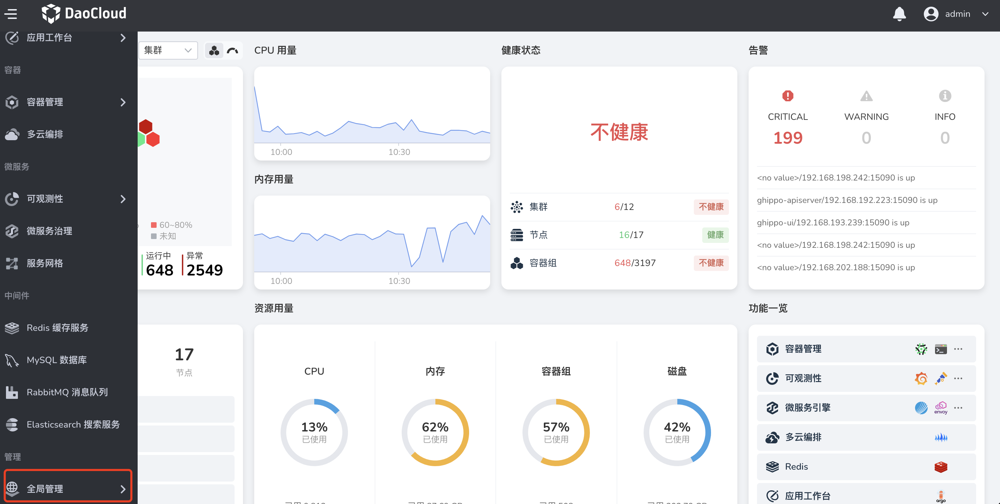
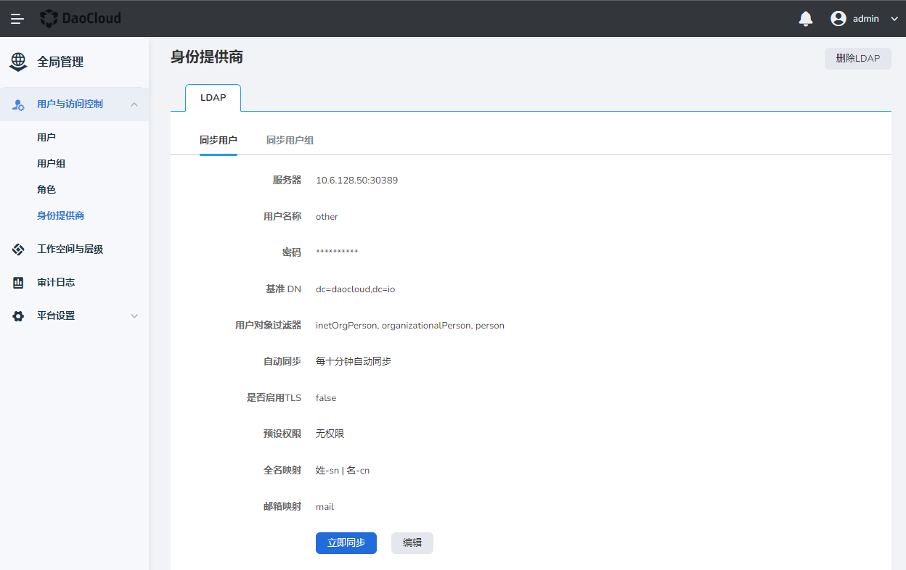

# OIDC

OIDC（OpenID Connect）是建立在 OAuth 2.0 基础上的一个身份层，是基于 OAuth2 协议的身份认证标准协议。

如果您的企业或组织已有自己的账号体系，同时您的企业用户管理系统支持 OIDC 协议，您可以使用全局管理提供的基于 OIDC 协议的身份提供商功能，而不必在您的 DCE 5.0 中为每一位组织成员创建用户名/密码。您可以向这些外部用户身份授予使用 DCE 5.0 资源的权限。

具体操作步骤如下。

1. 使用具有 `admin` 角色的用户登录 Web 控制台。点击左侧导航栏底部的`全局管理`。

    

2. 导航至`全局管理`下的`用户与访问控制`，选择`身份提供商`。

    

3. 在 `OIDC` 下，填写以下字段配身份提供商信息，可以在用户与访问控制中建立与身份提供商的信任关系。

    - 重定向 URL：重定向到 DCE 5.0 的 URL。
    - 提供商 ID：系统默认填入 oidc，用户可手动更改，保存后不可变更。
    - 提供商名称：显示在登录页上，是身份提供商的入口。
    - 认证方式：客户端身份验证方法（cfr.https://openid.net/specs/openid-connect-core-1_0.html#ClientAuthentication）。如果 JWT 使用私钥签名，请下拉选择 JWT 使用私钥签名。
    - 客户端 ID：客户端 ID。
    - 客户端密钥：客户端密码。
    - 客户端 URL：可通过身份提供商 well-known 接口一键获取登录 URL、Token URL、用户信息 URL 和登出 URL。
    - 自动关联：开启后当身份提供商用户名/邮箱与 DCE 5.0 用户名/邮箱重复时将自动使二者关联。

4. 点击`保存`。
  
!!! note

    1. 当用户通过企业用户管理系统完成第一次登录 DCE 5.0 后，用户信息才会被同步至 DCE 5.0 的`用户与访问控制`->`用户列表`。

    2. 初次登录的用户不会被赋予任何默认权限，需要有管理员给其赋权（管理员可以是平台管理员、子模块管理员或资源管理员）。
  
## 用户身份认证交互流程
  

  
从图上步骤可知：
  
1. 用户使用浏览器发起单点登录 DCE 5.0 的请求。
2. DCE 5.0 根据登录链接中携带的信息，查找`全局管理` -> `用户与访问控制` -> `身份提供商`中对应的配置信息，构建 OIDC 授权 Request，发送给浏览器。
3. 用户浏览器收到请求后，转发 OIDC 授权 Request 给企业 IdP。
4. 用户在企业 IdP 的登录页面中输入用户名和密码，企业 IdP 对用户提供的身份信息进行验证，并构建携带用户信息的 ID Token，向浏览器发送 OIDC 授权 Response。
5. 浏览器响应后转发 OIDC 授权 Response 给 DCE 5.0。
6. DCE 5.0 从 OIDC 授权 Response 中取出 ID Token，并根据已配置的身份转换规则映射到具体的用户列表，颁发 Token。
7. 用户完成单点登录，访问 DCE 5.0。
