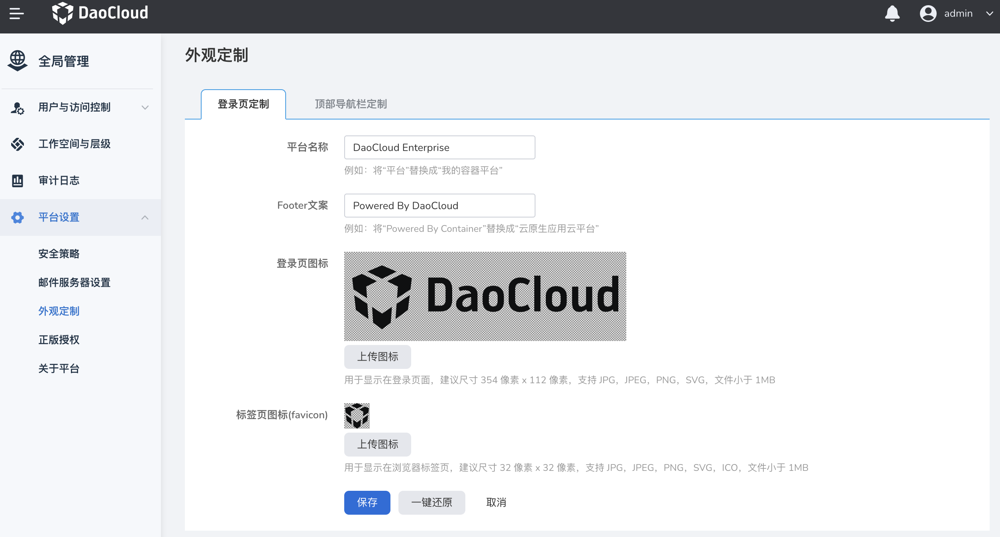
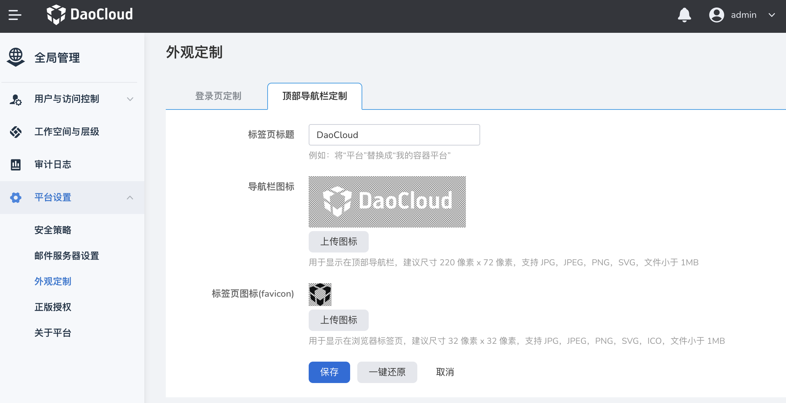

# 外观定制

企业购买DCE5.0后可通过外观定制更换登录界面及顶部导航栏的logo，帮助用户更好的辨识产品。

操作步骤如下。

1. 使用具有 `admin` 角色的用户登录 Web 控制台。
2. 点击左上角的 ，选择**全局管理**。

    

3. 导航至`全局管理`下的`平台设置`，选择`外观定制`。

    

4. 在`外观定制`页面中，在`登录页定制`区域点击`编辑`，可以自定义登录页。

    

    

5. 滚动到`导航栏定制`区域，点击`编辑`，可以自定义导航栏。

    

    
