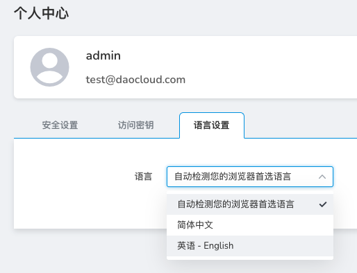

# 语言设置

本节说明如何设置界面语言。目前支持中文、English 两个语言。

语言设置是平台提供多语言服务的入口，平台默认显示为中文，用户可根据需要选择英语或自动检测浏览器语言首选项的方式来切换平台语言。
每个用户的多语言服务是相互独立的，切换后不会影响其他用户。

平台提供三种切换语言方式：中文、英语-English、自动检测您的浏览器语言首选项。

操作步骤如下。

1. 使用您的用户名/密码登录 Web 控制台。

   
2. 点击右上角的用户名位置，选择`个人中心`。

   
3. 点击`语言设置`页签。

   
4. 切换语言选项。

   