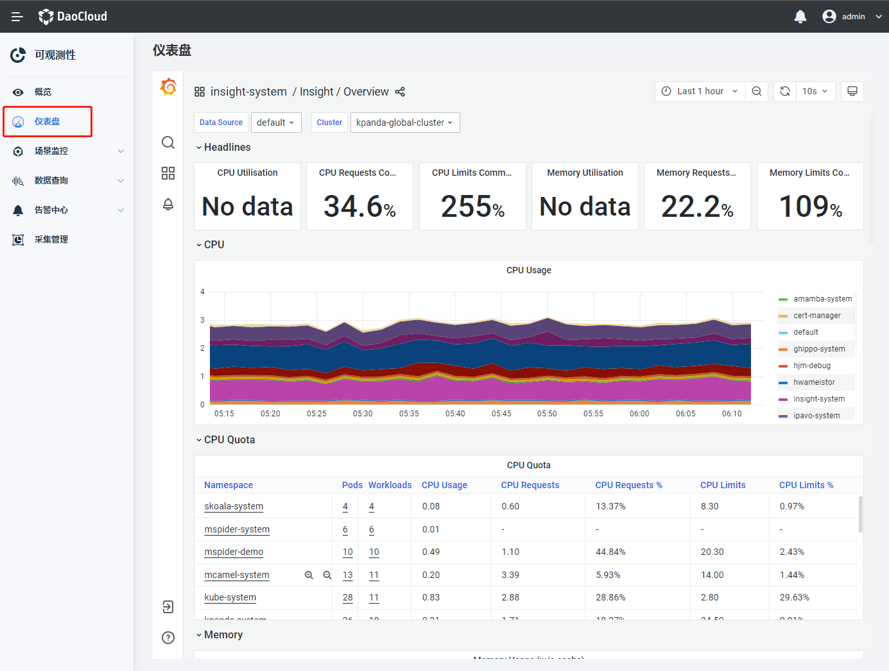
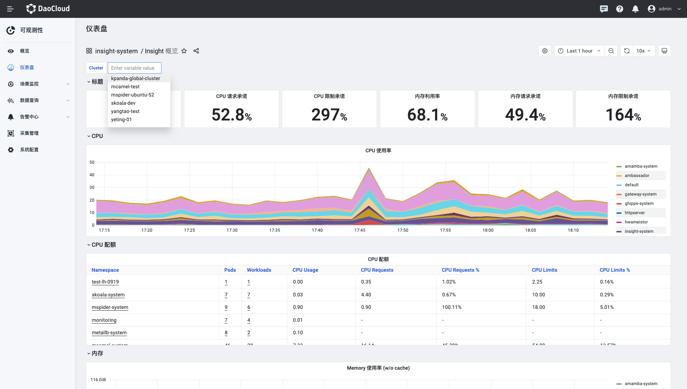
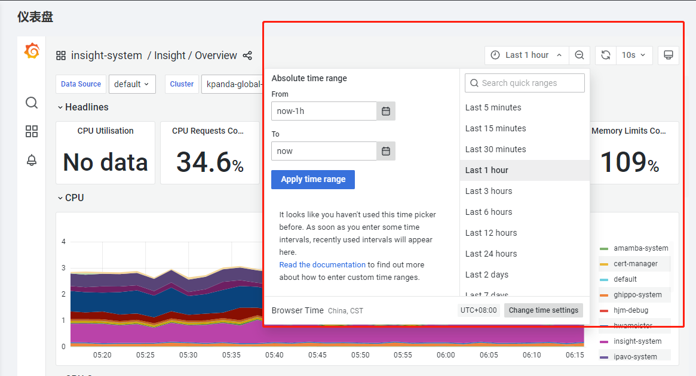

# 仪表盘

可观测性 Insight 通过原生 Grafana 提供开源精选仪表盘，对集群、节点、命名空间等多维度提供监控。Grafana 使用的数据源支持查看多集群的数据 。

1. 在左侧导航栏选择`仪表盘`。

    

2. 以 APIServer 为例，执行以下步骤，设置相关参数，查看集群指标。

    - 在页面左上角处，选择命名空间、集群。

        

    - 在页面右上角处，选择时间段，或者自定义时间。

        

    - 在页面右上角处，点击`刷新`界面，或者选择刷新时间间隔开启自动刷新。

        

