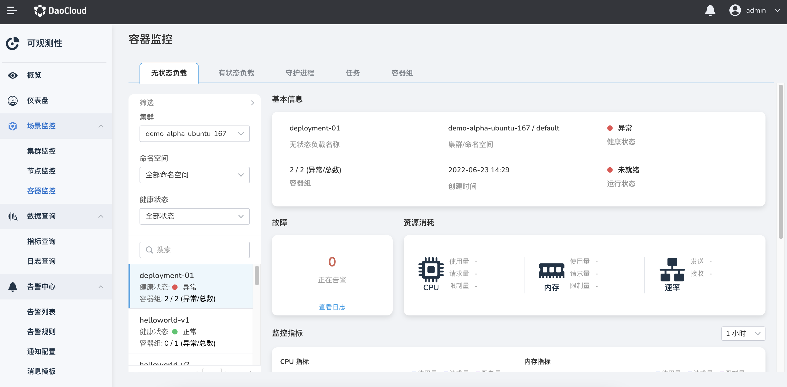

# 容器监控

通过容器监控，您可以根据列表概览页，监控工作负载当前的健康状态、对应容器组的异常数量。在工作负载详情页，可查看正在告警的数量以及 CPU、内存等资源消耗的变化趋势图。

1. 在左侧导航栏中，选择`容器监控`，默认展示第一个集群所有命名空间下的无状态负载。

  

2. 在筛选列表中，可按照集群、命名空间、健康状态筛选容器，也可以通过搜索框进行搜索。

  > 在`故障`卡片，点击`查看日志`，可以查看详细的告警信息。点击`正在告警`，可查看当前资源的告警列表。
