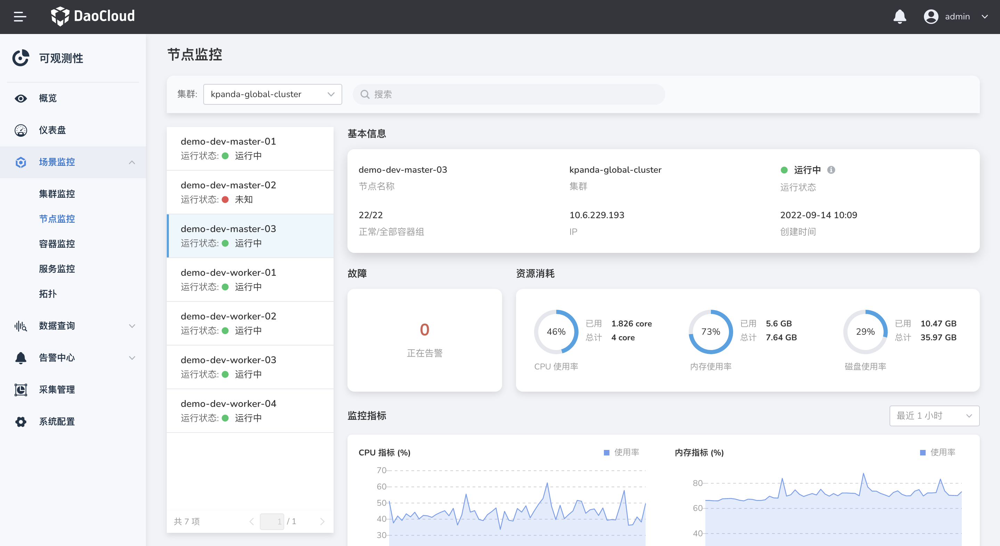

# 节点监控

通过节点监控，可概览选中集群下节点的当前健康状态、对应容器组的异常数；在当前节点详情页，可查看正在告警的数量以及 CPU、内存、磁盘等资源消耗的变化趋势图。

1. 在左侧导航栏中，选择`节点监控`，默认展示第一个集群下的节点。

  

2. 在筛选列表中，可按照集群、健康状态筛选节点，也可以通过搜索框进行搜索。

  > 在`故障`卡片，点击`查看日志`，可以查看详细的告警信息。点击`正在告警`，可查看当前资源的告警列表。
