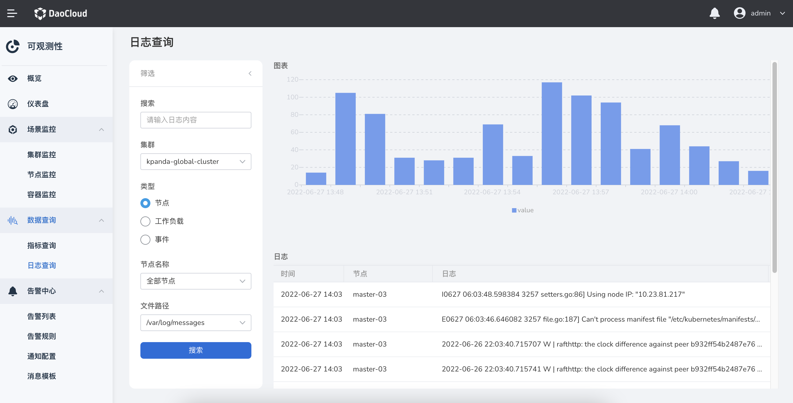
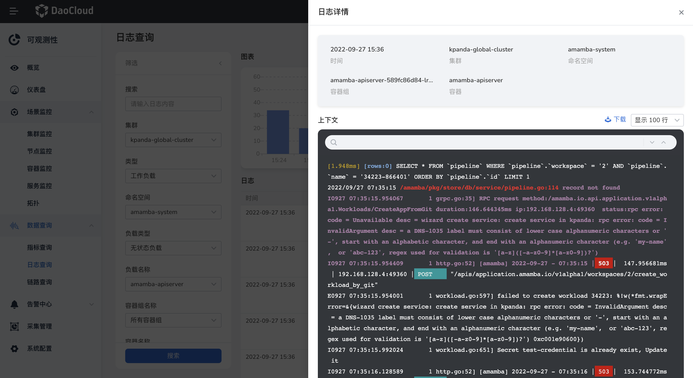
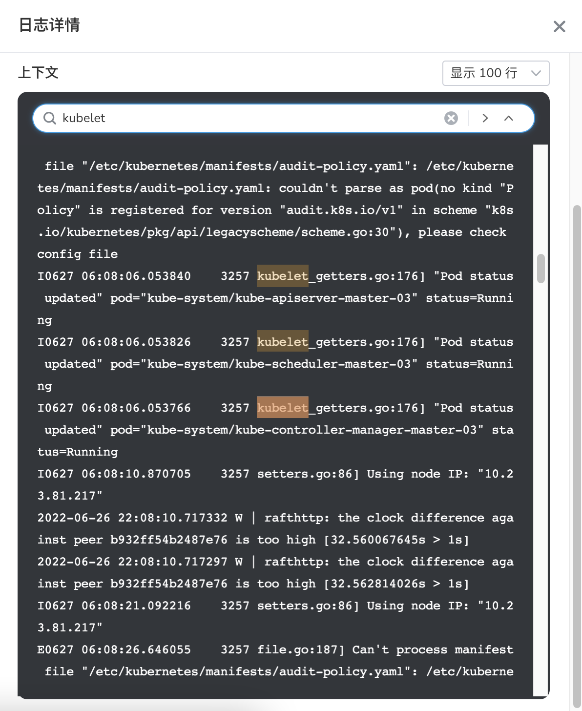

# 日志查询

日志查询支持查询节点、事件、工作负载的日志，可快速在大量日志中查询到所需的日志，同时结合日志的来源信息和上下文原始数据辅助定位问题。

## 前提条件

- 集群中已[安装 insight-agent](../../06UserGuide/01quickstart/installagent.md) 且应用处于 `运行中` 状态。

## 查询日志

1. 在左侧导航栏中，选择`数据查询` -> `日志查询`。

    

2. 选择查询条件后，点击`搜索`，将显示图表形式的日志记录。最新的日志显示在最上面。

3. 点击单条日志后的图标，可查看该条日志的上下文详情。

    

4. 在 `筛选` 面板，切换 `类型` 选择 `节点`，可查到该集群中所有节点的日志。

    

5. 在 `筛选` 面板，切换 `类型` 选择 `事件`，可查到该集群中所有的 kubernetes events 产生的日志。

    

6. 点击列表右上角的 `下载` ，可下载对应筛选条件下的日志内容。

    