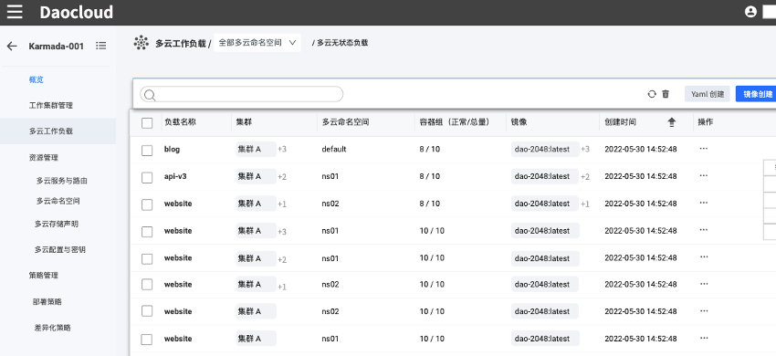
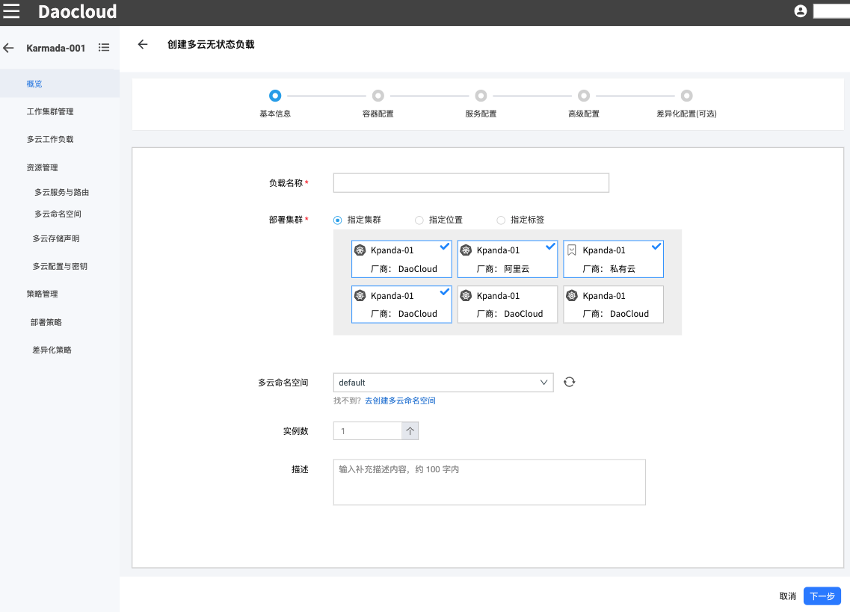
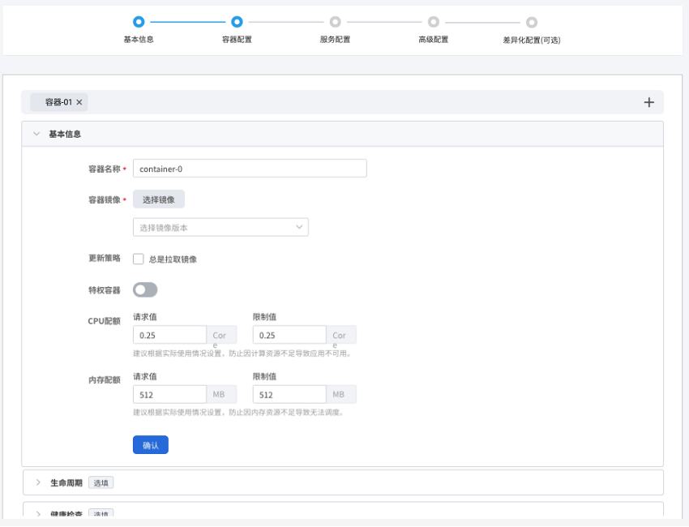
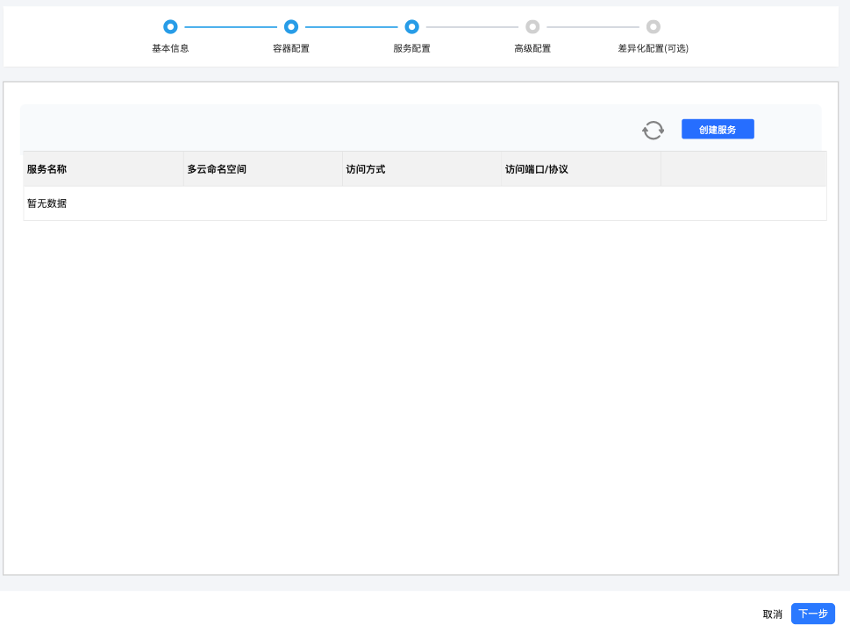
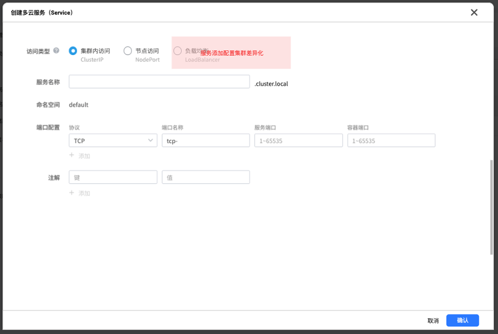
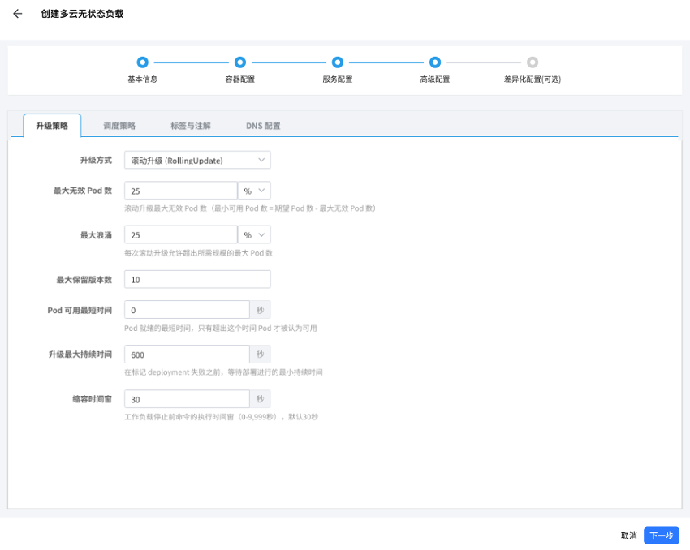

# 通过镜像创建

参照以下步骤创建一个无状态负载（Deployment）。

1. 在左侧导航栏中，点击**多云工作负载**，进入多云无状态负载页面，点击右上角的**镜像创建**按钮。

  

2. 在**创建多云无状态负载**页面中，配置负载的基本信息后，点击**下一步**。

  

3. 在**容器配置**页面中，配置负载所在容器的基本信息，可选择配置生命周期、健康检查等信息，然后点击**下一步**。

  

4. 在**服务配置**页面中，点击**创建服务**按钮。

  

  

  选择访问服务的类型，然后配置所有信息后点击**确认**，点击**下一步**。

5. 在**高级配置**页面中，分配配置升级策略、调度策略、标签与注解以及 DNS 后点击**下一步**。

  

6. 在**差异化配置**页面中，可选择配置个性化的差异策略：部署策略、更新策略、镜像差异化、标签差异化。点击**确认**。到此完成整个 deployment 无状态负载的创建过程。
