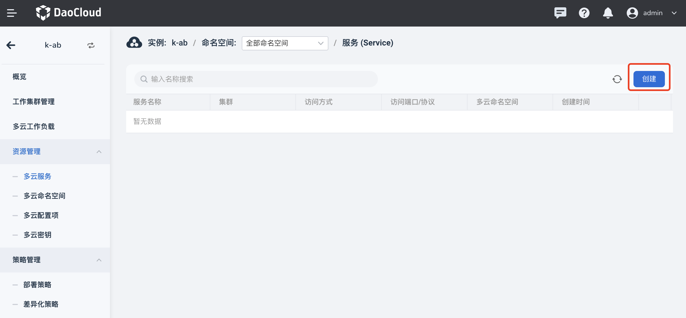
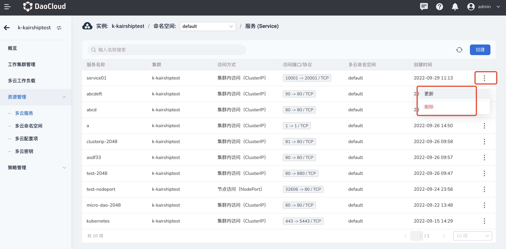

# 多云服务

多云服务是运行在一组 Pod 上的应用，对外暴露为一个一个的网络服务。
使用 DCE 多云编排模块，你无需修改应用即可使用不熟悉的服务发现机制。
DCE 为运行服务的 Pod 提供了 IP 地址，并为一组 Pod 提供相同的 DNS 名称，可以在这些 Pod 之间进行负载均衡。

参照以下步骤管理多云服务。

1. 进入某一个多云实例后，在左侧导航栏中，点击`资源管理` -> `多云服务`，点击右上角的`创建`按钮。

    

2. 在`创建多云服务`页面中，配置访问类型等信息后，点击`确定`。

    

3. 返回多云服务列表，新创建的默认位于第一个。点击列表右侧的 `⋮`，可以更新和删除该服务。

    

    !!! note

        如果一个服务被删除，该服务相关的信息也将消失，请谨慎操作。
