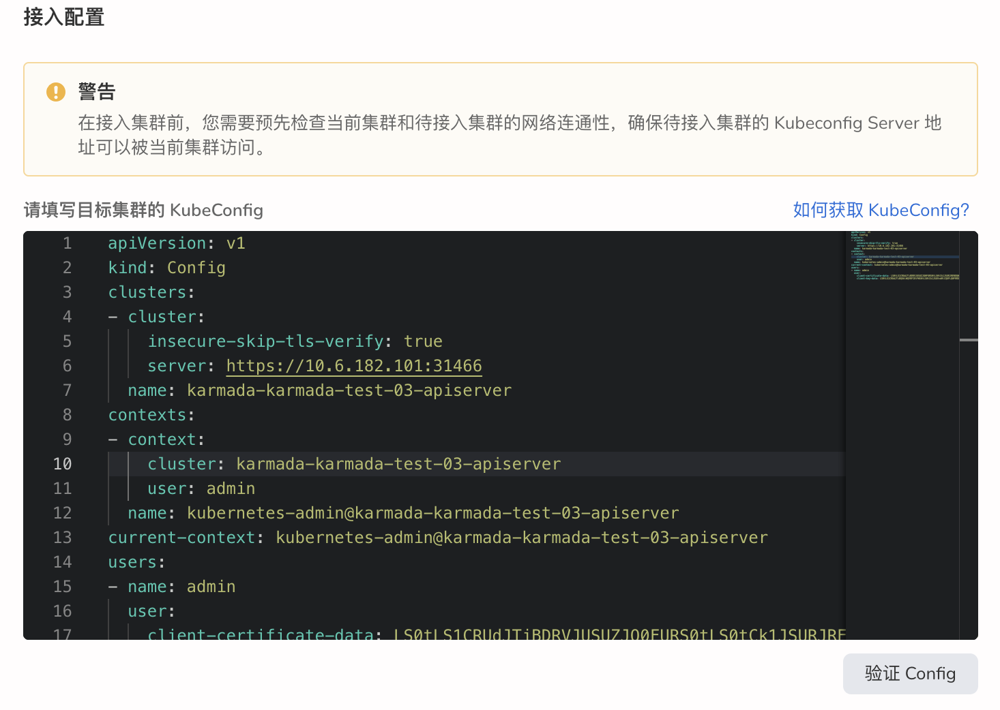

# 接入集群

通过接入集群操作，能够对众多云服务平台集群和本地私有物理集群进行统一纳管，形成统一治理平台。有效避免了被厂商锁定风险，助力企业业务安全上云。

DCE 支持接入多种主流的容器集群：

- DaoCloud KubeSpray
- DaoCloud ClusterAPI
- DaoCloud DCE4
- Redhat Openshift
- SUSE Rancher
- VMware Tanzu
- Amazon EKS
- Aliyun ACK
- 标准 Kubernetes 集群

## 前提条件

- 准备一个[已创建 Kubernetes 集群](CreateCluster.md) 的容器管理平台，且能够访问集群的 UI 界面。
- 准备一个待接入的集群，且该集群网络通畅。

## 登录平台

`NS Edit` 用户根据下表的信息成功登录后，点击左上角的`集群列表`进入`集群列表`页面。

| 参数                    | 说明                                                         | 举例值                       |
| :---------------------- | :----------------------------------------------------------- | :--------------------------- |
| UI 账户和密码          | 【类型】必填 【含义】用来登录容器管理平台 Web UI 的管理员账户和密码 | 账户：root 密码：****** |
| 容器平台的 Web UI 地址 | 【类型】必填 【含义】容器管理平台的 Web UI 的 IP 地址   | 10.6.124.110                 |

## 基本信息配置

1. 进入`集群列表`页面后，点击右上角的`接入集群`按钮。

    

2. 在 `接入容器集群` 页面中，先配置基本信息。

    

参照下表进行配置。

| 参数     | 说明                                                         | 举例值                                          |
| :------- | :----------------------------------------------------------- | :---------------------------------------------- |
| 集群名称 | 【类型】必填 【含义】集群接入后的名称，该名称具有唯一性，设置后不可更改 【注意】名称最大长度为 63 个字符，只能包含小写字母、数字及分隔符("-")，且必须以小写字母或数字开头及结尾 | Cluster-Daocloud                                |
| 集群别名 | 【类型】可选 【含义】集群接入后的别名 【注意】可输入任意字符，不超过 60 个字符 | Deployment-Cluster                              |
| 发行版 | 【类型】可选 【含义】集群的发行厂商，包括市场主流云厂商和本地私有物理集群。 【注意】对于本地私有物理集群或列表中未显示的集群厂商，可选择其它厂商，自定义厂商名 | Daocloud                                        |
| 集群标签 | 【类型】可选 【含义】为待接入集群添加标签               | Namespace-01                                    |
| 集群注解 | 【类型】可选 【含义】为待接入集群添加注解               | 2                                               |
| 描述信息 | 【类型】可选 【含义】为待接入集群添加描述信息           | 这是一个无状态工作负载，主要用来运行 Nginx 服务 |

## 接入配置

完成基本配置后，选择接入集群的方式：直接接入或者代理接入。

### 直接接入

通过直接接入集群需要确保容器管理集群和待接入集群之间的网络通畅，然后获取并填写目标集群的 KubeConfig。

1. 在`接入配置`区域，点击右上角的`如何获取 kubeConfig`。

    

2. 遵循屏幕提示获取目标集群的 KubeConfig。

    

3. 填写目标集群的 KubeConfig 后，点击`验证 Config`。如果信息无误，屏幕右上角将出现验证成功的提示。

    

### 代理接入

.......

## 完成接入

1. 确认所有参数输入完成后，点击`确定`按钮，完成集群的接入。

2. 自动跳转至集群列表页面，查看刚接入的集群。起初的集群状态为`接入中`，接入成功后变为`运行中`。

    

    > 如集群状态出现异常，请查阅异常提示并参考[集群状态](ClusterStatus.md)。
