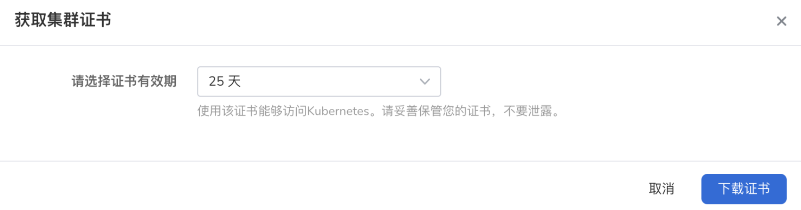

# 使用 kubectl 访问集群

除了通过容器管理平台 Web UI 界面来管理集群之外，您还可以通过命令行工具 kubectl 来管理集群以及应用。

## 前提条件

- 容器管理平台[已接入 Kubernetes 集群](../Clusters/JoinACluster.md)或者[已创建 Kubernetes](CreateCluster.md)，且能够访问集群的 UI 界面。

- 本地节点上已经安装了 kubectl 命令行工具。关于 Kubectl 命令行的更多信息请参阅[安装 Kubectl](https://kubernetes.io/docs/user-guide/kubectl/?spm=a2c4g.11186623.0.0.1841663fmq8YID)。

- 如果您的集群或本地节点处于内网环境，请您在使用 Kubectl 工具访问集群前，确保本地节点能够与集群成功建立网络连接。

## 登录平台

根据下表信息以 `NS Edit` 用户成功登录 DCE 5.0 容器管理平台。

| 参数                    | 说明                                                         | 举例值                       |
| :---------------------- | :----------------------------------------------------------- | :--------------------------- |
| UI 账户和密码          | 【类型】必填<br />【含义】用来登录容器管理平台 Web UI 的管理员账户和密码 | 账户：root<br />密码：****** |
| 容器平台的 Web UI 地址 | 【类型】必填<br />【含义】容器管理平台的 Web UI 的 IP 地址   | 10.6.124.110                 |

## 获取集群证书

1. 在左侧导航栏中，点击`集群列表`进入集群列表页面，点击一个需要使用 kubectl 工具访问的集群。
  

2. 在`集群概览`页面中，点击右上角的 `...` 按钮，选择`证书获取`。。
  

3. 选择证书有效期后，点击`下载证书`，集群证书文件将被自动下载到本地节点。
  

## 配置集群凭证

kubectl 工具默认会从本地节点的 `$HOME/.kube` 目录下查找名为 config 的文件。该文件用于存储所要管理集群的访问凭证，kubectl 可以凭此配置文件连接至集群。

找到并打开刚刚下载的集群证书，将其内容复制至本地节点的 config 文件内。


## 验证连通性

在本地节点上执行如下命令验证集群的连通性：

```shell
kubectl get pod -n default
```

预期的输出类似于：

```shell
NAME                            READY   STATUS    RESTARTS   AGE           
dao-2048-2048-58c7f7fc5-mq7h4   1/1     Running   0          30h
```
