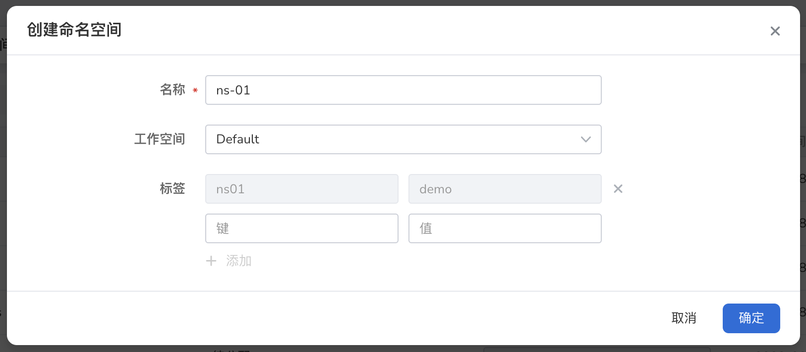

# 创建命名空间

命名空间是 Kubernetes 中用来进行资源隔离的一种抽象，本文将介绍如何创建命名空间。

## 前提条件

- 容器管理平台[已接入 Kubernetes 集群](../Clusters/JoinACluster.md)或者[已创建 Kubernetes](../Clusters/CreateCluster.md)，且能够访问集群的 UI 界面
- 已完成一个[命名空间的创建](../Namespaces/README.md)、[用户的创建]()，并将用户授权为`NS Admin`角色 ，详情可参考[命名空间授权]()。

## 操作步骤

1. 点击一个集群名称，进入`集群详情`。

  

2. 在左侧导航栏，点击`命名空间`，进入命名空间管理页面，点击页面右侧的`创建`按钮。

  

3. 在`创建命名空间`弹窗中，填写参数后点击`确定`。

  

4. 点击`确定`，完成命名空间的创建。在命名空间列表右侧，点击 `⋮`，可以从弹出菜单中选择更多操作。

  
