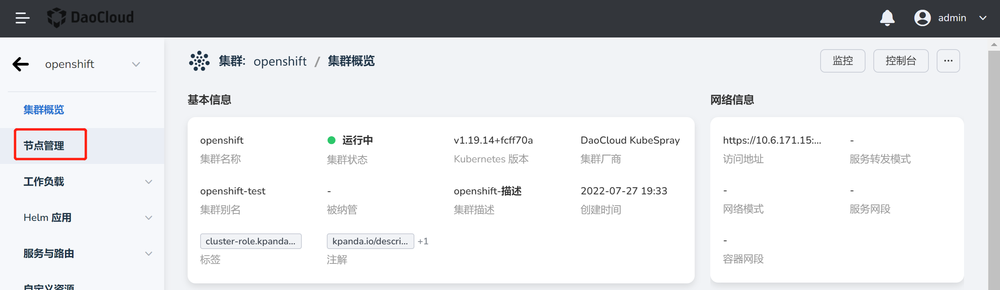

# 节点的污点管理

污点 (Taint) 能够使节点排斥某一类 Pod，避免 Pod 被调度到该节点上。当前操作用户应具备 [`NS Edit`](../Permissions/PermissionBrief.md) 角色授权。

## 操作步骤

1. 在`集群列表`页选择集群，点击集群名称，进入`集群概览`页面。

    

2. 在左侧导航栏，点击`节点管理`，进入节点列表页面。

    

3. 在`节点列表`页找到修改污点的节点，点击右侧的 `ⵗ` 操作图标并点击`修改污点`按钮。

    

4. 在修改污点的弹框内输入污点的 `key`、`vaule` 信息后，点击`添加`完成污点的添加，点击下方列表内的污点右上角的 `X` 可以删除污点。

    
