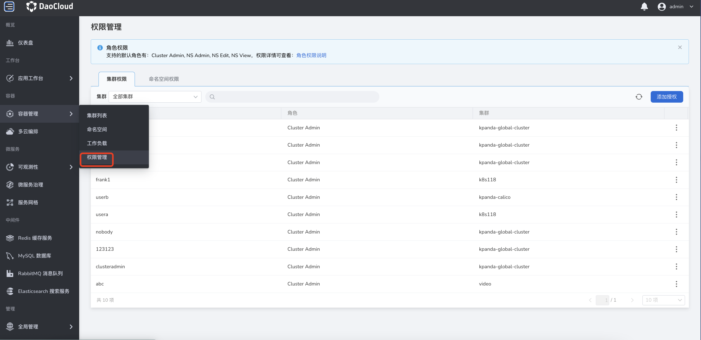
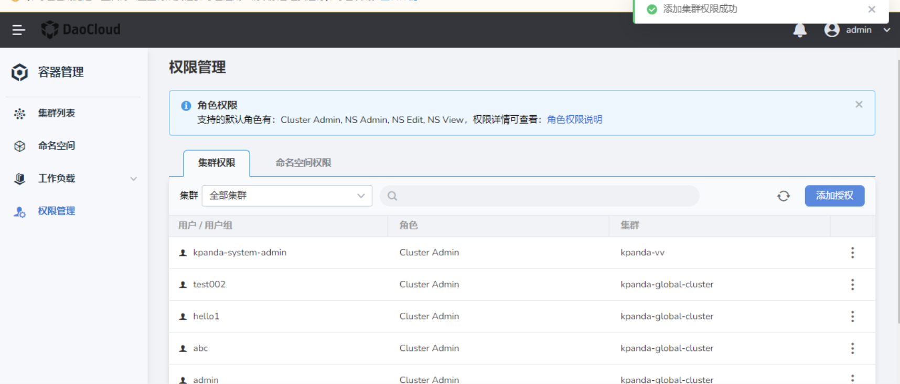
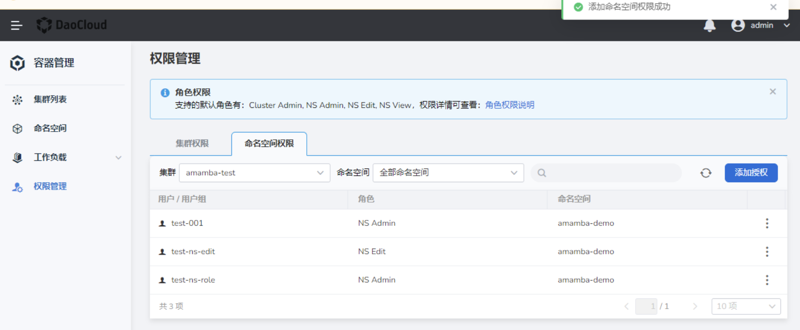

# 集群和命名空间授权

容器管理基于全局权限管理及全局用户/用户组管理实现授权，如需为用户授予容器管理的最高权限（可以创建、管理、删除所有集群），请参见[什么是用户与访问控制](../../../ghippo/04UserGuide/01UserandAccess/iam.md)。

## 前提条件

给用户/用户组授权之前，请完成如下准备：

- 已在全局管理中创建了待授权的用户/用户组，请参考[用户](../../../ghippo/04UserGuide/01UserandAccess/User.md)。

- 仅 [`Kpanda Owner`](../../../ghippo/04UserGuide/01UserandAccess/global.md) 及当前集群的 [`Cluster Admin`](PermissionBrief.md#cluster-admin) 具备集群授权能力。详情可参考[权限说明](PermissionBrief.md)。

- 仅 [`Kpanda Owner`](../../../ghippo/04UserGuide/01UserandAccess/global.md)、当前集群的 [`Cluster Admin`](PermissionBrief.md#cluster-admin)，当前命名空间的 [`NS Admin`](PermissionBrief.md#ns-admin) 具备命名空间授权能力。

## 集群授权

1. 用户登录平台后，点击左侧菜单栏`容器管理`下的`权限管理`，默认位于`集群权限`页签。

    

2. 点击`添加授权`按钮。

    

3. 在`添加集群权限`页面中，选择目标集群、待授权的用户/用户组后，点击`确定`。

    目前仅支持的集群角色为 `Cluster Admin`，详情权限可参考[权限说明](PermissionBrief.md)。如需要给多个用户/用户组同时进行授权， 可点击`添加用户权限`进行多次添加。

    

4. 返回集群权限管理页面，屏幕出现消息：`添加集群权限成功`。

    

## 命名空间授权

1. 用户登录平台后，点击左侧菜单栏`容器管理`下的`权限管理`，点击`命名空间权限`页签。

    

2. 点击`添加授权`按钮。在`添加命名空间权限`页面中，选择目标集群、目标命名空间，以及待授权的用户/用户组后，点击`确定`。

    目前支持的命名空间角色为 NS Admin、NS Edit、NS View，详情权限可参考[权限说明](PermissionBrief.md)。如需给多个用户/用户组同时进行授权，可点击`添加用户权限`进行多次添加。点击`确定`完成权限授权。

    

3. 返回命名空间权限管理页面，屏幕出现消息：`添加集群权限成功`。

    

!!! tip

    后续如需删除或编辑权限，可点击列表右侧的 `⋮`，选择`编辑`或`删除`。

