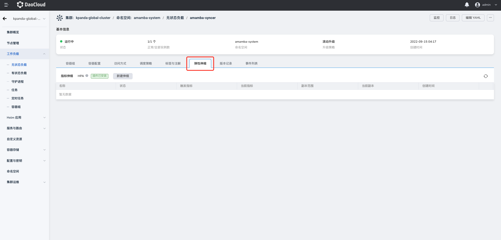

# 创建指标弹性伸缩（HPA）

Daocloud 第五代容器管理平台支持 Pod 资源基于指标进行弹性伸缩策略（HPA）。用户可以通过设置 CPU 利用率、内存用量两项指标来动态调整 Pod 资源的副本数量。
例如，为工作负载设置指标弹性伸缩后，当 Pod 的 CPU 利用率超过/低于您设置的指标阀值，工作负载控制器将会自动增加/减少 Pod 副本数。

本文将介绍如何为工作负载配置基于指标的弹性伸缩。请注意，只有 **无状态工作负载** 和 **有状态工作负载** 才支持配置基于指标的工作负载弹性伸缩策略。

## 前提条件

在为工作负载配置指标弹性伸缩策略之前，需要满足以下前提条件：

- 容器管理平台[已接入 Kubernetes 集群](../Clusters/JoinACluster.md)或者[已创建 Kubernetes 集群](../Clusters/CreateCluster.md)，且能够访问集群的 UI 界面。

- 已完成一个[命名空间的创建](../Namespaces/createns.md)、[无状态工作负载的创建](../Workloads/CreateDeploymentByImage.md)、[用户的创建](../../../ghippo/04UserGuide/01UserandAccess/User.md)，并将用户授权为 [`NS Edit`](../Permissions/PermissionBrief.md#ns-edit) 角色，详情可参考[命名空间授权](../Namespaces/createns.md)。

- 已完成[`metrics-server 插件安装`]。

参考以下步骤，为工作负载配置指标弹性伸缩策略。

### 进入弹性伸缩详情

1. 以 `NS Edit` 用户成功登录后，点击左侧导航栏上的`集群列表`进入集群列表页面。点击一个集群名称，进入`集群详情`页面。

    

2. 在集群详情页面，点击左侧导航栏的`工作负载`进入工作负载列表后，点击一个负载名称，进入`工作负载详情`页面。

    

3. 完成上述步骤后，您将跳转至`工作负载详情页面`，点击`弹性伸缩`按钮，查看当前集群的弹性伸缩配置情况。

    

### 配置指标弹性伸缩(#config-hpa)

1. 在确认您的集群已经安装了 `metrics-server` 插件，且插件运行状态为正常后，您即可在工作负载详情下的弹性伸缩页面点击`新建伸缩`按钮，配置工作负载的指标弹性伸缩。

    

2. 参照以下配置完成指标弹性伸缩参数的配置。

    

- 策略名称：输入弹性伸缩策略的名称，请注意名称最长 63 个字符，只能包含小写字母、数字及分隔符（“_”），且必须以小写字母或数字开头及结尾。例如 hpa-my-dep。
- 命名空间：负载所在的命名空间。
- 工作负载：执行弹性伸缩的工作负载对象
- 目标 CPU 利用率：工作负载资源下的 Pod 的 CPU 使用率，计算方式为：工作负载下所有的 Pod 的资源 / 工作负载的请求（request）值。当实际 CPU 用量大于/小于目标值时，系统自动减少/增加容器组副本数量。
- 目标内存用量：工作负载资源下的 Pod 的内存用量。当实际内存用量大于/小于目标值时，系统自动减少/增加容器组副本数量。
- 副本范围：Pod 副本数的弹性伸缩范围。默认区间为为 1 - 10。

3. 完成参数配置后，点击`确定` 按钮，完成弹性指标伸缩，系统将自动返回弹性伸缩详情页面，您可以看到刚刚创建的指标弹性伸缩的运行情况。

    
