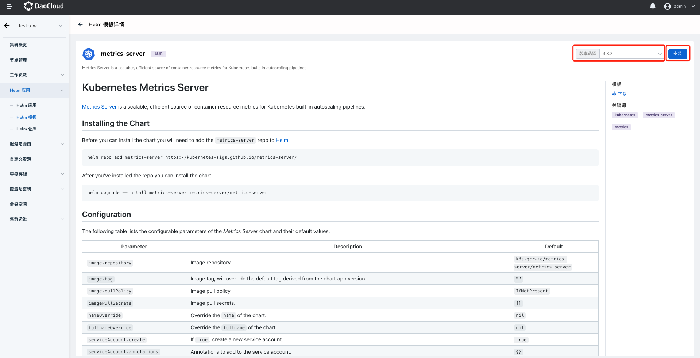
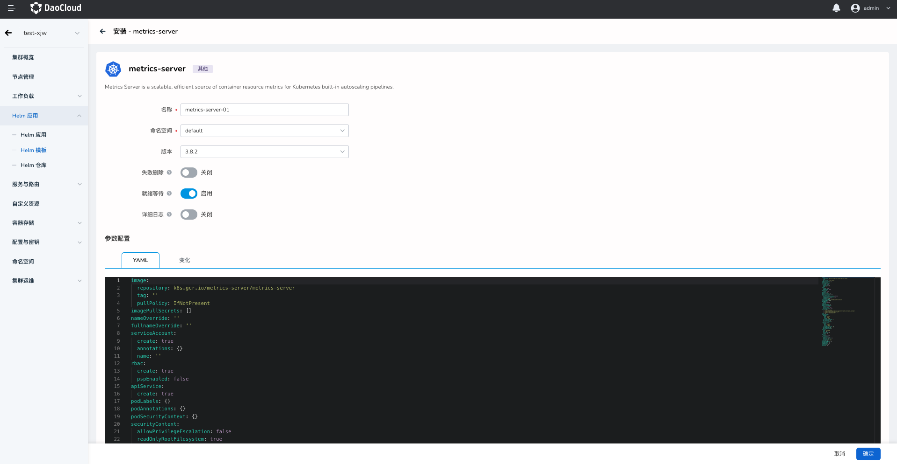

# metrics-server 插件安装

`metrics-server` 是 Kubernetes 内置的资源使用指标采集组件。您可以通过配置 Horizontal Pod Autoscaling（HPA）策略来实现工作负载资源自动水平伸缩 Pod 副本。

本节介绍如何安装 `metrics-server`。

## 前提条件

安装 `metrics-server` 插件前，需要满足以下前提条件：

- 容器管理平台[已接入 Kubernetes 集群](../Clusters/JoinACluster.md)或者[已创建 Kubernetes 集群](../Clusters/CreateCluster.md)，且能够访问集群的 UI 界面。

- 已完成一个[命名空间的创建](../Namespaces/createns.md)、[用户的创建](../../../ghippo/04UserGuide/01UserandAccess/User.md)，并将用户授权为 [`NS Edit`](../Permissions/PermissionBrief.md#ns-edit) 角色，详情可参考[命名空间授权](../Namespaces/createns.md)。

## 操作步骤

请执行如下步骤为集群安装 `metrics-server` 插件。

1. 在工作负载详情下的弹性伸缩页面，点击 `安装` 按钮，进入 `metrics-server` 插件安装界面。

    

2. 阅读 `metrics-server` 插件相关介绍，选择版本后点击`安装`按钮，本文将以 `3.8.2` 版本为例进行安装，推荐您使用 `3.8.2` 及以上版本进行安装。

    

3. 在安装配置界面配置基本参数。

    

- 名称：输入插件名称，请注意名称最长 63 个字符，只能包含小写字母、数字及分隔符（“_”）,且必须以小写字母或数字开头及结尾。例如 metrics-server-01。
- 命名空间：选择插件安装的命名空间，此处以 `default` 为例。
- 版本：插件的版本，此处我们以 `3.8.2` 版本为例。
- 就绪等待：启用后，将等待应用下所有关联资源处于就绪状态才标记应用安装成功。
- 失败删除：开启后，将默认同步开启就绪等待。如果安装失败，将删除安装相关资源。
- 详情日志：开启安装过程日志的详细输出。

4. 高级参数配置
- 如果您的集群网络无法访问 `k8s.gcr.io` 仓库，请修改 `repositort` 参数为 `repository: k8s.m.daocloud.io/metrics-server/metrics-server`。
- 安装 `metrics-server` 插件还需提供 SSL 证书，您也可以在 `defaultArgs:` 处添加 `- --kubelet-insecure-tls` 参数，以绕过证书校验。

**推荐您使用如下参数来替换参数配置内的默认 `YAML` 内容**。

```yaml
image:
  repository: k8s.m.daocloud.io/metrics-server/metrics-server # 将仓库源地址修改为 k8s.m.daocloud.io
  tag: ''
  pullPolicy: IfNotPresent
imagePullSecrets: []
nameOverride: ''
fullnameOverride: ''
serviceAccount:
  create: true
  annotations: {}
  name: ''
rbac:
  create: true
  pspEnabled: false
apiService:
  create: true
podLabels: {}
podAnnotations: {}
podSecurityContext: {}
securityContext:
  allowPrivilegeEscalation: false
  readOnlyRootFilesystem: true
  runAsNonRoot: true
  runAsUser: 1000
priorityClassName: system-cluster-critical
containerPort: 4443
hostNetwork:
  enabled: false
replicas: 1
updateStrategy: {}
podDisruptionBudget:
  enabled: false
  minAvailable: null
  maxUnavailable: null
defaultArgs:
  - '--cert-dir=/tmp'
  - '--kubelet-preferred-address-types=InternalIP,ExternalIP,Hostname'
  - '--kubelet-use-node-status-port'
  - '--metric-resolution=15s'
  - --kubelet-insecure-tls # 绕过证书校验
args: []
livenessProbe:
  httpGet:
    path: /livez
    port: https
    scheme: HTTPS
  initialDelaySeconds: 0
  periodSeconds: 10
  failureThreshold: 3
readinessProbe:
  httpGet:
    path: /readyz
    port: https
    scheme: HTTPS
  initialDelaySeconds: 20
  periodSeconds: 10
  failureThreshold: 3
service:
  type: ClusterIP
  port: 443
  annotations: {}
  labels: {}
metrics:
  enabled: false
serviceMonitor:
  enabled: false
  additionalLabels: {}
  interval: 1m
  scrapeTimeout: 10s
resources: {}
extraVolumeMounts: []
extraVolumes: []
nodeSelector: {}
tolerations: []
affinity: {}
```

5. 点击 `确定` 按钮，完成 `metrics-server` 插件的安装，之后系统将自动跳转至 `Helm 应用`列表页面，稍等几分钟后，为页面执行刷新操作，即可看到刚刚安装的应用。