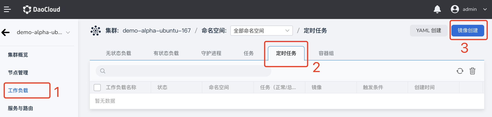
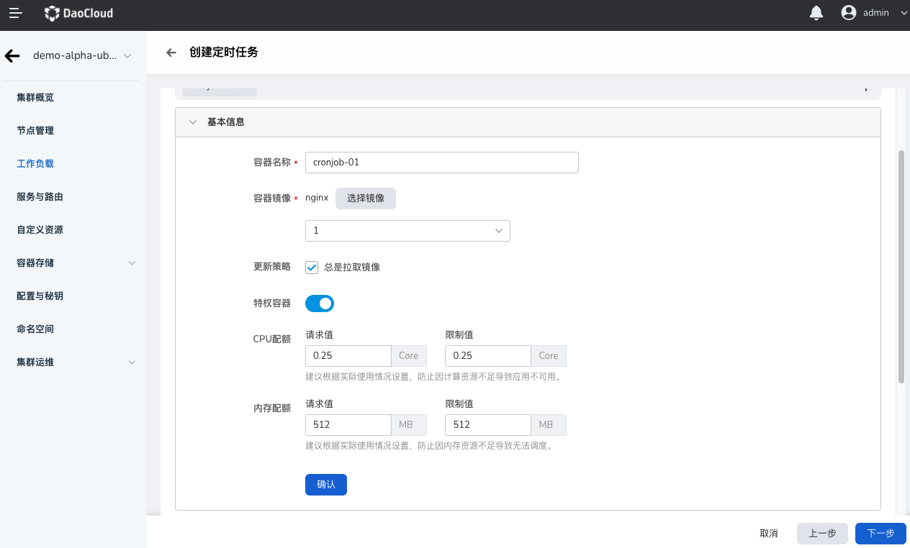

# 通过镜像创建定时任务

定时任务（CronJob） 适用于于执行周期性的操作场景，例如备份、报告生成等。这些任务可以配置为周期性重复的（例如：每天/每周/每月一次）；您可以定义任务开始执行的时间间隔。

## 前提条件

通过镜像创建 CronJob 之前，需要满足以下前提条件：

- 容器管理平台[已接入 Kubernetes 集群](../Clusters/JoinACluster.md)或者[已创建 Kubernetes 集群](../Clusters/CreateCluster.md)，且能够访问集群的 UI 界面。

- 已完成一个[命名空间的创建]()、[用户的创建]()，并将用户授权为`NS Edit`角色 ，详情可参考[命名空间授权]()。

- 单个实例中有多个容器时，请确保容器使用的端口不冲突，否则部署会失效。

参考以下步骤，创建一个 CronJob。

## 1. 登录平台

`NS Edit` 用户根据下表的信息成功登录后，点击左上角的`集群列表`进入集群列表页面。

| 参数                   | 说明                                                         | 举例值                       |
| :--------------------- | :----------------------------------------------------------- | :--------------------------- |
| UI 账户和密码          | 【类型】必填 【含义】用来登录容器管理平台 Web UI 的管理员账户和密码 | 账户：root 密码：****** |
| 容器平台的 Web UI 地址 | 【类型】必填 【含义】容器管理平台的 Web UI 的 IP 地址   | 10.6.124.110                 |

## 2. 镜像创建

1. 点击一个集群名称，进入`集群详情`。
  

2. 点击左侧导航栏的`工作负载`进入工作负载列表，点击`定时任务`页签，点击右上角`镜像创建`按钮。
  

3. 屏幕将显示`创建定时任务`页面。

## 3. 基本信息配置

进入部署页面，根据下表输入信息，完成后点击`下一步`开始[容器配置](#4-容器配置)。

| 参数     | 说明                                                         | 举例值       |
| :------- | :----------------------------------------------------------- | :----------- |
| 负载名称 | 【类型】必填 【含义】输入新建工作负载的名称，命名必须唯一。 【注意】请输入4 到 63 个字符的字符串，可以包含小写英文字母、数字和中划线（-），并以小写英文字母开头，小写英文字母或数字结尾。 | cronjob-01   |
| 集群     | 【类型】必选 【含义】选择新建工作负载所在的集群。 【注意】在集群内创建工作负载时，将在当前集群中创建工作负载。集群不可更改。当在集群外部创建工作负载时，将在所选集群创建工作负载。 | Cluster-01   |
| 命名空间 | 【类型】必选 【含义】选择新建工作负载所在的命名空间。关于命名空间更多信息请参考[命名空间概述](http://dwiki.daocloud.io)。 【注意】若您不设置命名空间，系统会默认使用 default 命名空间。 | Namespace-01 |
| 实例数   | 【类型】可选 【含义】输入工作负载的 [Pod](http://dwiki.daocloud.io) 实例数量。 【注意】若您不设置实例数量，系统会默认创建 2 个 Pod 实例。 | 2            |
| 描述     | 【类型】可选 【含义】输入工作负载的描述信息，内容自定义。 【注意】字符数量应不超过 512 个。 | --           |

## 4. 容器配置

容器配置仅针对单个容器进行配置，如需在一个容器组中添加多个容器，可点击左侧的 `+` 添加多个容器。

完成以下所有容器配置信息后，点击`下一步`进行[定时任务配置](#5-定时任务配置)。

### 基本信息（必填）

按照下表输入信息后，点击`确认`。

| 参数      | 说明                                                         | 举例值       |
| :-------- | :----------------------------------------------------------- | :----------- |
| 容器名称* | 【类型】必选 【含义】输入新建容器的名称。 【注意】请输入 4 到 63 个字符的字符串，可以包含小写英文字母、数字和中划线（-），并以小写英文字母开头，小写英文字母或数字结尾。 | backup_log   |
| 容器镜像* | 【类型】必选 【含义】从镜像仓库选择的镜像名称，也支持手动输入镜像名称（名称需为镜像仓库中已有的镜像名，否则将无法获取），如需对接外部私有镜像，需要先[创建镜像仓库密钥]()，然后拉取镜像。 | backupjob    |
| 更新策略  | 【类型】可选 【含义】容器执行更新时，镜像拉取策略。 【注意】开启后工作负载每次重启/升级均会重新拉取镜像，否则只会在节点上不存在同名同版本镜像时拉取镜像 | 总是拉取镜像 |
| 特权容器  | 【类型】可选 【含义】默认情况下，容器不可以访问宿主机上的任何设备，开启特权容器后，容器即可访问宿主机上的所有设备，享有宿主机上的运行进程的所有权限。 | 特权容器     |
| CPU 配额  | 【类型】可选 【含义】容器 CPU 资源的最低使用量和最高限度。 申请：容器需要使用的最小 CPU 值。 限制：允许容器使用的 CPU 最大值。建议设容器配额的最高限额，避免容器资源超额导致系统故障。 | --           |
| 内存配额  | 【类型】可选 【含义】容器内存资源的最低使用量和最高限度。 申请：容器需要使用的最小内存值。 限制：允许容器使用的内存最大值。建议设容器配额的最高限额，避免容器资源超额导致系统故障。 | --           |

### 生命周期（选填）

容器生命周期配置用于设置容器启动时、启动后、停止前需要执行的命令。具体详情请参照[容器生命周期配置](PodConfig/lifescycle.md)。

### 健康检查（选填）

容器健康检查用于判断容器和应用的健康状态。有助于提高应用的可用性。具体详情请参考[容器健康检查配置](PodConfig/healthcheck.md)。

### 环境变量（选填）

容器环境变量配置用于配置 Pod 内的容器参数，为 Pod 添加环境标志或传递配置等。具体详情请参考[容器环境变量配置](PodConfig/EnvironmentVariables.md)。

### 数据存储（选填）

容器数据存储配置用于配置容器挂载数据卷和数据持久化设置。具体详情请参考[容器数据存储配置](http://dwiki.daocloud.io)。

### 安全设置（选填）

按照下表对容器权限进行设置，保护系统和其他容器不受其影响。

### 容器日志（选填）

设置容器日志采集策略、配置日志目录。用于收集容器日志便于统一管理和分析。具体详情请参考[容器日志配置](http://dwiki.daocloud.io)。

## 5. 定时任务配置

| 参数     | 说明                                                         | 举例值                                   |
| :------- | :----------------------------------------------------------- | :--------------------------------------- |
| 定时规则 | 【类型】必选 【含义】可基于 小时、天、周、月进行规则设置 | 2                                        |
| 并发规则 | 【类型】必选 【含义】是否允许多个 Job 任务并行执行。  **Forbid**：在前一个任务未完成时，不创建新任务，如果新任务的执行时间到了而老任务没有执行完，CronJob 会忽略新任务的执行。   **Allow**：定时任务支持新建 Job，多个任务可并行。  **Replace**：已到新任务创建时间点，但前一个任务还未完成，新的任务会取代前一个任务。 | 3                                        |
| 任务记录 | 【类型】可选 【含义】可设定任务执行成功或失败的任务记录数量，如设置为 0  表示不保留   | 保留成功任务数：0 保留失败任务书：0 |
| 超时时间 | 【类型】可选 【含义】当任务执行超出该时间时，任务将会被标识为执行失败，任务下的所有 Pod 都会被删除。为空时表示不设置超时时间。默认值为：600 ms   | 600ms                                    |
| 重试次数 | 【类型】可选 【含义】任务可重试次数，默认值为：6   | 6                                        |
| 重启策略 | 【类型】可选 【含义】任务执行是否重启，支持的重启策略如下  1. 不重启 2.失败时重启 | 不重启                                   |

## 6. 高级配置

除了基本信息配置，DCE 还提供了丰富的高级配置，可对的升级策略、调度策略、标签与注解等功能进行配置。

### 标签与注解

可以点击`添加`按钮为工作负载实例 Pod 添加标签和注解。

### 7. 完成创建

确认所有参数输入完成后，点击`创建`按钮，完成工作负载创建。等待工作负载状态变为`运行中`。如果工作负载状态出现异常，请查看具体异常信息，可参考[工作负载状态]()。
