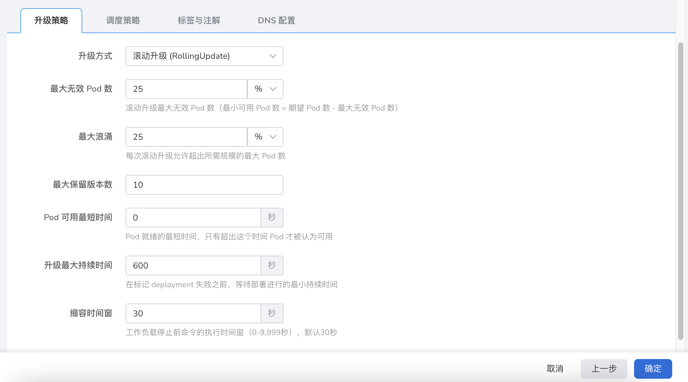

# 通过镜像创建无状态负载

无状态负载（Deployment）的容器组之间完全独立、功能相同，具有弹性扩缩、滚动升级等特性，您可以部署无状态负载实现快速扩缩。其实例数量可以灵活扩缩，若一个无状态负载配有多个副本，在宕机或者发生故障时可自动切换。

## 前提条件

通过镜像创建无状态负载之前，需要满足以下前提条件：

- 容器管理平台[已接入 Kubernetes 集群](../Clusters/JoinACluster.md)或者[已创建 Kubernetes 集群](../Clusters/CreateCluster.md)，且能够访问集群的 UI 界面。

- 已完成一个[命名空间的创建](../Namespaces/createns.md)、[用户的创建](../../../ghippo/04UserGuide/01UserandAccess/User.md)，并将用户授权为 [`NS Edit`](../Permissions/PermissionBrief.md#ns-edit) 角色 ，详情可参考[命名空间授权](../Namespaces/createns.md)。

- 单个实例中有多个容器时，请确保容器使用的端口不冲突，否则部署会失效。

参考以下步骤，创建一个无状态负载。

## 镜像创建

1. 以 `NS Edit` 用户成功登录后，点击左上角的`集群列表`进入集群列表页面。点击一个集群名称，进入`集群详情`。

    

2. 点击左侧导航栏的`工作负载`进入工作负载列表，点击右上角`镜像创建`按钮。

    

3. 屏幕将显示`创建无状态负载`页面。

## 基本信息配置

在`创建无状态负载`页面中，根据下表输入基本信息后，点击`下一步`开始[容器配置](#4-容器配置)。

- 负载名称：输入新建工作负载的名称，命名必须唯一。请输入 4 到 63 个字符的字符串，可以包含小写英文字母、数字和中划线（-），并以小写英文字母开头，小写英文字母或数字结尾。例如 Deployment-01。
- 集群：选择新建工作负载所在的集群。在集群内创建工作负载时，将在当前集群中创建工作负载。集群不可更改。当在集群外部创建工作负载时，将在所选集群创建工作负载。例如 Cluster-01。
- 命名空间：选择新建工作负载所在的命名空间。关于命名空间更多信息请参考[命名空间概述](../Namespaces/createns.md)。若您不设置命名空间，系统会默认使用 default 命名空间。
- 实例数：输入工作负载的 Pod 实例数量。若您不设置实例数量，系统会默认创建 2 个 Pod 实例。
- 描述：输入工作负载的描述信息，内容自定义。字符数量应不超过 512 个。这是一个无状态负载，主要用来运行 Nginx 服务。

## 容器配置

容器配置仅针对单个容器进行配置，如需在一个容器组中添加多个容器，可点击右侧的 `+` 添加多个容器。

完成以下所有容器配置信息后，点击`下一步`进行[服务配置](#5-服务配置)。

=== "基本信息（必填）"

    

    按照以下输入信息后，点击`确认`。

    - 容器名称：输入新建容器的名称。请输入 4 到 63 个字符的字符串，可以包含小写英文字母、数字和中划线（-），并以小写英文字母开头，小写英文字母或数字结尾。例如 deployment-01。
    - 容器镜像：从镜像仓库选择的镜像名称，也支持手动输入镜像名称（名称需为镜像仓库中已有的镜像名，否则将无法获取）。例如 nginx。
    - 更新策略：容器执行更新时，镜像拉取策略。开启后工作负载每次重启/升级均会重新拉取镜像，否则只会在节点上不存在同名同版本镜像时拉取镜像。默认为：总是拉取镜像。
    - 特权容器：默认情况下，容器不可以访问宿主机上的任何设备，开启特权容器后，容器即可访问宿主机上的所有设备，享有宿主机上的运行进程的所有权限。默认启用。
    - CPU 配额：容器 CPU 资源的最低使用量和最高限度。申请：容器需要使用的最小 CPU 值。限制：允许容器使用的 CPU 最大值。建议设容器配额的最高限额，避免容器资源超额导致系统故障。默认为 0.25，0.25。
    - 内存配额：容器内存资源的最低使用量和最高限度。申请：容器需要使用的最小内存值。限制：允许容器使用的内存最大值。建议设容器配额的最高限额，避免容器资源超额导致系统故障。默认为 512 MB，512 MB。

=== "生命周期（选填）"

    容器生命周期配置用于设置容器启动时、启动后、停止前需要执行的命令。具体详情请参照[容器生命周期配置](PodConfig/lifescycle.md)。

    

=== "健康检查（选填）"

    容器健康检查用于判断容器和应用的健康状态。有助于提高应用的可用性。具体详情请参考[容器健康检查配置](PodConfig/healthcheck.md)。

    

=== "环境变量（选填）"

    容器环境变量配置用于配置 Pod 内的容器参数，为 Pod 添加环境标志或传递配置等。具体详情请参考[容器环境变量配置](PodConfig/EnvironmentVariables.md)。

    

=== "数据存储（选填）"

    容器数据存储配置用于配置容器挂载数据卷和数据持久化设置。具体详情请参考[容器数据存储配置](PodConfig/EnvironmentVariables.md)。

    

=== "安全设置（选填）"

    按照下表对容器权限进行设置，保护系统和其他容器不受其影响。

    

=== "容器日志（选填）"

    设置容器日志采集策略、配置日志目录。用于收集容器日志便于统一管理和分析。具体详情请参考[容器日志配置](PodConfig/EnvironmentVariables.md)。

    

## 服务配置

对工作负载访问方式进行设置，可以设置服务访问方式。

1. 点击`创建服务`按钮。

    

2. 选择访问服务的各项信息，具体详情请参考[创建服务](../ServicesandRoutes/CreatingServices.md)。

    

3. 点击`确定`，点击`下一步`。

## 高级配置

除了基本信息配置，DCE 还提供了丰富的高级配置，可对工作负载的升级策略、调度策略、标签与注解等功能进行配置。

=== "升级策略"

    

    - 升级方式：**滚动升级** 将逐步用新版本的实例替换旧版本的实例，升级的过程中，业务流量会同时负载均衡分布到新老的实例上，因此业务不会中断。**重建升级** 将先把您工作负载的老版本实例删除，再安装指定的新版本，升级过程中业务会中断。
    - 最大无效 Pod 数：用于指定 Deployment 在更新过程中不可用状态的 Pod 数量的上限，如果等于实例数有服务的风险。默认 25%。
    - 最大浪涌：更新 Pod 的过程中 Pod 总数量超过 Pod 期望副本数量部分的最大值或比率。默认 25%。
    - 最大保留版本数：为回滚时保留的旧版本的数量。默认 10。
    - Pod 可用最短时间(s)：Pod 就绪的最短时间，只有超出这个时间 Pod 才被认为可用，默认 0 秒。
    - 升级最大持续时间(s)：在标记 deployment 失败之前，等待部署进行的最大持续时间，默认 600 秒。
    - 缩容时间窗(s)：工作负载停止前命令的执行时间窗（0-9,999秒），默认 30 秒。

=== "调度策略"

    用户可以设置容忍时间来定义当工作负载所在的节点损坏时，将工作负载调度到其它节点的容忍时间。也支持基于节点标签和 Pod 标签对工作负载所部署的节点进行调度。具体详情请参考[调度策略](PodConfig/SchedulingPolicy.md)。

    

    - 容忍时间：工作负载实例所在的节点不可用的情况下，将工作负载实例重新调度到其它可用节点的时间，单位为秒。
    - 节点亲和性：根据节点上的标签来约束 Pod 可以调度到哪些节点上。
    - 工作负载亲和性：更新 Pod 的过程中 Pod 总数量超过 Pod 期望副本数量部分的最大值。
    - 工作负载反亲和性：基于已经在节点上运行的 **Pod** 的标签来约束 Pod 不可以调度到的节点。

=== "标签与注解"

    可以点击`添加`按钮为工作负载和容器组添加标签和注解。

    

=== "DNS 配置"

    应用在某些场景下会出现冗余的 DNS 查询。Kubernetes 为应用提供了与 DNS 相关的配置选项，通过对应用进行 DNS 配置，能够在某些场景下有效地减少冗余的 DNS 查询，提升业务并发量。具体详情请参考 [DNS 配置](PodConfig/EnvironmentVariables.md)。

    

    - DNS 策略：对应用进行 DNS 配置，减少冗余的 DNS 查询，提升业务并发量。
        - Default：容器的域名解析文件使用 kubelet 的 `--resolv-conf` 参数指向的域名解析文件。该配置只能解析注册到互联网上的外部域名，无法解析集群内部域名，且不存在无效的 DNS 查询。
        - ClusterFirstWithHostNet：应用对接主机的域名文件。
        - ClusterFirst：应用对接 Kube-DNS/CoreDNS。
        - None：Kubernetes v1.9（Beta in v1.10）中引入的新选项值。设置为 None 之后，必须设置 dnsConfig，此时容器的域名解析文件将完全通过 dnsConfig 的配置来生成。
    - 域名服务器：根据节点上的标签来约束 Pod 可以调度到哪些节点上。
    - 搜索域：域名查询时的 DNS 搜索域列表。指定后，提供的搜索域列表将合并到基于 dnsPolicy 生成的域名解析文件的 search 字段中，并删除重复的域名。Kubernetes 最多允许 6 个搜索域。
    - Options：DNS 的配置选项，其中每个对象可以具有 name 属性（必需）和 value 属性（可选）。该字段中的内容将合并到基于 dnsPolicy 生成的域名解析文件的 options 字段中，dnsConfig 的 options 的某些选项如果与基于 dnsPolicy 生成的域名解析文件的选项冲突，则会被 dnsConfig 所覆盖。
    - 主机别名：为主机设置的别名。

## 完成创建

确认所有参数输入完成后，点击`确定`按钮，完成工作负载创建，自动返回`无状态负载`列表。点击列表右侧的 `︙`，可以执行各项操作。

等待工作负载状态变为`运行中`。如果工作负载状态出现异常，请查看具体异常信息，可参考[工作负载状态](../Workloads/PodConfig/workload-status.md)。
