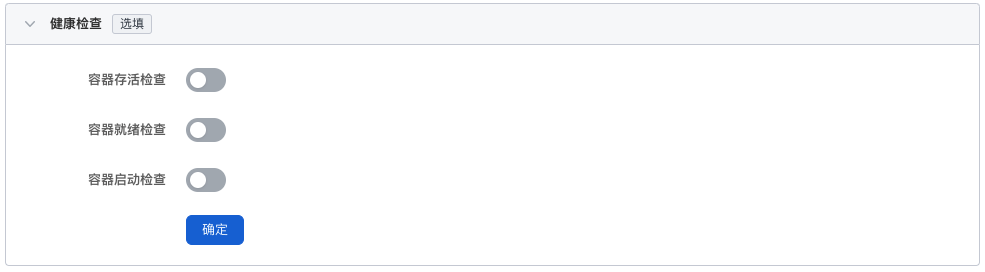
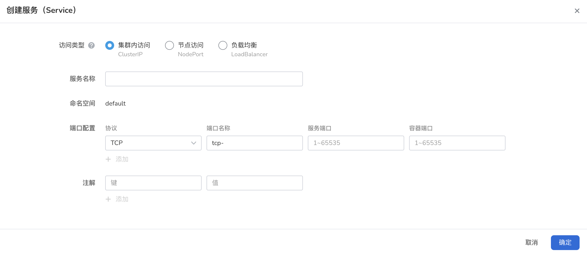

# 通过镜像创建任务

任务（Job）适用于一次性的任务执行，会创建一个或者多个 Pod，并将继续重试 Pod 的执行，直到指定数量的 Pod 成功终止。 随着 Pod 成功结束，Job 将跟踪记录成功完成的 Pod 个数。 当数量达到指定的成功个数阈值时，Job 结束。 删除 Job 的操作会清除所创建的全部 Pod。 挂起 Job 的操作会删除 Job 的所有活跃 Pod，直到 Job 被再次恢复执行。Job 根据 `.spec.completions` 设定完成标注：

1. 非并行 Job：

    - 通常只启动一个 Pod，除非该 Pod 失败。
    - 当 Pod 成功终止时，立即视 Job 为完成状态。
   
2. 具有确定完成计数的并行 Job：

    - `.spec.completions` 字段设置为非 0 的正数值。
    - Job 用来代表整个任务，当成功的 Pod 个数达到 `.spec.completions` 时，Job 被视为完成。
    - 当使用 `.spec.completionMode="Indexed"` 时，每个 Pod 都会获得一个不同的 索引值，介于 0 和 `.spec.completions-1` 之间。

3. 带工作队列的并行 Job：

    - 不设置 `spec.completions`，默认值为 `.spec.parallelism`。
    - 多个 Pod 之间必须相互协调，或者借助外部服务确定每个 Pod 要处理哪个工作条目。 例如，任一 Pod 都可以从工作队列中取走最多 N 个工作条目。
    - 每个 Pod 都可以独立确定是否其它 Pod 都已完成，进而确定 Job 是否完成。
    - 当 Job 中 *任何* Pod 成功终止，不再创建新 Pod。
    - 一旦至少 1 个 Pod 成功完成，并且所有 Pod 都已终止，即可宣告 Job 成功完成。
    - 一旦任何 Pod 成功退出，任何其它 Pod 都不应再对此任务执行任何操作或生成任何输出。 所有 Pod 都应启动退出过程。

## 前提条件

通过镜像创建任务之前，需要满足以下前提条件：

- 容器管理平台[已接入 Kubernetes 集群](../Clusters/JoinACluster.md)或者[已创建 Kubernetes 集群](../Clusters/CreateCluster.md)，且能够访问集群的 UI 界面。

- 已完成一个[命名空间的创建](../Namespaces/createns.md)、[用户的创建](../../../ghippo/04UserGuide/01UserandAccess/User.md)，并将用户授权为`NS Edit`角色 ，详情可参考[命名空间授权](../Namespaces/createns.md)。

- 单个实例中有多个容器时，请确保容器使用的端口不冲突，否则部署会失效。

参考以下步骤，创建一个任务。

## 1. 登录平台

`NS Edit` 用户根据下表的信息成功登录后，点击左侧导航栏的`集群列表`进入集群列表。

| 参数                   | 说明                                                         | 举例值                       |
| :--------------------- | :----------------------------------------------------------- | :--------------------------- |
| UI 账户和密码          | 【类型】必填 【含义】用来登录容器管理平台 Web UI 的管理员账户和密码 | 账户：root 密码：****** |
| 容器平台的 Web UI 地址 | 【类型】必填 【含义】容器管理平台的 Web UI 的 IP 地址   | 10.6.124.110                 |

## 2. 镜像创建

1. 点击一个集群名称，进入`集群详情`。

    

2. 点击左侧导航栏的`工作负载`进入工作负载列表，点击`任务`页签，点击右上角`镜像创建`按钮。

    

3. 屏幕将显示`创建任务`页面。

## 3. 基本信息配置

在`创建任务`页面中，根据下表输入基本信息后，点击`下一步`开始[容器配置](#4-容器配置)。

| 参数     | 说明                                                         | 举例值       |
| :------- | :----------------------------------------------------------- | :----------- |
| 负载名称 | 【类型】必填 【含义】输入新建工作负载的名称，命名必须唯一。 【注意】请输入4 到 63 个字符的字符串，可以包含小写英文字母、数字和中划线（-），并以小写英文字母开头，小写英文字母或数字结尾。 | job-01   |
| 集群     | 【类型】必选 【含义】选择新建工作负载所在的集群。 【注意】在集群内创建工作负载时，将在当前集群中创建工作负载。集群不可更改。当在集群外部创建工作负载时，将在所选集群创建工作负载。 | Cluster-01   |
| 命名空间 | 【类型】必选 【含义】选择新建工作负载所在的命名空间。关于命名空间更多信息请参考[命名空间概述](http://dwiki.daocloud.io)。 【注意】若您不设置命名空间，系统会默认使用 default 命名空间。 | Namespace-01 |
| 实例数   | 【类型】可选 【含义】输入工作负载的 [Pod](http://dwiki.daocloud.io) 实例数量。 【注意】若您不设置实例数量，系统会默认创建 2 个 Pod 实例。 | 2            |
| 描述     | 【类型】可选 【含义】输入工作负载的描述信息，内容自定义。 【注意】字符数量应不超过 512 个。 | --           |

## 4. 容器配置

容器配置仅针对单个容器进行配置，如需在一个容器组中添加多个容器，可点击左侧的 `+` 添加多个容器。

完成以下所有容器配置信息后，点击`下一步`进行[服务配置](#5-服务配置)。

### 基本信息（必填）

按照下表输入信息后，点击`确认`。

| 参数      | 说明                                                         | 举例值       |
| :-------- | :----------------------------------------------------------- | :----------- |
| 容器名称* | 【类型】必选 【含义】输入新建容器的名称。 【注意】请输入 4 到 63 个字符的字符串，可以包含小写英文字母、数字和中划线（-），并以小写英文字母开头，小写英文字母或数字结尾。 | backup_log   |
| 容器镜像* | 【类型】必选 【含义】从镜像仓库选择的镜像名称，同时也支持手动输入镜像名称（名称需为镜像仓库中已有的镜像名，否则将无法获取），如需对接外部私有镜像，需要先[创建镜像仓库密钥](../ConfigMapsandSecrets/create-secret.md)，然后拉取镜像。 | backupjob    |
| 更新策略  | 【类型】可选 【含义】容器执行更新时，镜像拉取策略。 【注意】开启后工作负载每次重启/升级均会重新拉取镜像，否则只会在节点上不存在同名同版本镜像时拉取镜像 | 总是拉取镜像 |
| 特权容器  | 【类型】可选 【含义】默认情况下，容器不可以访问宿主机上的任何设备，开启特权容器后，容器即可访问宿主机上的所有设备，享有宿主机上的运行进程的所有权限。 | 特权容器     |
| CPU 配额  | 【类型】可选 【含义】容器 CPU 资源的最低使用量和最高限度。 申请：容器需要使用的最小 CPU 值。 限制：允许容器使用的CPU最大值。建议设容器配额的最高限额，避免容器资源超额导致系统故障。 | --           |
| 内存配额  | 【类型】可选 【含义】容器内存资源的最低使用量和最高限度。 申请：容器需要使用的最小内存值。 限制：允许容器使用的内存最大值。建议设容器配额的最高限额，避免容器资源超额导致系统故障。 | --           |

### 生命周期（选填）

容器生命周期配置用于设置容器启动时、启动后、停止前需要执行的命令。具体详情请参照[容器生命周期配置](PodConfig/lifescycle.md)。

### 健康检查（选填）

容器健康检查用于判断容器和应用的健康状态。有助于提高应用的可用性。具体详情请参考[容器健康检查配置](PodConfig/healthcheck.md)。

### 环境变量（选填）

容器环境变量配置用于配置 Pod 内的容器参数，为 Pod 添加环境标志或传递配置等。具体详情请参考[容器环境变量配置](PodConfig/EnvironmentVariables.md)。

### 数据存储（选填）

容器数据存储配置用于配置容器挂载数据卷和数据持久化设置。具体详情请参考[容器数据存储配置](http://dwiki.daocloud.io)。

### 安全设置（选填）

按照下表对容器权限进行设置，保护系统和其他容器不受其影响。

### 容器日志（选填）

设置容器日志采集策略、配置日志目录。用于收集容器日志便于统一管理和分析。具体详情请参考[容器日志配置](http://dwiki.daocloud.io)。

## 5. 服务配置

对工作负载访问方式进行设置，可以设置服务访问方式。

1. 点击`创建服务`按钮。

    

2. 选择访问服务的各项信息，具体详情请参考[创建服务](../ServicesandRoutes/CreatingServices.md)。

    

3. 点击`确定`，点击`下一步`。

## 6. 高级配置

除了基本信息配置，DCE 还提供了丰富的高级配置，可对的升级策略、调度策略、标签与注解等功能进行配置。

### 任务设置

| 参数     | 说明                                                         | 举例值 |
| :------- | :----------------------------------------------------------- | :----- |
| 并行数   | 【类型】必选 【含义】任务负载执行过程中允许同时创建的最大 Pod 数，并行数应不大于 Pod 总数 | 2      |
| 超时时间 | 【类型】必选 【含义】当任务执行超出该时间时，任务将会被标识为执行失败，任务下的所有 Pod 都会被删除。为空时表示不设置超时时间。 | 3      |

### 标签与注解

可以点击添加按钮为工作负载实例 Pod 添加标签和注解。

## 7. 完成创建

确认所有参数输入完成后，点击`创建`按钮，完成工作负载创建。等待工作负载状态变为`运行中`。如果工作负载状态出现异常，请查看具体异常信息，可参考[工作负载状态](../Workloads/PodConfig/workload-status.md)。
