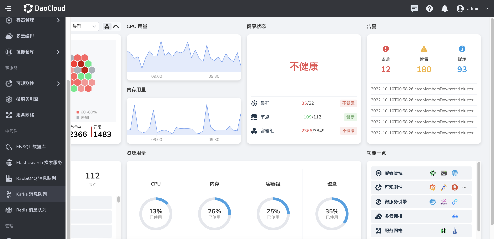

# 首次进入 Kafka

请提前联系管理员在`容器管理` -> `Helm 应用`安装好 kafka-operator 后，执行以下操作。

1. 在左侧导航栏中选择 `Kafka 消息队列`。

    

2. 在弹窗中选择一个工作空间后，点击`确认`。

    

    !!! note
    
        如果未出现弹窗，可手动点击左上角图标后选择一个工作空间。

    

3. 初次使用时，可以点击`立即部署`来创建 Kafka 实例。

    
