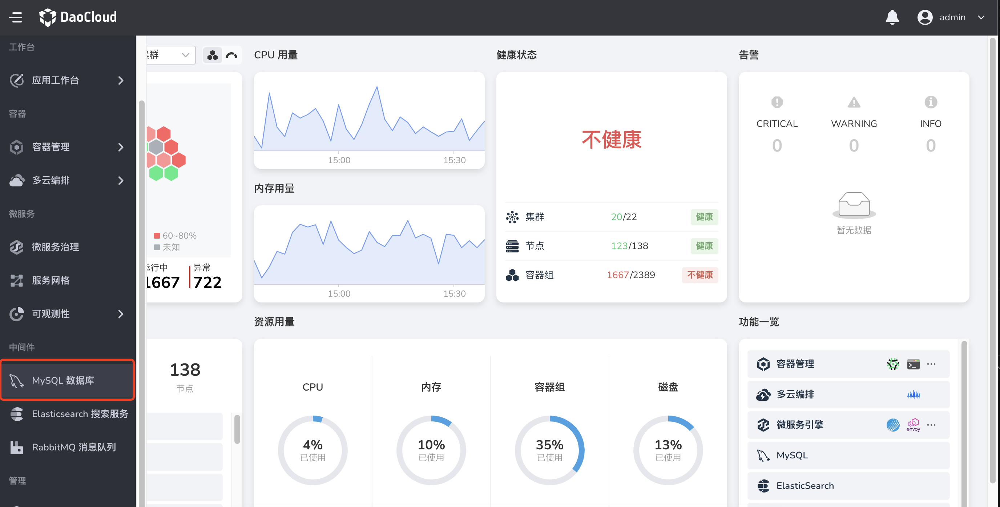

# 首次使用 MySQL

请提前联系管理员在 `容器管理 → helm 应用` 安装好 MySQL-Operator 后，执行以下操作。

1. 在左侧导航栏中选择 `MySQL 数据库`。

    

2. 在弹窗中选择一个工作空间后，点击`确认`。

    

    > 如果未出现弹窗，可手动点击左上角图标后选择一个工作空间。

    

3. 将显示所有 MySQL 数据库服务实例及其运行状态等信息。

    