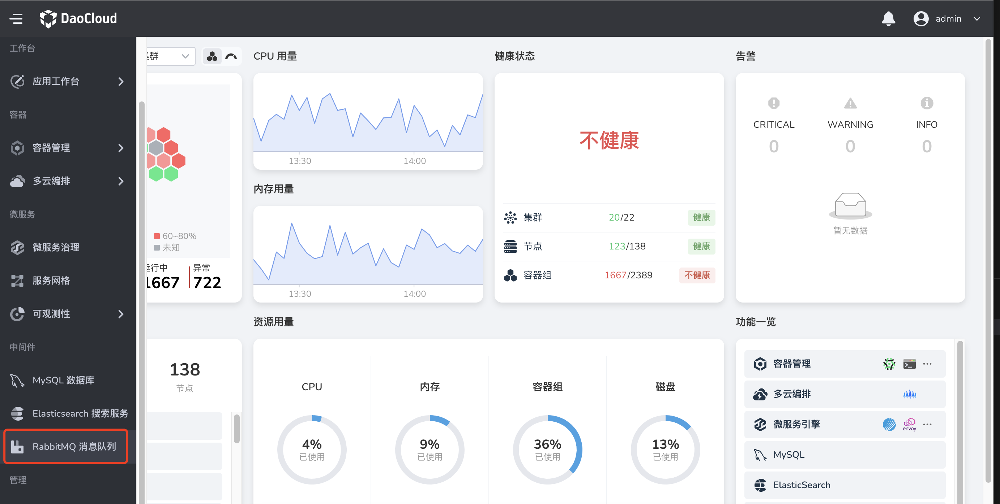
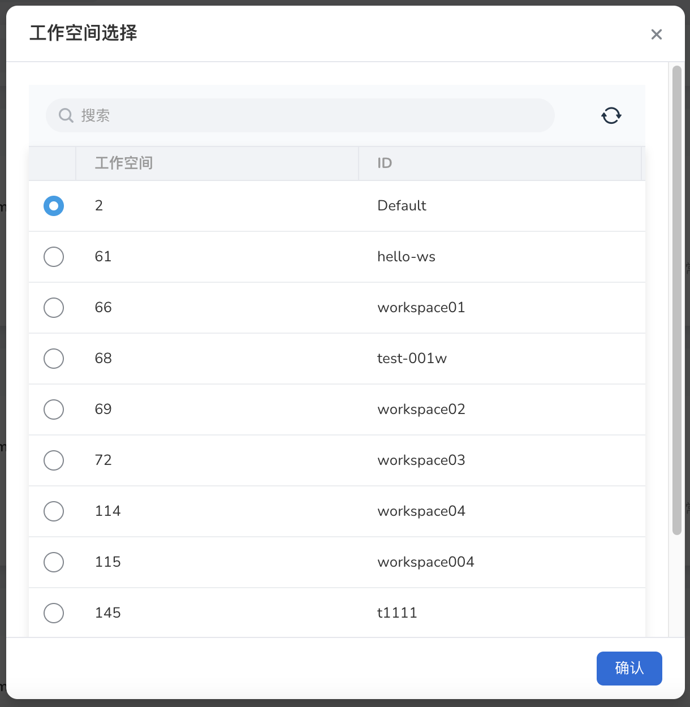

# 首次进入 RabbitMQ

请提前联系管理员在 `容器管理 → helm 应用` 安装好 RabbitMQ-Operator 后，执行以下操作。

1. 在左侧导航栏中选择 `RabbitMQ 消息队列`。

  

2. 在弹窗中选择一个工作空间后，点击`确认`。

  

  > 如果未出现弹窗，可手动点击左上角图标后选择一个工作空间。

  

3. 将显示所有 RabbitMQ 消息队列实例及其运行状态等信息。

  