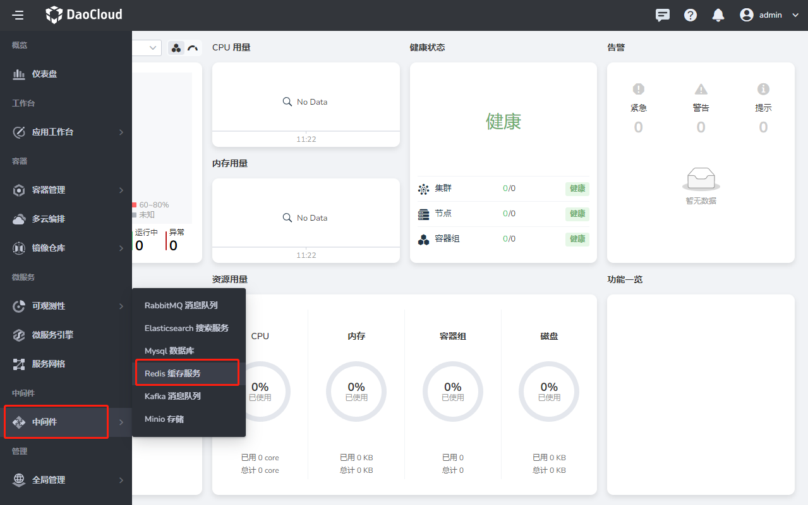
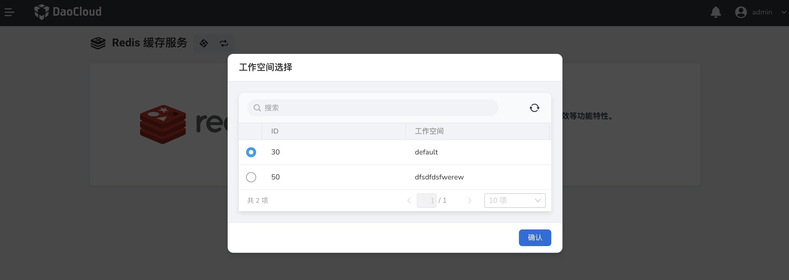
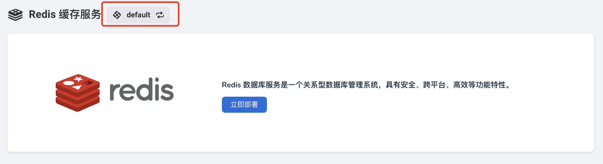

# 首次使用 Redis

请提前联系管理员在 `容器管理 -> helm 应用` 安装好 Redis-Operator 后，执行以下操作。

1. 在左侧导航栏中选择 `Redis 缓存服务`。

    

2. 在弹窗中选择一个工作空间后，点击`确认`。

    

    !!! note
    
        如果未出现弹窗，可手动点击左上角图标后选择一个工作空间。

    
