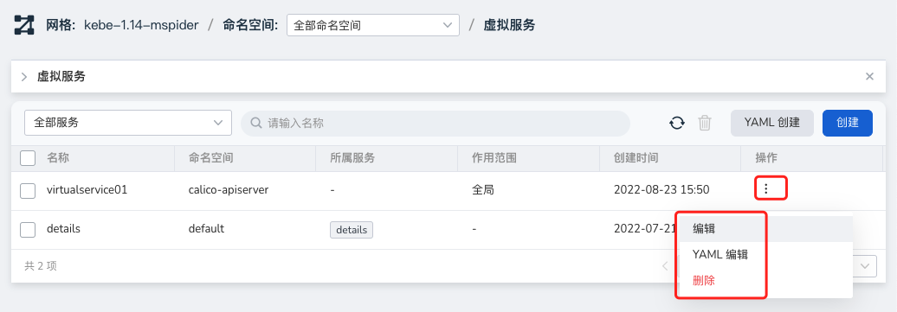

# 虚拟服务

在虚拟服务中，可以通过多种匹配方式（端口、host、header 等）实现对不同的地域、用户请求做路由转发，分发至特定的服务版本中，并按权重比划分负载。

虚拟服务提供了 HTTP、TCP、TLS 三种协议的路由支持。

## 概念介绍

### Hosts

流量的目标主机。可以来自服务注册信息，服务条目（service entry），或用户自定义的服务域名。可以是带有通配符前缀的 DNS 名称，也可以是 IP 地址。根据所在平台情况，还可能使用短名称来代替 FQDN。这种场景下，短名称到 FQDN 的具体转换过程是要靠下层平台完成的。

一个主机名只能在一个 VirtualService 中定义。同一个 VirtualService 中可以用于控制多个 HTTP 和 TCP 端口的流量属性。

需要注意的是，当使用服务的短名称时（例如使用 reviews，而不是 `reviews.default.svc.cluster.local`），Istio 会根据规则所在的命名空间来处理这一名称，而非服务所在的命名空间。假设 `default` 命名空间的一条规则中包含了一个 reviews 的 host 引用，就会被视为 `reviews.default.svc.cluster.local`，而不会考虑 reviews 服务所在的命名空间。

为了避免可能的错误配置，建议使用 FQDN 来进行服务引用。hosts 字段对 HTTP 和 TCP 服务都是有效的。网格中的服务也就是在服务注册表中注册的服务，必须使用他们的注册名进行引用；只有 Gateway 定义的服务才可以使用 IP 地址。

示例：

```yaml
spec:
  hosts:
  - ratings.prod.svc.cluster.local
```

### gateways

通过将 VirtualService 绑定到同一 Host 的网关规则，可向网格外部暴露这些 Host。

网格使用默认保留字——mesh 指代网格中的所有 Sidecar。当这一字段被省略时，就会使用缺省值（mesh），也就是针对网格中的所有 Sidecar 生效。如果为 gateways 字段设置了网关规则（可以有多个），这一 VS 就只会应用到声明的网关规则中。如果想同时对网关规则和所有服务生效，需要显式的将 mesh 加入 gateways 列表。

示例：

```yaml
gateways:
  - bookinfo-gateway
  - mesh
```

### http

有序规则列表。该字段包含了针对http协议的所有路由配置功能，对名称前缀为 http-、http2-、grpc- 的服务端口，或者协议为 HTTP、HTTP2、GRPC 以及终结的 TLS，另外还有使用 HTTP、HTTP2 以及 GRPC 协议的 ServiceEntry 都是有效的。流量会使用匹配到的第一条规则。

http 下主要字段：

- Match

    匹配要激活的规则要满足的条件。单个匹配块内的所有条件都具有AND语义，而匹配块列表具有OR语义。如果任何一个匹配块成功，则匹配该规则。

- Route

    http规则可以重定向或转发（默认）流量。

- redirect

    http 规则可以重定向或转发（默认）流量. 如果在规则中指定了流量通过选项，则将忽略路由/重定向。重定向原语可用于将 HTTP 301 重定向发送到其他 URI 或 Authority。

- rewrite

    重写 HTTP URI 和 Authority header，重写不能与重定向原语一起使用。

- fault

    故障注入策略，适用于客户端的 HTTP 通信。如果在客户端启用了故障注入策略，则不会启用超时或重试。

- Mirror/mirrorPercent

    将 HTTP 流量镜像到另一个目标，并可以设置镜像比例。

- Tcp

    一个针对透传 TCP 流量的有序路由列表。TCP 路由对所有 HTTP 和 TLS 之外的端口生效。进入流量会使用匹配到的第一条规则。

- Tls

    一个有序列表，对应的是透传 TLS 和 HTTPS 流量。路由过程通常利用 ClientHello 消息中的 SNI 来完成。
    TLS 路由通常应用在 https-、tls- 前缀的平台服务端口，或者经 Gateway 透传的 HTTPS、TLS 协议端口，以及使用 HTTPS 或者 TLS 协议的 ServiceEntry 端口上。
    注意：没有关联 VirtualService 的 https- 或者 tls- 端口流量会被视为透传 TCP 流量。

    Tcp 协议和 tls 的子字段相对简单，仅包含 match 和 route 两部分，并且与 http 相似，不再累述。

## 操作步骤

服务网格提供了两种创建方式：向导和 YAML。通过向导创建的具体操作步骤如下：

1. 在左侧导航栏点击`流量治理` -> `虚拟服务`，点击右上角的`创建`按钮。

    

2. 在`创建虚拟服务`界面中，先进行基本配置后点击`下一步`。

    

3. 按屏幕提示选择进行路由配置后，点击`确定`。

    

4. 返回虚拟服务列表，屏幕提示创建成功。

    

5. 在列表右侧，点击操作一列的 `⋮`，可通过弹出菜单进行更多操作。

    
