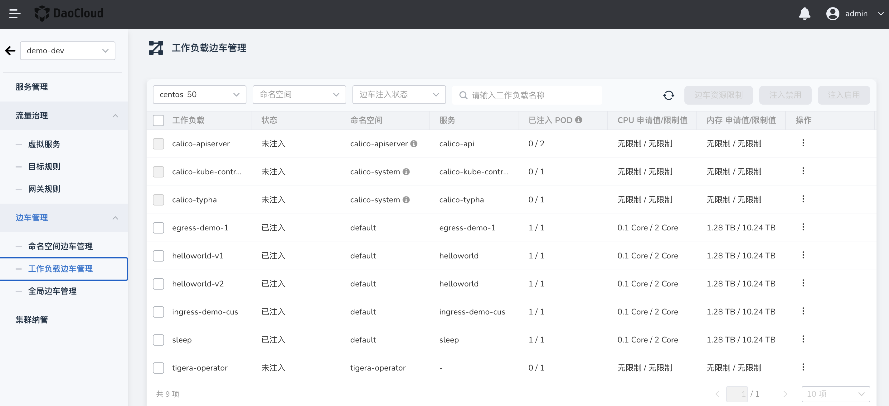
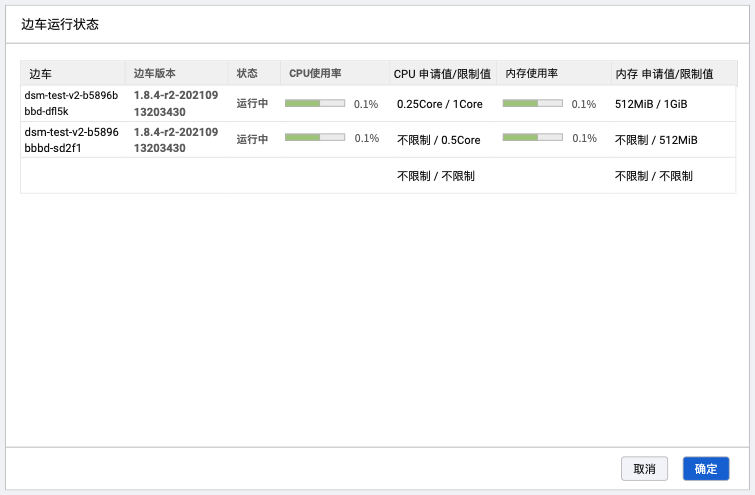
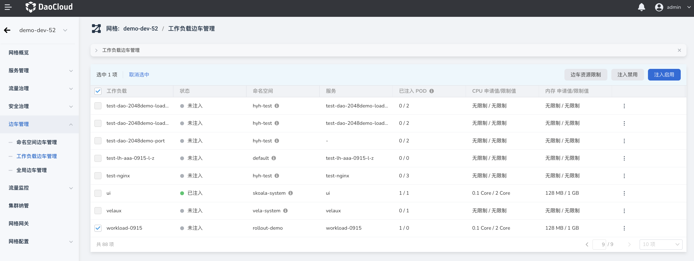
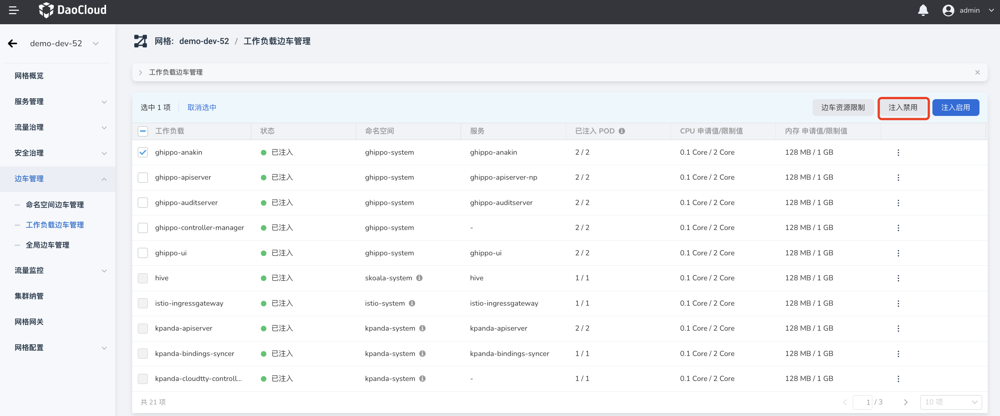
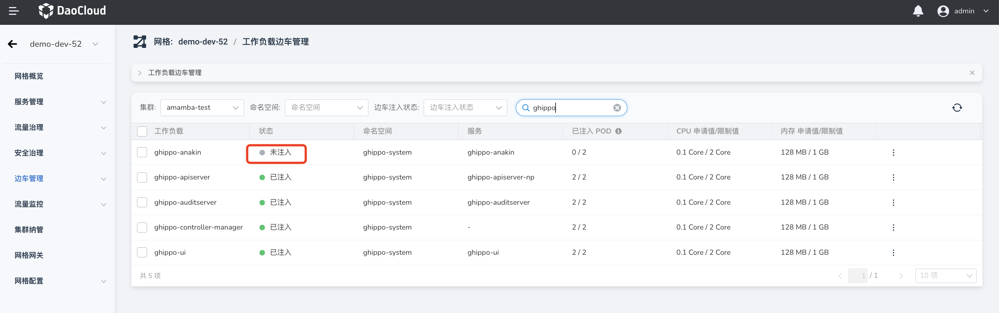
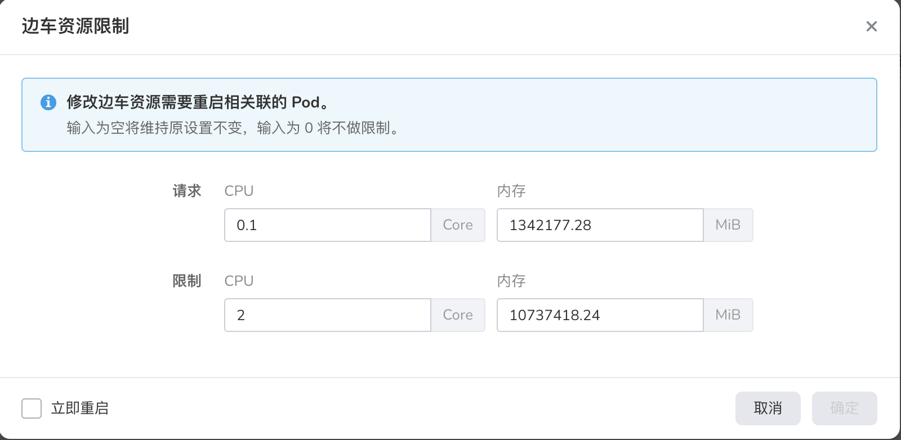

# 工作负载边车管理

用户可以对工作负载执行边车注入的查看、启用、禁用等操作，还可以为工作负载设置资源限制。

## 查看边车注入信息

在左侧导航栏中，点击`边车管理` -> `工作负载边车管理`，选择一个集群后，可以查看该集群下所有工作负载及其边车注入状态、所属命名空间、资源限制等信息。

各列的含义如下：

| 工作负载          | 所选集群下所有工作负载（不包含系统占用不可边车注入的工作负载） |
| ----------------- | ------------------------------------------------------------ |
| 状态              | 三个状态： 已注入 - 已完成边车自动注入 未注入 - 禁用边车自动注入 待重启 - 所述命名空间的 istio-injection 已发生变化，但相关 Pod 还未重启 |
| 命名空间          | 该工作负载所属命名空间；                                     |
| 服务              | 该工作负载相关服务，该项内容可能有多个，可采用扩缩列表，用户点击后浮动窗显示所有内容； |
| 已注入Pod         | 该工作负载下 Pod 的注入情况； 格式：已注入 Pod/所有可注入 Pod  如果工作负载的注入状态为`已注入`，但有部分 Pod 没有注入，例如 3/5，该项将高亮显示，提醒用户有注入失败的 Pod，需及时处理 |
| CPU申请值/限制值  | 包含`请求`资源和`限制`资源两个数值，如果用户未进行资源设置，该项目为`未设置`。 格式：请求 / 限制 |
| 内存申请值/限制值 | 包含`请求`资源和`限制`资源两个数值，如果用户未进行资源设置，该项目为`未设置`。 格式：请求 / 限制 |
| 操作              | 包含两个操作链接： 边车资源限制：对当前工作负载做资源设置，该操作对所有状态的工作负载有效； 查看边车状态：仅在状态为`注入`的工作负载中显示，调用`边车运行状态`对话框； |

当工作负载较多时，可以对工作负载名称进行排序，并通过搜索功能查找当前集群下的目标工作负载。

## 查看边车运行状态

在工作负载边车列表右侧，点击`操作`一列的图标 `┇`，在弹出的菜单中选择`查看边车状态`。可以查看边车当前运行状态及资源限制值。

## 启用边车注入

选择一个或多个工作负载后，可以启用边车自动注入功能。该操作会重启相关 Pod，因此请在执行该操作前确认 Pod 可以重启。具体操作步骤如下：

1. 选择一个或多个未启用边车注入的工作负载，点击右侧的`注入启用`按钮。
   
    

2. 在弹出对话框中，确认选择的工作负载数量是否正确，确认无误后，勾选`立即重启`，点击`确定`。
   
    

3. 返回工作负载的边车列表，可以看到所选工作负载的`状态`已变更为`已注入`。在完成工作负载的重启后，将完成边车注入，相关注入进度可查看`已注入 POD`这一列。

   

!!! note

    如果工作负载所属命名空间已执行`注入启用/禁用`操作但未重启工作负载，则该工作负载将无法执行新的边车相关操作。
    需先完成重启，才能执行新的边车操作。

## 禁用边车注入

选择一个或多个工作负载后，可以禁用边车自动注入功能。该操作会重启相关 Pod，因此请在执行该操作前确认 Pod 可以重启。具体操作步骤如下：

1. 选择一个或多个已启用边车注入的工作负载，点击右侧的`注入禁用`按钮。
   
    

2. 在弹出对话框中，确认选择的工作负载数量是否正确，确认无误后，勾选`立即重启`，点击`确定`。
   
    

3. 返回工作负载的边车列表，可以看到所选工作负载的`状态`已变更为`未注入`。相关卸载进度可查看`已注入 POD`这一列。

   

## 边车资源限制

为了防止工作负载的资源被过量使用，可以为工作负载设置资源使用限制。该操作会重启相关 Pod，因此请在执行该操作前确认 Pod 可以重启。具体操作步骤如下：

1. 选择一个（或多个）已启用边车注入的工作负载，点击`边车资源限制`按钮。

    

2. 弹出对话框中，分别设置 CPU/内存的请求值与限制值。选中`立即重启`，点击`确定`。

    

3. 在工作负载边车管理列表中，可以看到指定工作负载的 `CPU 申请值/限制值`和`内存申请值/限制值`内数据已更新。
