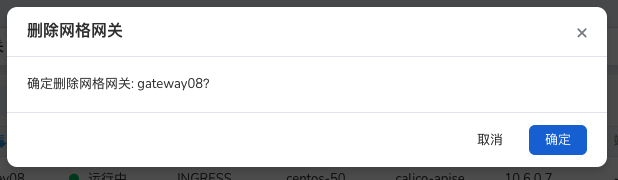
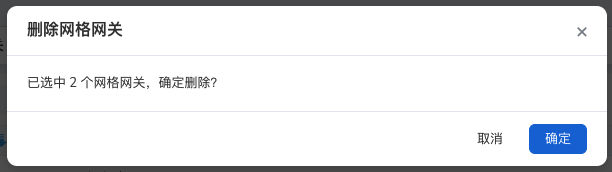

# 删除网格网关

如果想要从网关列表中删除一个集群时，可以按照以下步骤删除集群。

## 删除一个网关

这是推荐操作，可以防止误删除。

1. 在左侧导航栏点击`网格网关`，在网格列表右侧点击 `...` 按钮，在弹出菜单中选择`删除`。

    

2. 在弹出窗口中，确认信息无误后，点击`确定`，该网关将被删除。

    

> 注意：删除网关后，该网关相关的信息将会丢失，请谨慎操作。

## 批量删除

如果确实需要一次性删除多个网关，可以采用此项操作。

1. 在网关列表中勾选多个网关后，点击右上角的垃圾箱图标。

    

2. 在弹出窗口中，确认信息无误后，点击`确定`，选中的网关将全部被删除。

    

> 注意：如非必要，请勿使用批量删除功能，删除的网关无法恢复，请谨慎操作。
