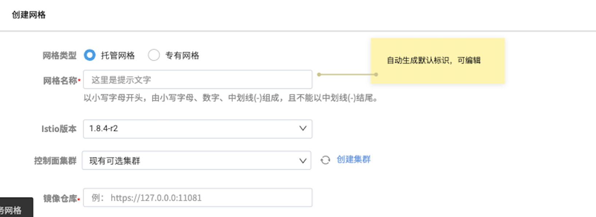
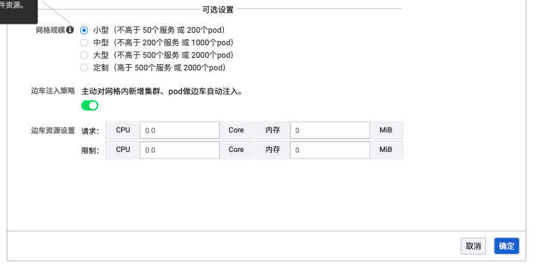

# 创建网格

托管网格指的是将控制面组件从用户集群中分离，部署到一个独立的控制面集群中，减轻用户运维负担和资源消耗，用户只需基于网格进行服务管理。

DCE 5.0 服务网格支持创建托管网格、专有网格、外接网格。创建托管网格/专有网格的步骤如下：

!!! info

    专有与托管网格的区别在于，专有网格不需要控制面集群。
    有关如何接入外部网格的信息，请参见[接入外部网格](integrate-mesh.md)。

1. 在服务网格列表页面的右上角，点击`创建网格`。

    

2. 选择`托管网格`或`专有网格`，填写网格配置信息。
   
    - 网格名称：以小写字母开头，由小写字母、数字、中划线(-)组成，且不能以中划线(-)结尾
    - 别名：用于提高易用性和网格识别度，可输入字母、数字、中文及其他符号，60 个字符以内
    - Istio 版本：当前系统可以支持的 Istio 版本号
    - 控制面集群：用于运行网格管理面的集群，列表包含当前网格平台可以访问且状态正常的集群。该项附带一个刷新图标和一个`创建集群`按钮。点击`创建集群`将跳转至`容器管理平台`创建新集群，创建完成后返回本页面，点击刷新图标更新列表。
    - 镜像仓库：输入镜像仓库的 URL 地址。
  
    

3. 点击`确定`按钮，完成网格创建。系统自动返回网格列表，可以查看和管理新增的网格。

!!! info

    创建托管网格后，还未接入任何托管的集群，此时网格处于`未就绪`状态。用户可以[添加集群](../08ClusterManagement/README.md)，选择需要服务治理的集群接入。

## 可选设置

正确填写基本配置后就可以成功创建基本的托管网格。如需使用高级功能，可以点击`可选设置`填写可选配置。

- 网格规模：包含四个规模选项，提供了与所选规模相关的资源建议信息
- 边车注入策略：可以启用/禁用网格层面的边车自动注入策略，启用后所有接入集群将自动注入边车
- 边车资源设置：对网格下所有集群的注入边车进行资源限制，可作为网格下的默认边车资源值。各层级的边车资源限制规则执行优先级为：工作负载级资源限制 -> 集群级资源限制 - > 网格资源限制

