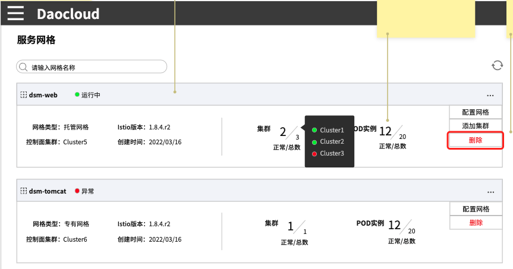

# 删除网格

当用户不再使用网格治理服务时可以使用删除操作，删除网格需用户完成一系列前置操作，才可以激活对话框的`确定`按钮。

> [!Note|style:flat] 执行删除操作后，网格不可恢复，如需再次纳管，需重新创建配置网格。

1. 在网格列表的右侧，点击 `...` 按钮，在弹出菜单中选择`删除`。

    

2. 在`删除网格`页面中，系统将自动检测是否满足删除条件。

    

    - 如果有残留的边车，则点击`边车管理页面`按钮，卸载当前网格下所有集群的边车注入并完成重启，具体操作可参考[命名空间边车禁用](../07SidecarManagement/NamespaceSidecar.md)和[工作负载边车禁用](../07SidecarManagement/WorkloadSidecar.md)。

    - 如果有残留的网格网关，则点击`网格网关页面`按钮，确认并删除该网格下所有网关，建议在删除前确认此操作不会对原有服务产生影响。

    - 如果有残留的集群，则点击`集群纳管页面`按钮，移除该网格下纳管的所有集群。

3. 清除所有依赖项之后，勾选复选框`执行删除操作后，网格不可恢复，如果再次纳管，需重新创建配置网格。`，`确定`按钮被激活。

4. 点击`确定`按钮，完成删除网格的操作。
