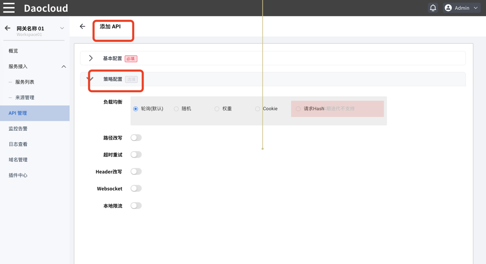
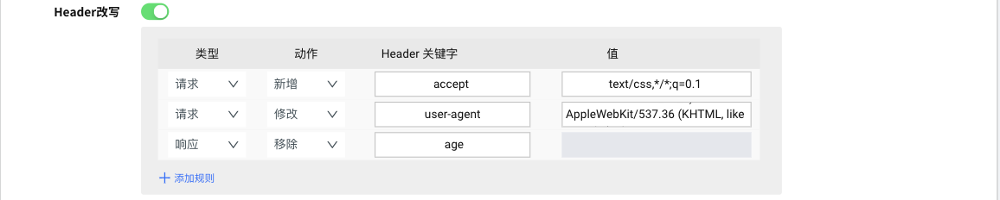

# 配置 API 策略

有两种方式可以配置 API 策略：

- 在创建 API 的过程中设置策略

  

- 在 API 创建完成后通过[更新 API 策略配置](manage-api.md#更新-api)进行调整。

当前支持的策略配置如下，根据业务需要自行配置即可：

## 负载均衡

当后端服务配置为多服务时，可以根据不同的细分规则实现负载均衡。

- 轮询
  
  默认的负载均衡策略，网关会按顺序将请求依次分发到后端服务。此规则可以在流量较小时保障平均分配。

- 随机
  
  选择随机规则时，网关会随机将请求分发给后端的任一服务。在流量较小时，部分后端服务可能会负载较多。

- 权重
  
  选择根据权重进行路由分配时，会根据 API 配置中多个后端服务的权重数值来分发请求。权重数值越大，优先级越高，承担的流量也相对较多。

- Cookie
  
  选择根据 Cookie 进行分配时，网关会将来源请求头中属于相同 Cookie 的流量分发到固定的后端服务商，这在后端服务会根据 Cookie 进行不同响应处理时有效

- 请求 Hash
  
  选择请求 Hash 时，可以通过一些高级策略来进负载均衡分配。当前支持的 Hash 策略为：IP、请求参数。

## 路径改写

当对外暴露的 API 路径与后端服务提供的路径不一致时可以配置路径改写功能。当启用此功能时，必须配置正确的重写路径，网关会将外部请求流量转发到重写后的路径。

## 超时重试

此策略可以控制请求响应超时的最大时长，减少异常处理导致的阻塞问题，支持的超时时长类型为：

- ms 毫秒
- s 秒

支持数值类型为 >=1 的整数值。

## Header 改写

此策略可以实现对来源请求的 Header 参数处理，目前支持的方式基本包含了 Header 参数调整的全部策略。

目前支持对特定的请求/响应 Header 的关键字进行如下操作：
  
- 增加关键字，支持增加对应的关键字和值
- 修改关键字，支持通过关键字来选定并赋予新值
- 删除关键字，支持删除特定的关键字

## Websocket

启用此配置可以为端口启用 Websocket 通信能力。

## 本地限流

微服务网关支持丰富的限流能力，支持在 API 层级启用本地限流能力。基础配置包括请求速率和超时时长两项参数，通过自定义配置可以设置允许溢出速率、限制返回码等更多参数。

>除了在 API 层级的本地限流能力之外，还可以通过[域名管理](../domain/manage-domain.md)针对整个域名进行限流处理。当 API 与域名同时配置限流策略时，以 API 层级的限流策略为准。

- `请求速率 (Max)`

  允许的超时时长内允许的最大请求速率,支持输入 >=1 的整数
  
- `超时时长`

  支持的时间单位包括：秒/分钟/小时/天

- `允许溢出速率`
  
  当达到预设的最大请求速率时，仍旧允许一部分请求处理，非常适用于业务突增的流量高峰时段
  支持输入 >=1 的整数

- `限制返回`
  
  默认返回码为 429

- `Header 关键字`

  默认为空，可根据需求自行设置

