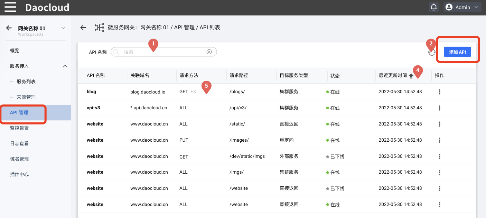
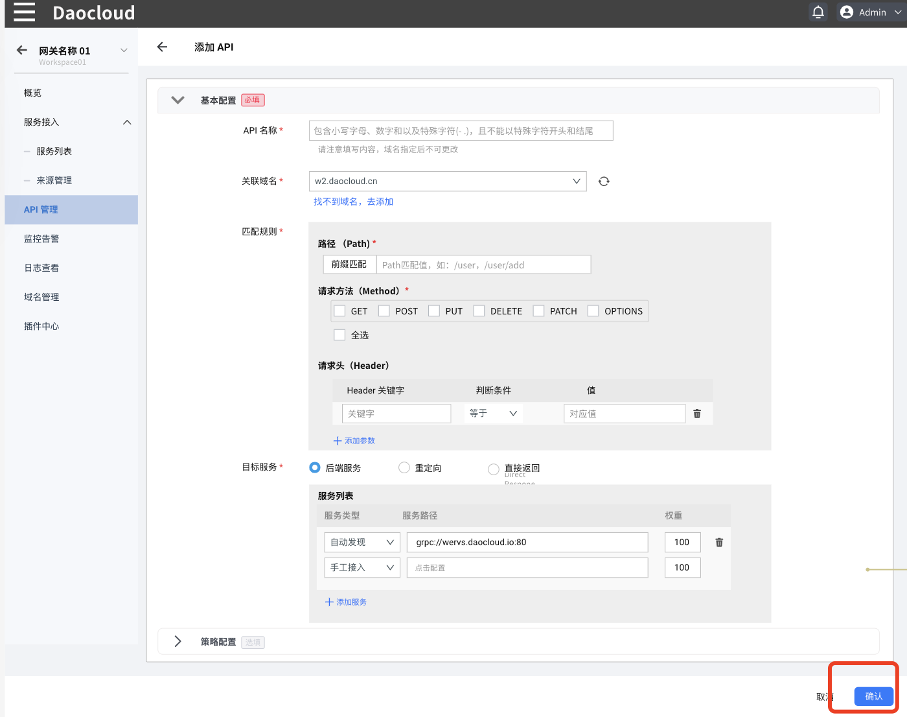
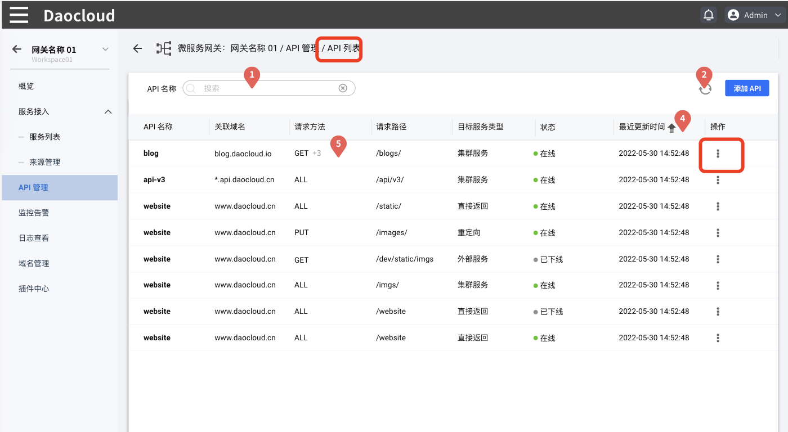
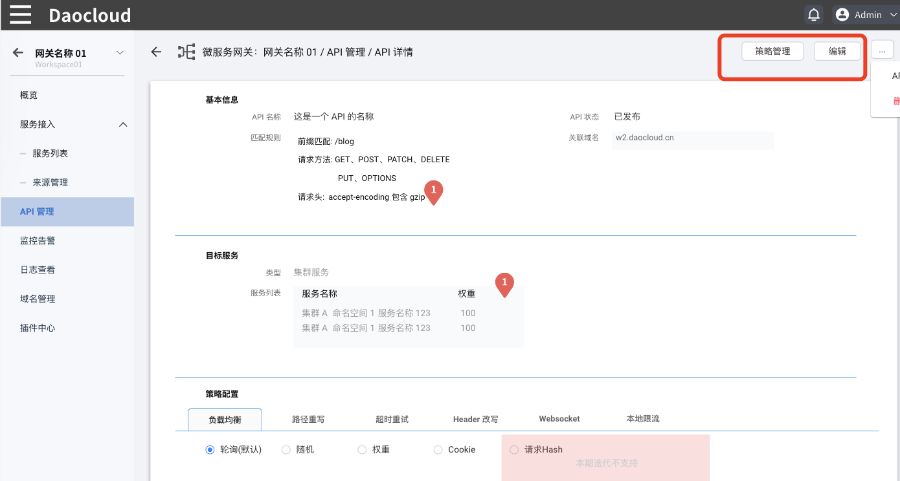
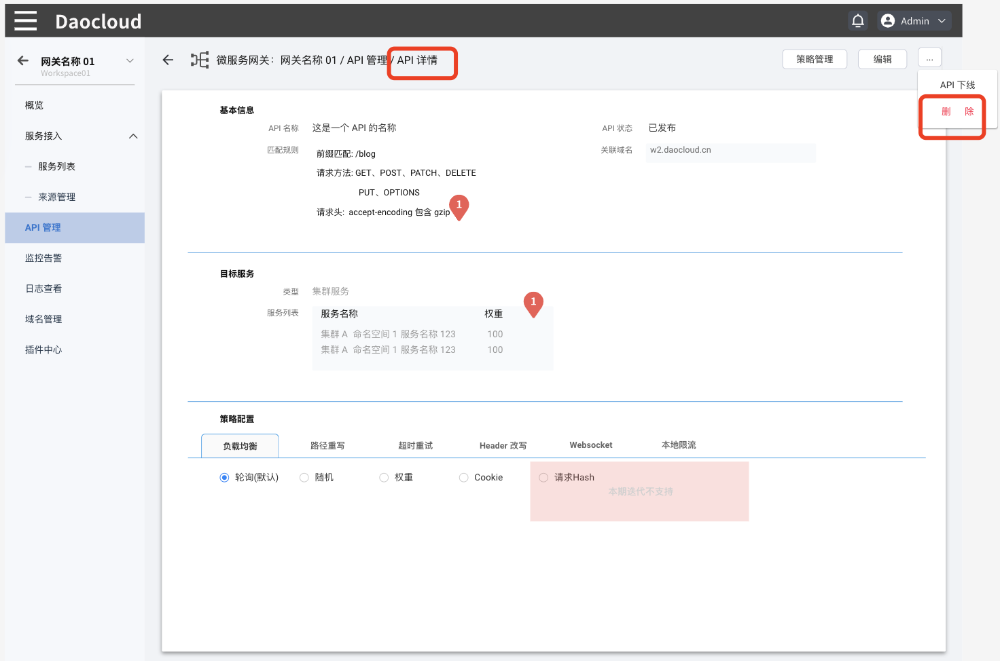
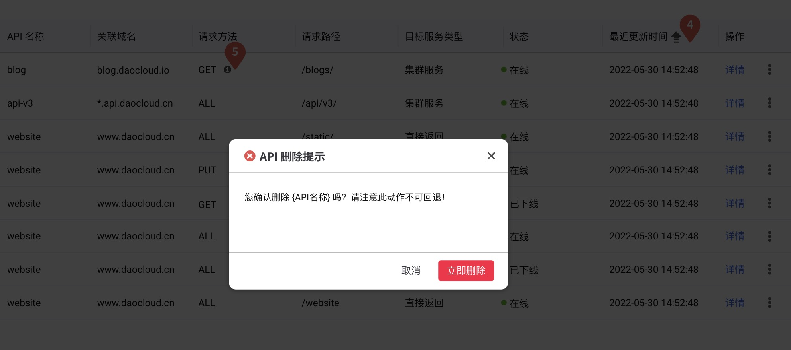

# API 管理

微服务网关提供网关实例的 API 路由全生命周期管理，包括 API 的创建、更新和删除。

## 创建 API

在网关实例列表页面点击网关名称进入网关实例，在左侧导航栏点击 `API 管理`，然后在页面右上角点击 `创建 API`，进入 API 的创建页面。

### 填写基本配置信息

参照下表填写 API 的基础配置：

|配置名称|填写要求|注意事项|
|--|--|--|
|API 名称|包含小写字母、数字和以及特殊字符(- .)，且不能以特殊字符开头和结尾|创建完成后不可以修改|
|关联域名|指 API 访问的域名，API 配置完成并上线后，可以通过域名+Path 来访问 API|域名不存在时，需要先去域名管理页面[创建域名](../domain/manage-domain.md)|
|匹配规则-路径|支持前缀配置，这里设定的是外部服务请求的 API 前缀|限定前缀后，只允许符合前缀的请求通过|
|匹配规则-请求方法|网关目前支持 GET、POST、PUT、DELETE、PATCH、OPTIONS 等主流方法|限定方法后，只允许符合方法的请求通过|
|匹配规则-请求头|配置对应的 Header 关键字和判断条件，以及对应的值|限定 Header 字段后，只允许服务字段要求的请求通过。 配置多个 Header 时，需要同时满足多个 Header 条件才能通过|
|目标服务-后端服务|即当请求到达时，网关调用应该调用哪个后端服务。下拉选择对应的服务类型，并点击中间空白配置对应的服务|支持多服务间的权重配置|
|目标服务-重定向|配置重定向后，所有的请求都会被转发到重定向后的地址|/|
|目标服务-直接返回|支持 MockAPI 功能，简单配置响应内容和响应状态码即可|/|

### 填写策略配置

策略配置属于选填内容，如需进行设置，可参考 [配置 API 策略](api-policy.md)。

### 完成创建

填写好所有配置之后，在页面右下角点击确定完成API的创建。

## 更新 API

更新  API  可以分为更新其基本信息和策略配置两种操作。

### 更新 API 基本信息

在 `API 管理`页面找到需要更新的 API，在该 API 的右侧**`ⵗ`**操作按钮下选择`基本信息`。

### 更新 API 策略配置

在 `API 管理`页面找到需要更新的 API，在该 API 的右侧**`ⵗ`**操作按钮下选择`编辑策略`。有关 API 策略配置的详细说明，可参考 [API 策略配置](api-policy.md)。

此外，也可以在 API 详情页点击`编辑`更新基本信息，点击`策略管理`更新策略。

## 删除 API

> 注意：删除操作是不可逆的。无论 API 是否处于在线状态，删除后均立即失效。

有两种方式可以删除 API：

- 在 `API 列表`页面找到需要删除的 API，在该 API 的右侧 **`ⵗ`** 操作按钮下选择`删除`。

  

- 在 `API 列表`点击需要删除的 API 的名称，进入该 API 的详情页，在页面右上角点击 **`ⵈ`** 操作按钮然后选择`删除`，

  

为了防止误删，点击删除按钮后，需要输入 API 的名称进行二次确认。

