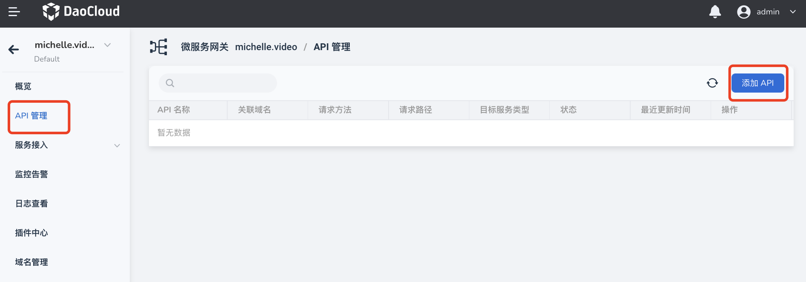
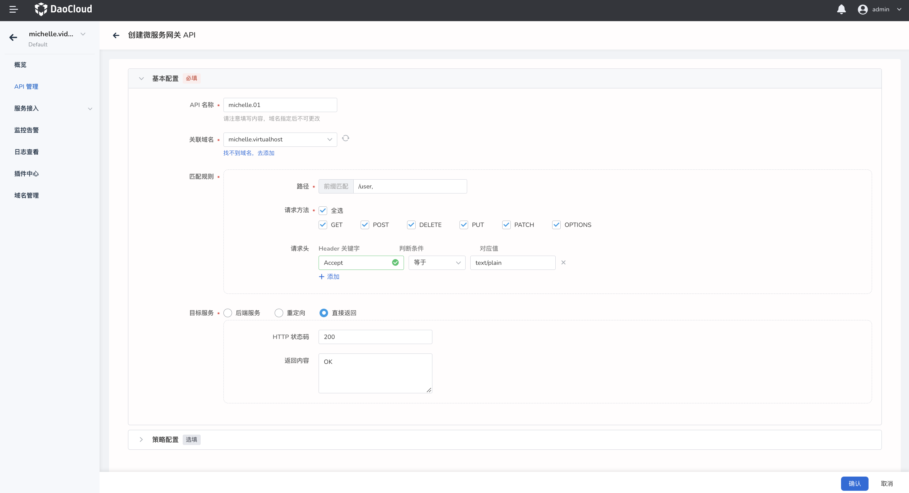
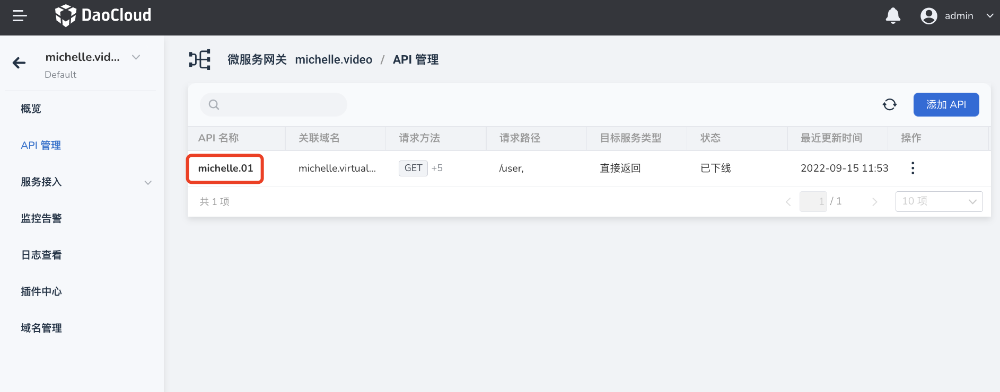
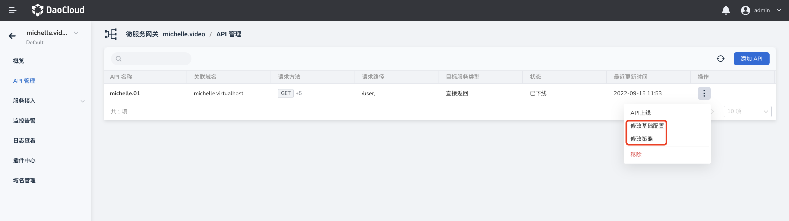
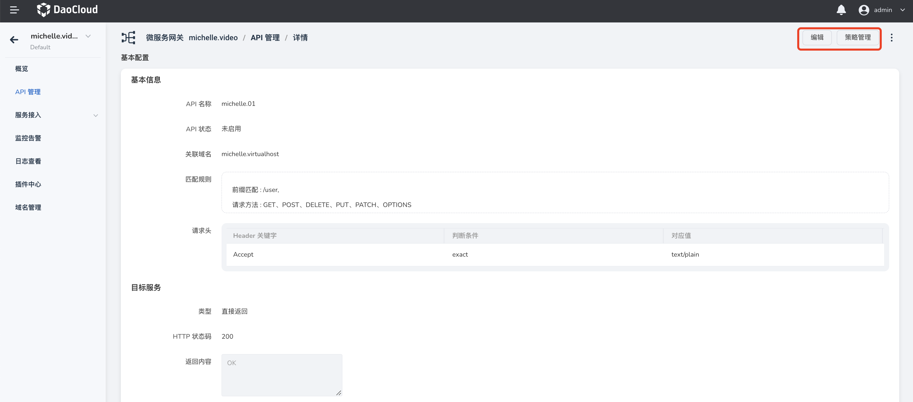
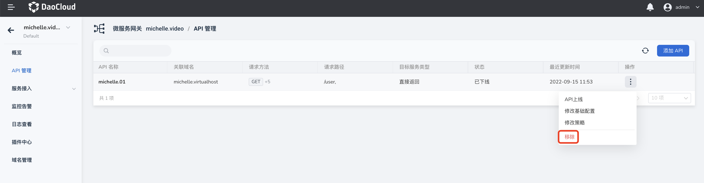
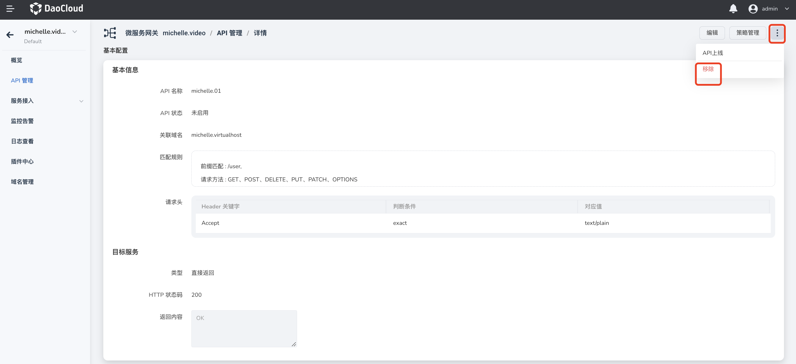

# 管理 API

微服务网关支持对网关实例的 API 进行全生命周期管理，包括 API 的添加、更新和删除。

## 添加 API

创建 API 的步骤如下：

1. 点击网关名称进入网关实例，在左侧导航栏点击 `API 管理`，然后在页面右上角点击 `添加 API`，进入 API 的创建页面。

    

2. 填写配置信息

    填写配置信息时需要注意：

    - API 名称：包含小写字母、数字和以及特殊字符(- .)，不能以特殊字符开头和结尾。
    - 关联域名：API 访问的域名。API 配置完成并上线后，可以通过域名 + 路径的方式访问 API。找不到域名时可以添加新的域名。有关添加域名的详细信息，请参见[管理域名](../domain/manage-domain.md)
    - 匹配规则：只允许符合该规则的请求通过。如果设置了多条规则，需要同时满足所有规则才能放行。
    - 目标服务：请求通过网关后，将请求发送到后端服务，或者重定向，或者直接返回 HTTP 状态码。

        

3. 在页面右下角点击`确认`

    点击`确认`后，如果所有配置都正常，右上角会弹出添加成功的提示信息。可以在 `API 管理`页面看到新建的 API。

    

## 更新 API

可以通过两种方式更新 API 的基础配置或策略配置。

- 在 `API 管理`页面找到需要更新的 API，在该 API 的右侧点击 **`ⵗ`** 选择`修改基础配置`或`修改策略`。

    

- 点击 API 名称进入 API 详情页，在页面右上角点击`编辑`更新基本信息，点击`策略管理`更新策略。

    

## 移除 API

可以通过两种方式移除 API。

!!!danger

    注意：删除操作是不可逆的。无论 API 是否处于在线状态，删除后均立即失效并且不可恢复。

- 在 `API 管理`页面找到需要删除的 API，在该 API 的右侧点击 **`ⵗ`** 并选择`移除`。

    

- 点击 API 名称进入 API 详情页，在页面右上角点击 **`ⵈ`** 操并选择`移除`。

    
