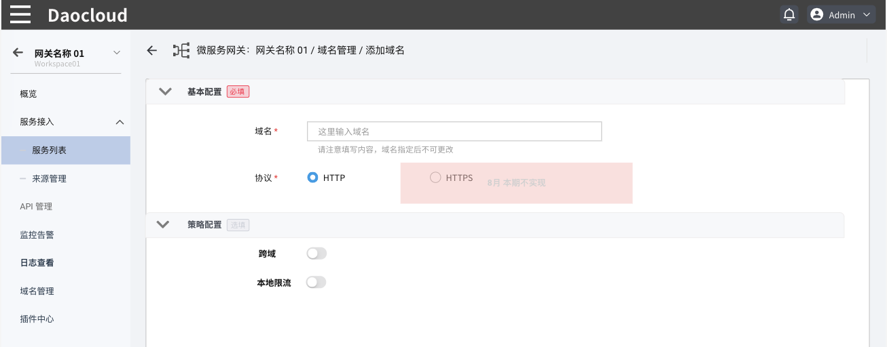

# 配置域名策略

微服务网关提供了域名级的策略配置能力。配置域名级的策略之后，就无需对同一域名下的多个 API 重复配置策略。目前支持两种域名级的策略：跨域支持和本地限流。

有两种方式可以配置域名策略：

- 在创建域名的过程中配置策略

  

- 在域名创建完成后通过[修改域名策略](manage-domain.md#修改域名)进行调整。

当前支持的策略配置如下，根据业务需要自行配置即可：

## 跨域

参照下表填写配置信息：

|配置名称|含义|填写要求|
|--|--|--|
|启用凭证|开启凭证后，跨域请求将会检查凭证|点击滑块开启或关闭|
|允许的请求方法|进一步细化选择允许哪些跨域方法|可选 GET、POST、PUT、DELETE、PATCH、OPTIONS|
|允许的请求来源|限定多个特定的请求来源|通常使用 IP|
|预检时长|在跨域请求时预先检查凭证、请求方法等事项所用的时间，|可以选择毫秒、秒、分钟、小时等单位|
|允许的请求头|限定特定的 HTTP 请求头的关键字|根据需要填写|
|暴露的请求头|控制暴露的请求头关键字，可以配置多项|根据需要填写|

## 本地限流配置

通过增加域名的本地限流配置，可以将本地限流规则应用到所有使用此域名的 API。

> 当 API 与域名同时配置限流策略时，以 API 层级的限流策略为准。

参照下方信息填写各项配置。

- `请求速率 (Max)`

    允许的超时时长内允许的最大请求速率,支持输入 >=1 的整数
  
- `超时时长`

    支持的时间单位包括：秒/分钟/小时/天

- `允许溢出速率`
  
    当达到预设的最大请求速率时，仍旧允许一部分请求处理，非常适用于业务突增的流量高峰时段
  支持输入 >=1 的整数

- `限制返回`
  
    默认返回码为 429

- `Header 关键字`

  默认为空，可根据需求自行设置

    