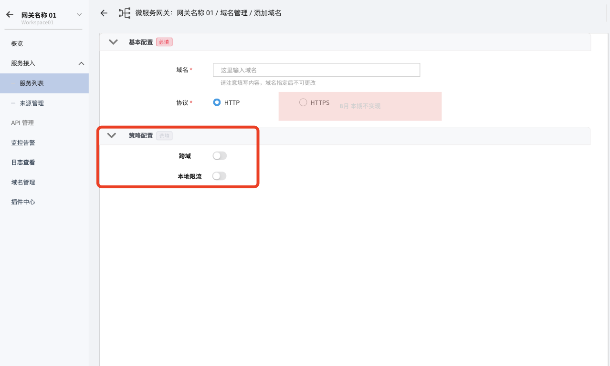

# 域名管理

微服务网关提供了网关实例统一托管域名的全生命周期管理，包括域名的创建、更新和删除。通过域名管理，可以将一个域名应用到网关内的多个 API，并拥有域名层级的策略配置能力。

在网关实例列表页点击网关实例的名称，进入网关实例，然后在左侧导航栏点击`域名管理`，进入域名列表页面。

## 创建域名

1. 在域名列表页面的右上角`添加域名`按钮，进入域名创建界面。

    

2. 填写配置信息

    参照下方说明填写各项参数：

    - 域名： 不可以为空；并且域名创建后不可以修改。
    - 协议： 默认选择 HTTP。如果选择 HTTPS，需要提供对应的 HTTPS 证书
      > 目前仅支持 HTTPS ，HTTPS 正在规划中。

    - 仅 HTTPS: 启用后，网关会拒绝此域名的 HTTP 请求
    - 策略配置：参考[配置域名策略](domain-policy.md)

    

3. 确认配置

    填写所需配置之后，在页面底部点击`确认`，完成添加域名。返回域名列表后，就可以在列表中看到刚才新建的域名。

    

## 修改域名

修改域名分为修改基本信息和修改配置两项操作。

### 修改域名基本信息

在 `域名管理`页面找到需要更新的域名，在该域名的右侧 **`ⵈ`** 操作按钮下选择`域名信息`。

### 修改域名策略配置

在 `域名管理`页面找到需要更新的域名，在该域名的右侧 **`ⵈ`** 操作按钮下选择`域名配置`。有关域名策略配置的详细说明，可参考 [配置域名策略](../api/api-policy.md)。

此外，也可以在域名详情页点击`修改基本信息`更新域名基本信息，点击`修改策略`更新域名的策略。

## 删除域名

> 注意：正在被 API 使用的域名无法删除，并且删除操作是不可逆的。

有两种方式可以删除域名：

- 在 `域名管理`页面找到需要删除的域名，在该域名的右侧 **`ⵈ`** 操作按钮下选择`删除`。

    

- 在 `域名管理`页点击需要删除的域名的名称，进入该域名的详情页，在页面右上角点击 **`ⵈ`** 操作按钮然后选择`删除`，

    

点击删除后，在弹框中选择立即删除。

