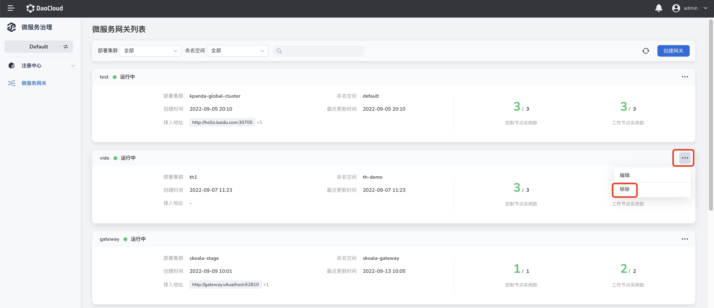

# 删除网关

删除网关的步骤如下：

在【网关列表】页面，选择要删除的网关实例，点击【⋯】在下拉列表中选择【删除】进入删除网关页面。

> 为保证服务不受影响，删除网关之前需要释放到当前网关中全部路由的 API。
> 网关删除后不可恢复，请谨慎操作。

- 如果待删除网关中有正在使用的 API，需要点击【API 管理】将所有 API 删除之后，再重新删除该网关。

  

- 如果待删除网关中没有正在使用的 API，点击【立即删除】即可直接删除当前网关。

  