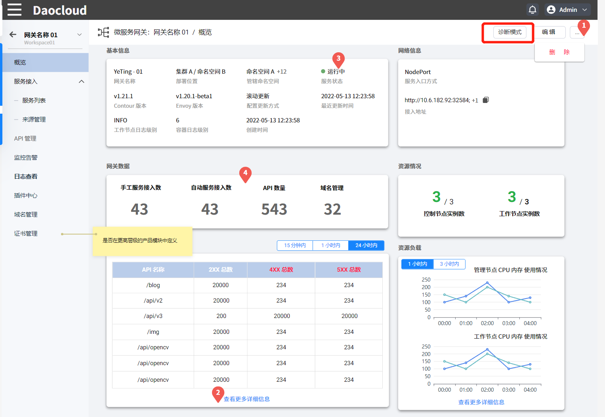
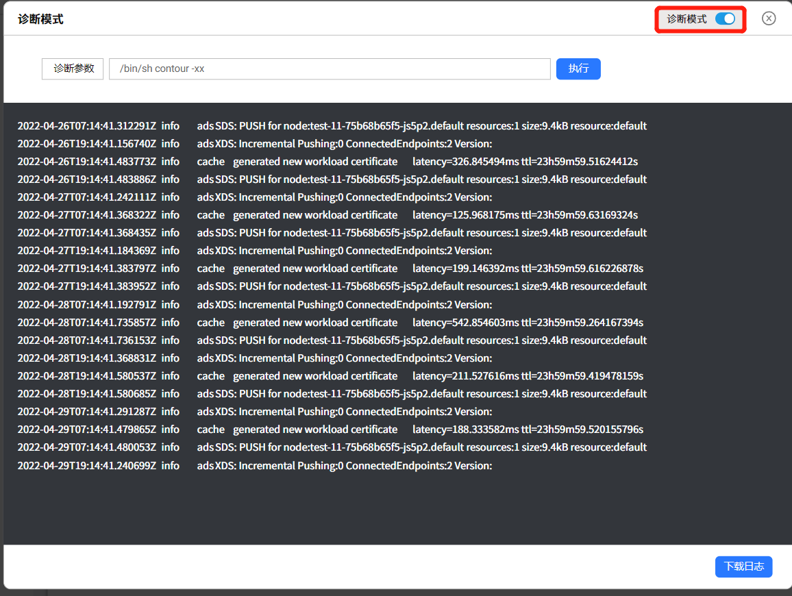

# 诊断网关

使用诊断模式可以根据所填参数对网关进行调试，便于您测试网关配置的可用性以及查找故障所在。

诊断网关的步骤如下：

## 进入诊断模式

在【网关列表】页面选择需要诊断的网关，点击【⋯】在下拉列表中选择【网关详情】，进入网关详情页面后点击右上角的【诊断模式】。

## 输入诊断参数并执行

根据不同的场景输入相关参数，点击【执行】，即可看到当前配置的调试结果。

- 如需修改参数重新调试，关闭【诊断模式】开关按钮，重新输入参数并点击执行即可。
- 点击底部的【下载日志】可以下载当前配置的诊断结果。

## 3. 退出诊断模式

点击【Ⓧ】即可退出诊断模式。
