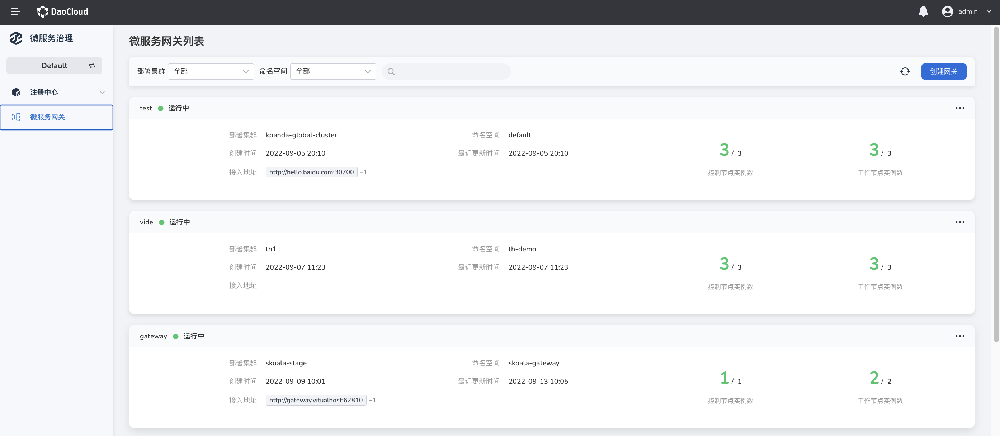
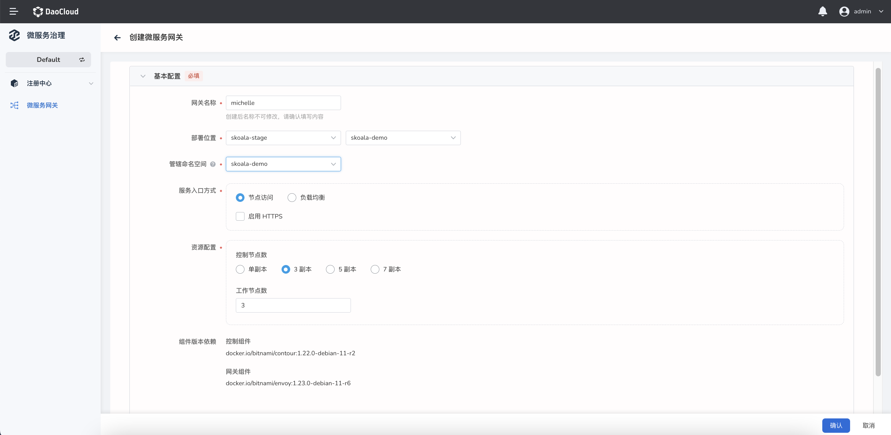
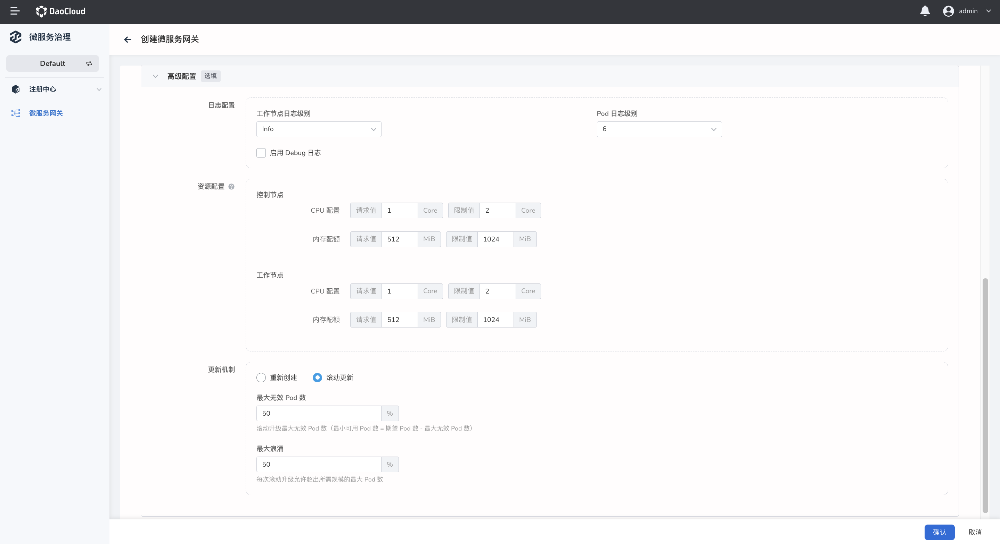
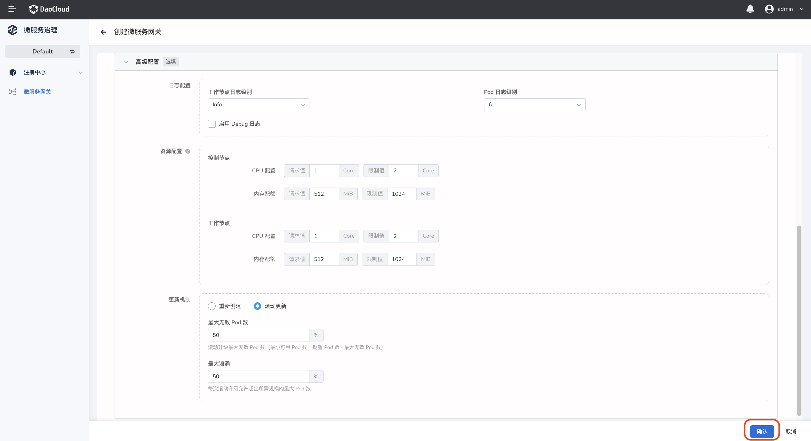

# 管理微服务网关

微服务网关支持多租户实例的高可用架构，兼容多种模式微服务的统一网关接入能力。

## 创建微服务网关

创建微服务网关的步骤如下：

1. 在左侧导航栏点击`微服务网关`，在`微服务网关列表`页的右上角点击`创建网关`，进入微服务网关的创建页面。

    

2. 填写配置

    网关配置分为基本配置（必填）和高级配置（选填）两部分。填写配置信息时需要注意以下事项：

    - 网关名称：长度不超过 63 个字符，支持字母、数字、下划线，在网关创建完成后不可更改
    - 部署位置：一个命名空间中只能部署一个网关
    - 管辖命名空间：默认管辖网关所在的命名空间，支持同时管辖多个命名空间，同一个命名空间不能被两个网关同时管辖
    - 控制节点数：单副本存在不稳定性，需谨慎选择

        
        

3. 确认所填信息

    在页面右下角点击`确认`，确认所填信息。

    

点击`确认`后，右上角弹出网关创建成功的消息。系统会自动返回`微服务网关列表`页，应该能在列表中看到新创建的网关实例。

## 更新网关配置

在`微服务网关列表`页选择需要更新的网关实例，在实例右侧点击 **`⋯`** 并选择`编辑`，可以更新该网关实例的基本配置和高级配置。

## 移除网关实例

在`微服务网关列表`页选择需要移除的网关实例，在实例右侧点击 **`⋯`** 并选择`移除`，可以更新该网关实例的基本配置和高级配置。

!!!note
    
    为保证服务不受影响，删除网关之前需要释放到网关中全部路由的 API。

!!!danger
    
    网关移除后不可恢复，请谨慎操作。

