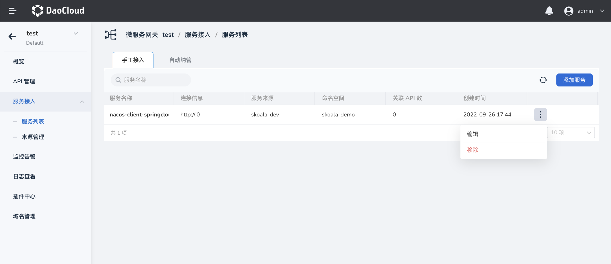

# 管理服务

微服务网关支持通过手动接入和自动发现两种方式添加服务。服务添加之后，可以作为 API 的目标服务。

## 添加服务

在`微服务网关列表`页面点击网关名称，进入网关详情页后，在左侧导航栏点击`服务接入`-->`服务列表`。

### 手动添加服务

1. 在`服务列表`页面点击`手工接入`-->`添加服务`
   
    

2. 选择服务来源，配置服务连接信息
   
    

3. 在页面右下角点击`确认`

### 自动发现服务

在`服务列表`页面点击`自动纳管`，无需任何手动操作，即可查看网关所在命名空间下的服务

## 更新服务

在`服务列表`页面找到需要更新的服务，在服务右侧点击 `ⵗ`，选择`更新`

## 删除服务

在`服务列表`页面找到需要更新的服务，在服务右侧点击 `ⵗ`，选择`删除`

!!! note

    删除服务之前，需要确保没有 API 正在使用该服务。

