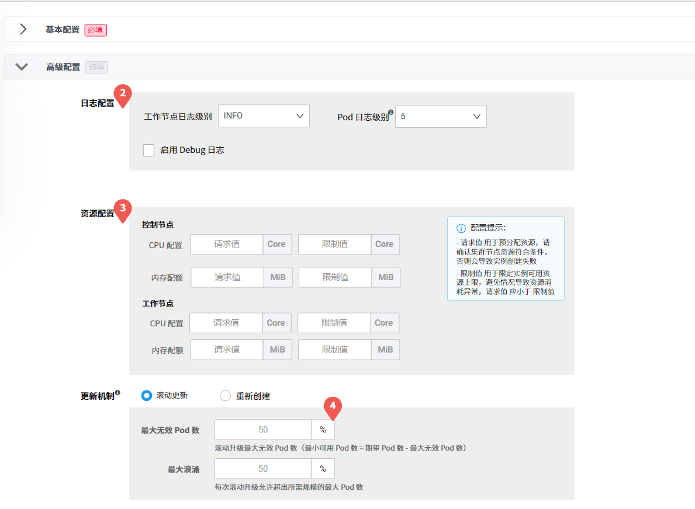
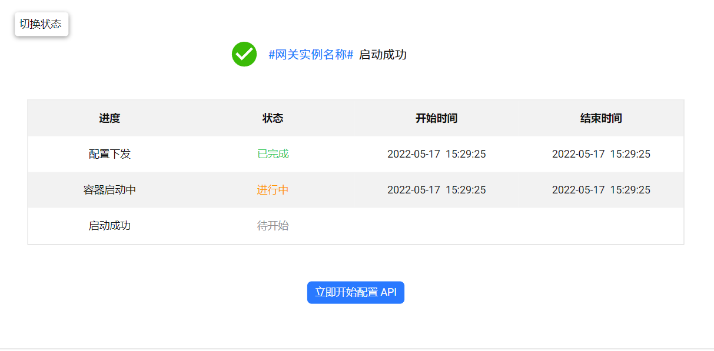

# 创建微服务网关

创建微服务网关的步骤如下：

**前置条件**：在【微服务网关列表】页面点击【创建网关】，进入微服务网关的创建页面。

## 1. 填写配置信息

根据页面提示填写相应字段。

### 基本配置（必填）

<table>
    <tbody>
    <tr>
        <th>参数名称</th>
        <th>填写说明</th>
        <th>备注</th>
    </tr>
    <tr>
        <td style="vertical-align: middle;text-align: left;">网关名称</td>
        <td>长度不超过 63 个字符 支持字母、数字、连字符和下划线</td>
        <td>网关名称在网关创建完成后不可更改</td>
    </tr>
    <tr>
        <td style="vertical-align: middle;text-align: left;">部署位置</td>
        <td>选择将网关部署在当前工作空间中的某个集群下的某个命名空间</td>
        <td>一个命名空间中只能部署一个网关实例</td>
    </tr>
    <tr>
        <td style="vertical-align: middle;text-align: left;">管辖命名空间</td>
        <td>选择此网关可以管辖的命名空间。默认选择网关所在的命名空间。</td>
        <td>可以选择管辖多个命名空间，但必须至少包含当前网关所在的命名空间 已被其他网关管辖的命名空间不可选择</td>
    </tr>
    <tr>
        <tr><td rowspan="3" style="vertical-align: middle;text-align: left;">服务入口方式</td></tr>
        <tr><td>如果选择节点访问（NodePort），需要进一步选择是否启用 HTTPS</td><td>节点访问是默认的服务入口方式</td></tr>
        <tr><td>如果选择负载均衡器（LoadBalancer），必须选择当前网关所在命名空间下的负载均衡器。</td><td>已被其他网关使用的负载均衡器不可选择。 如果当前命名空间中没有想要的负载均衡器，点击【去创建负载均衡器】进入 DCE 容器管理模块创建一个。</td></tr>
    </tr>
    <tr>
        <tr><td rowspan="3" style="vertical-align: middle;text-align: left;">资源配置</td></tr>
        <tr><td>控制节点数可选单副本、3 副本、5 副本、7 副本</td><td>单副本存在不稳定性，需谨慎选择 控制节点数默认为 3 副本</td></tr>
        <tr><td>工作节点数支持输入 1-999 的正整数。</td><td>工作节点数默认为 3</td></tr>
    </tr>
    <tr>
        <td style="vertical-align: middle;text-align: left;">组件版本依赖</td>
        <td>显示网关功能正常运行所依赖的组件版本</td>
        <td>不可编辑</td>
    </tr>
    </tbody>
</table>

> 点击右侧的【网关创建说明】可以查看各个参数的填写要求。

### 高级配置（可选）

高级配置为可选项。您可以进行根据自身需要进行自定义配置。如果不填写，则使用系统给定的默认值。

<table>
    <tbody>
    <tr>
        <th>参数名称</th>
        <th>填写要求</th>
        <th>备注</th>
    </tr>
    <tr>
        <tr><td rowspan="3" style="vertical-align: middle;text-align: left;">日志配置</td></tr>
        <tr><td>工作节点日志级别可配置为 TRACE、DEBUG、INFO、WARNING、ERROR。</td><td>工作节点的日志级别即 envoy 日志级别 默认选择 INFO 级别</td></tr>
        <tr><td>容器日志级别可选 1–9 的级别</td><td>即 Kubernetes 的容器日志级别</td></tr>
    </tr>
    <tr>
        <td style="vertical-align: middle;text-align: left;">资源配置</td>
        <td>请求值不可为空，但限制值可以为空。请求值必须大于限制值。</td>
        <td>为控制节点和工作节点配置资源份额 默认控制节点的配置和工作节点的配置一致： CPU 请求值 1，限制值 2，内存请求值 512，限制值 1024</td>
    </tr>
    <tr>
        <td style="vertical-align: middle;text-align: left;">更新机制</td>
        <td>可以选择滚动更新或重新创建</td><td>默认选择滚动更新。默认为 50% 最大浪涌：每次滚动更新允许超出所需规模的最大 Pod 数</td>
    </tr>
    </tbody>
</table>

## 2. 确认所填信息

确认所填信息是否有误。

- 如果有误，则点击【上一步】返回[第一步](#1-填写配置信息)并修改相关信息；
- 如果无误，则点击【确认】进入下一步。
- 如果想放弃创建网关，则点击【取消】或页面顶部的【🡰】箭头放弃创建。

## 3. 启动网关实例

完成前两个步骤后，系统会自动尝试启动新建的网关实例，该过程可能需要几分钟时间。

- 如果网关实例启动成功:
    - 点击【立即开始配置 API】进入 API 配置页面。
    - 点击【返回列表】或页面顶部的【🡰】箭头可以直接回到网关列表。
      > 在【网关列表】页面选择该网关，点击【⋯】在下拉列表中选择【网关详情】，进入网关详情页面后在左侧边栏点击【API 管理】可以继续为该网关配置 API。

- 如果网关实例启动失败:

    - 点击【变更配置】返回第一步修改信息。可以在【状态】栏查看失败原因，点击【去查看实例日志】可以获得更详细的故障信息。
    - 点击【返回列表】或页面顶部的【🡰】箭头会直接返回网关列表，当前新建的网关会显示在列表中，但状态为【异常】。在【网关列表】页面选择该网关，点击【⋯】在下拉列表中选择【编辑】可以修改该网关的各项配置。
    
    