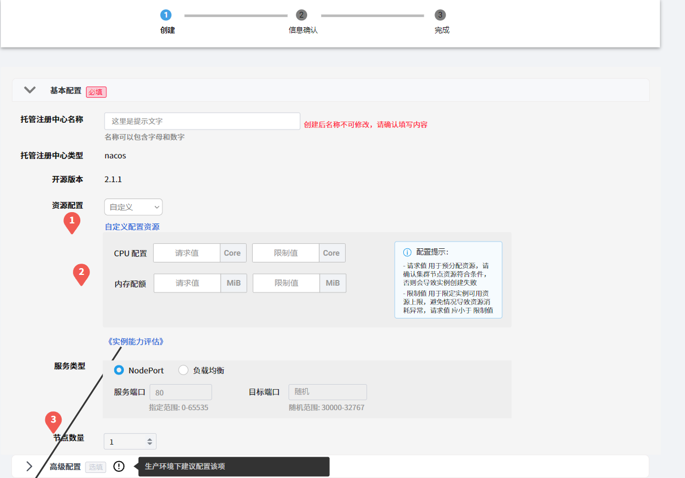
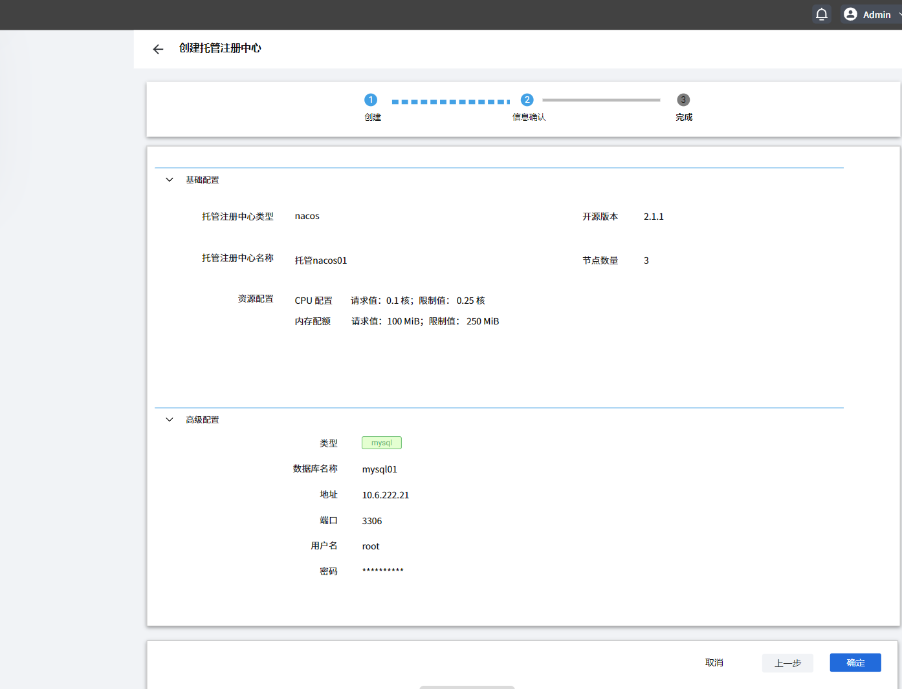
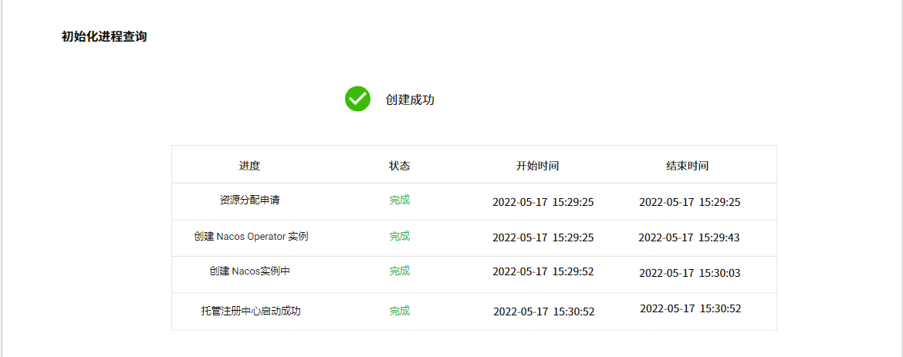
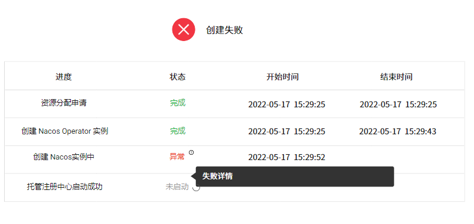

# 创建 Nacos 托管注册中心

通过创建 Nacos 托管注册中心，可以使用 Nacos 的服务注册与发现、配置管理、服务元数据管理等更多功能，提升微服务管理的灵活度和高效性。

创建 Nacos 托管注册中心的具体步骤如下：

**前置条件**：在左侧边栏点击`微服务注册配置中心`->`创建实例`，进入创建页面。

## 1. 填写配置信息

| 参数             | 说明                                                         | 举例值 |
| ---------------- | ------------------------------------------------------------ | ------ |
| 托管注册中心名称 | 【类型】必填 【注意】名称可以包含字母和数字。创建实例之后不可更改名称。 | 待补充 |
| 托管注册中心类型 | 【含义】需要创建的注册中心所属的类型 【注意】默认为 Nacos，不可编辑。 | 待补充 |
| 开源版本         | 【含义】Nacos 的开源版本 【注意】默认为 2.1.1，不可编辑。 | 待补充 |
| 资源配置         | 【类型】必填 【含义】设置为正在创建的 Nacos 注册中心分配多少资源。 【注意】最小值为 1 核 2G。需要确认集群节点具有足够的资源可供分配，否则会导致创建失败。`请求值`用于预分配资源，`限制值`用于限定实例最多可以使用多少资源，请求值应小于限制值。点击`实例能力评估`，可以查看不同环境下的推荐配置。 | 待补充 |
| 服务类型         | 【类型】必填 【含义】需要暴露的 Service 类型。           | 待补充 |
| 节点数量         | 【类型】必填 【含义】该数据中心分布在几个节点上 【注意】由于 Nacos 采用 Raft 协议实现一致性，所以节点数量必须为奇数。 | 待补充 |
| 高级配置         | 【类型】可选 【含义】设置 MySql 数据库的名称、地址、端口、用户名和密码，从而连接该数据库。 【注意】生产环境下建议配置此项。数据库的名称在创建后不可更改。 | 待补充 |

## 2. 确认所填信息

- 如果信息无误则点击`确定`进入下一步。

- 如果有误则点击`上一步`返回修改。

- 点击`取消`可以退出创建流程，并且不会保留已经填写的信息。

## 3. 初始化注册中心

完成前三个步骤之后，系统会根据所填信息自动初始化 Nacos 注册中心。初始化进程包含多个子任务。如果所有子任务都已完成，说明 Nacos 注册中心创建成功。

- 初始化进程完成后，点击`确定`，结束创建流程。
- 在等待过程中，可以点击 `<-`箭头返回实例列表，不会中断初始化进程。
  
    

- 如果初始化进程失败：

  - 点击`重新创建`会保留已经填写的信息并回到[第 1 步](#1-填写配置信息)，可以修改信息并重新初始化。

  - 点击`取消`会退出创建流程，并且不会保留已经填写的任何信息。
  
      
