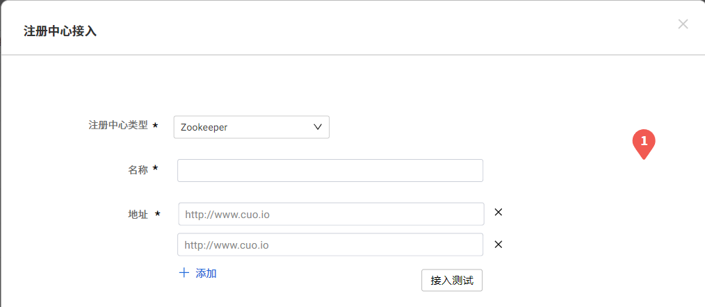
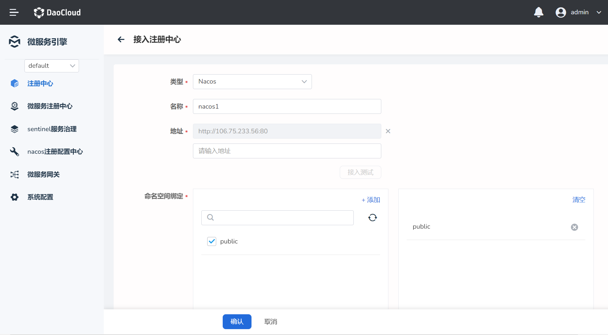
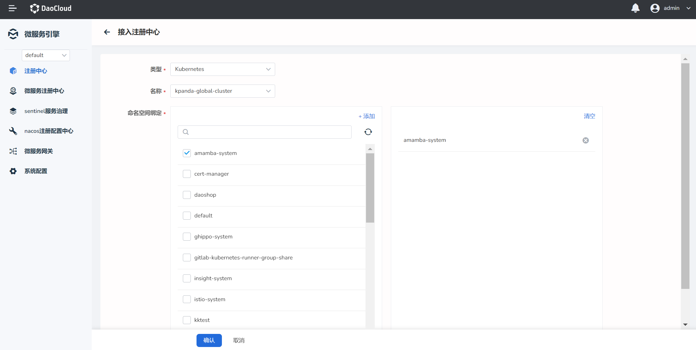

# 接入注册中心

DaoCloud 支持接入 [Nacos 注册中心](../reference/concepts.md/#nacos-注册中心)、[Eureka 注册中心](../reference/concepts.md/#eureka-注册中心)、[Zookeeper 注册中心](../reference/concepts.md/#zookeeper-注册中心)、[Kubernetes 注册中心](../reference/concepts.md/#kubernetes-注册中心)、[Mesh 注册中心](../reference/concepts.md/#service-mesh-注册中心)。

**前置条件**：在左侧边栏点击`注册中心`->`接入注册中心`，进入注册中心接入页面。

## Zookeeper 或 Eureka 注册中心

1. 选择注册中心的类型。
1. 输入注册中心名称和地址。对于分布式的高可用注册中心，可以输入多个地址。
3. 点击`接入测试`，测试能否成功连接该注册中心。
4. 所有的地址都测试成功后，在页面底部点击`确定`，完成接入。如果测试失败，应修改并核对信息后再次点击`接入测试`，直至测试成功。
4. 在页面底部点击`确认`，完成接入。

## Nacos 注册中心

1. 选择注册中心的类型。
1. 输入注册中心名称和地址。对于分布式的高可用注册中心，可以输入多个地址。
3. 点击`接入测试`，测试能否成功连接该注册中心。
4. 所有的地址都测试成功后，选择一个命名空间进行绑定。如果测试失败，应修改并核对信息后再次点击`接入测试`，直至测试成功。
4. 在页面底部点击`确认`，完成接入。

## Kubernetes 或 Mesh 注册中心

1. 选择注册中心的类型。
2. 选择注册中心的名称。
3. 在页面底部点击`确认`，完成接入。
   
