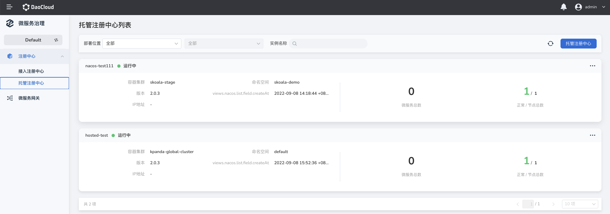
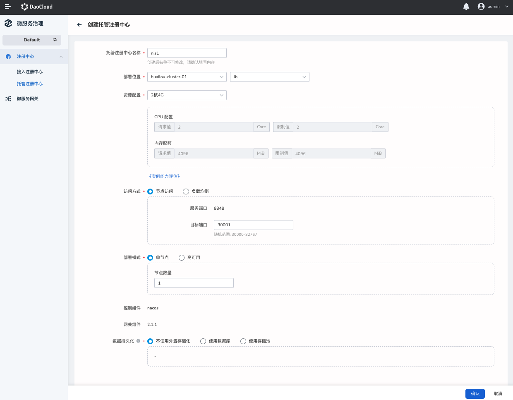

# 管理托管注册中心

微服务治理模块支持创建 Nacos 托管注册中心。相对于接入型注册中心而言，托管型注册中心支持更多的操作，包括管理微服务命名空间、微服务治理策略、微服务配置中心等。

本页介绍如何创建托管注册中心、如何更新托管注册中心，以及如何删除托管注册中心。

## 创建托管注册中心

创建托管注册中心的步骤如下。

1. 在左侧导航栏点击`注册中心`->`托管注册中心`，然后在页面右上角点击`托管注册中心`，进入创建注册中心的页面

    

2. 填写配置信息，在页面底部点击`确认`
   
    !!! note
      点击`《实例能力评估》`可以查看注册中心在 2 核 4G、4 核 8G 等主流规格下的吞吐量。

    

如果操作正确，页面右上角会弹出创建成功的消息，并且`托管注册中心列表`页也会展示新建的注册中心。

## 查看托管注册中心详情

在托管注册中心列表页找到需要查看详情的托管注册中心，点击注册中心的名称，进入该注册中心的基础信息页面。

在基础信息页面可以查看注册中心的`基础信息`、`服务治理信息`（需要开启服务治理功能）、`节点列表`。

**相关操作**：

- 全量重启实例：在页面右上角点击`重启`可以对整个托管注册中心实例进行重启
- 单节点重启实例：在节点列表下对应节点的右侧先点击下线然后再点击上线
- 查看节点元数据

## 更新托管注册中心

1. 在`托管注册中心列表`页找到需要更新的托管注册中心，点击右侧的 **`⋯`** 操作按钮选择`编辑`；
2. 修改好之后，在页面右下角点击`确认`

    !!! warning
      修改存储池/数据库，变动存储位置后，之前的数据不会随之迁移。

3. 更新注册中心之后，重启该托管注册中心。

    在托管注册中心的右侧点击 **`⋯`** 操作按钮选择`重启`

## 删除托管注册中心

!!! note
  删除托管注册中心之前，需要先清空该注册中心实例下面的各类资源，包括微服务及微服务下面的实例等。

1. 在`托管注册中心列表`页找到需要更新的托管注册中心，点击右侧的 **`⋯`** 操作按钮选择`移除`；

2. 输入注册中心的名称，点击`移除`。

    