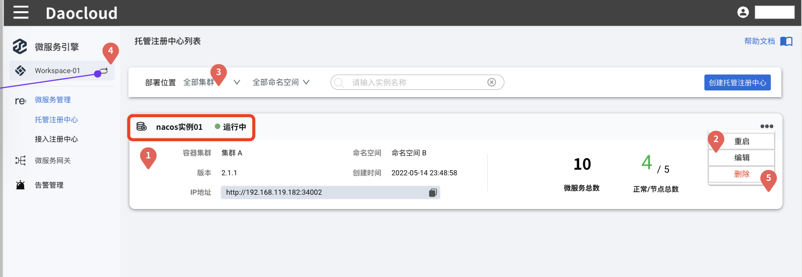
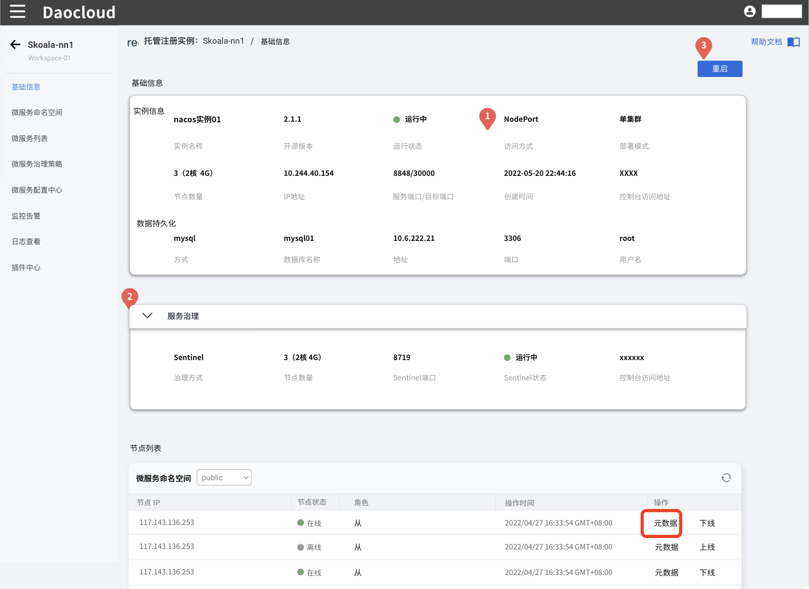
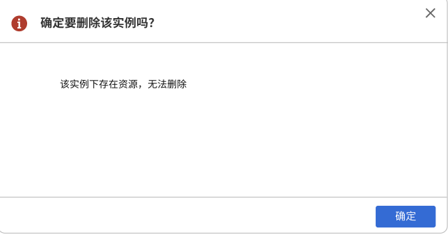

# 管理托管注册中心

## 创建托管注册中心

参见[快速入门-创建托管注册中心](../../quick-start/create-registry.md)。

## 查看托管注册中心详情

在托管注册中心列表页找到需要查看详情的托管注册中心，点击注册中心的名称，进入该注册中心的基础信息页面。

在基础信息页面可以查看注册中心的`基础信息`、`服务治理信息`（需要开启服务治理功能）、`节点列表`。

**相关操作**：

- 全量重启实例：在页面右上角点击`重启`可以对整个托管注册中心实例进行重启
  
    

- 单节点重启实例：在节点列表下对应节点的右侧先点击下线然后再点击上线
    

- 查看节点元数据
    

## 更新托管注册中心

1. 在托管注册中心列表页找到需要更新的托管注册中心，点击右侧的`⋯`操作按钮选择`编辑`；
2. 进入托管注册中心的更新页面，根据需要修改各项参数；
3. 修改好之后，在页面右下角点击`确定`
4. 更新托管实例之后，需要重启该托管注册中心。在该托管注册中心的右侧点击`⋯`操作按钮选择`重启`即可。

    

**注意**：

- 托管注册中心的名称及部署位置不可编辑；
- 资源配额的最小值为 1 核 2G。
- 在数据持久化设置中，存储池和数据库的名称不可编辑。更换存储池/数据库，变动存储位置后，之前的数据不会随之迁移。

## 删除托管注册中心

> 删除托管注册中心之前，需要先清空该注册中心实例下面的各类资源，包括微服务及微服务下面的实例等。

1. 在托管注册中心列表页找到需要更新的托管注册中心，点击右侧的`⋯`操作按钮选择`删除`；

2. 如果注册中心下面仍有未删除的实例，系统会提示存在资源无法删除，需要清理掉这些资源后才能继续删除该注册中心。

    

3. 清理完注册中心下面的实例后，为了防止误删，需要输入注册中心的名称进行确认，最后点击`删除`即可。

    
