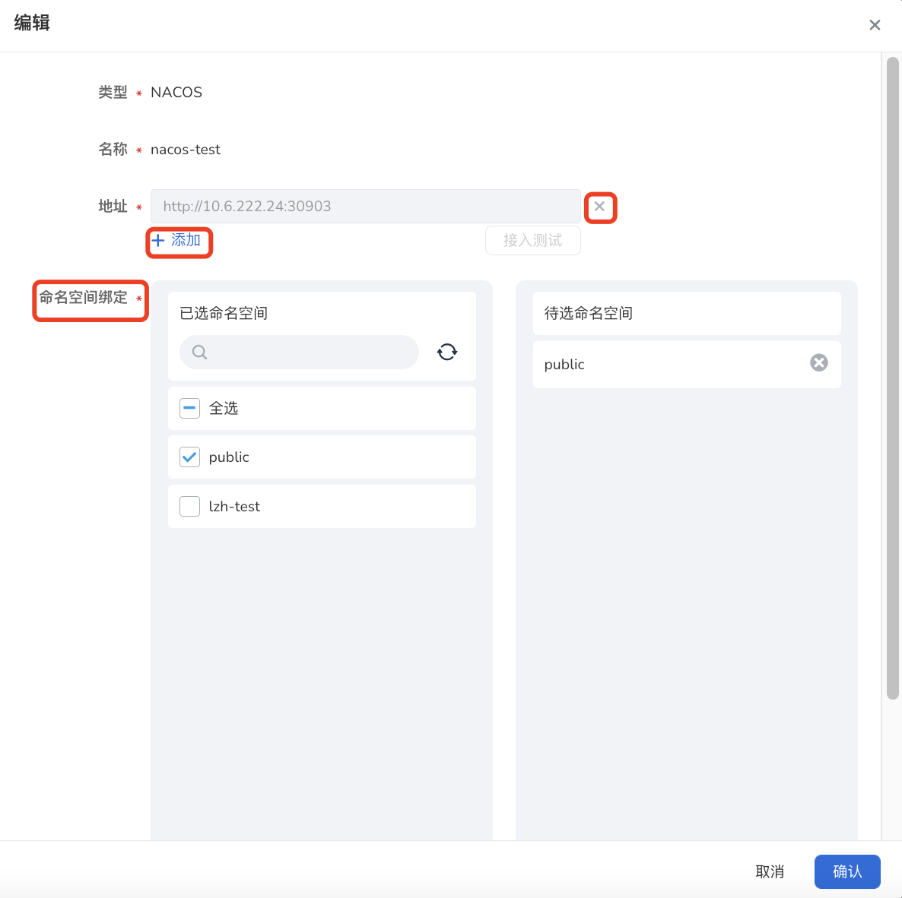

# 管理接入型注册中心

注册中心支持接入 [Nacos 注册中心](../reference/concepts.md/#nacos-注册中心)、[Eureka 注册中心](../reference/concepts.md/#eureka-注册中心)、[Zookeeper 注册中心](../reference/concepts.md/#zookeeper-注册中心)、[Kubernetes 注册中心](../reference/concepts.md/#kubernetes-注册中心)、[Mesh 注册中心](../reference/concepts.md/#service-mesh-注册中心)。

本页介绍如何接入注册中心、更新注册中心，以及如何移除注册中心。

## 接入注册中心

接入注册中心的步骤如下：

### 进入注册中心接入页面

在左侧导航栏点击`注册中心`->`接入注册中心`，然后在页面右上角点击`接入注册中心`，进入注册中心接入页面。

### 填写配置信息

接入不同注册中心需要填写的配置信息有所不同。

#### 接入 Nacos/Zookeeper/Eureka 注册中心

1. 选择注册中心的类型
2. 填写注册中心名称和地址
    
    对于分布式的高可用注册中心，点击`+添加`可以输入多个地址。

3. 点击`接入测试`，测试能否成功连接该注册中心
    
    地址栏变灰则说明测试成功。

    !!!note
        对于 Nacos 注册中心，测试成功后还需要绑定命名空间。

4. 在页面底部点击`确认`

    

#### 接入 Kubernetes/Mesh 注册中心

1. 选择注册中心的类型和名称
2. 在页面底部点击`确认`
   
    

## 更新注册中心配置

目前仅支持更新 Nacos/Zookeeper/Eureka 注册中心的配置。如需更新 Kubernetes/Mesh 注册中心，可以先[移除现有的注册中心](#移除注册中心)，然后再接入新的注册中心。

1. 在`接入注册中心列表`页选择需要更新的注册中心，在右侧点击 **`⋯`** 并选择`编辑`
   
    

2. 增删注册中心地址，绑定/解绑命名空间，最后在页面底部点击`确认`
   
    

## 移除注册中心

1. 在`接入注册中心列表`页选择需要移除的注册中心，在右侧点击 **`⋯`** 并选择`移除`
   
    

2. 输入注册中心的名称，点击`移除`

