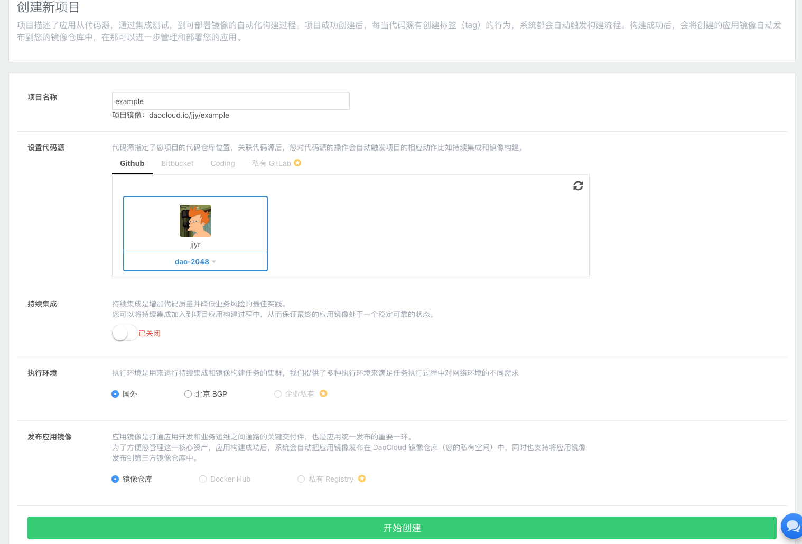
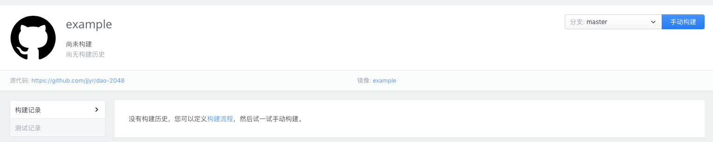
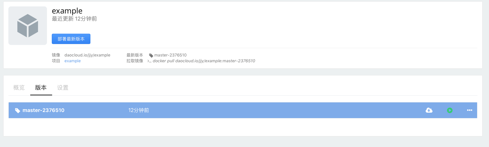
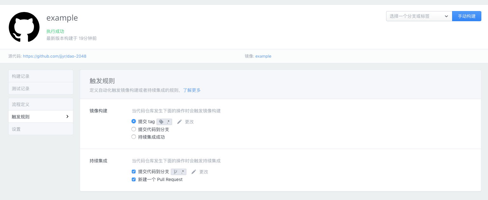
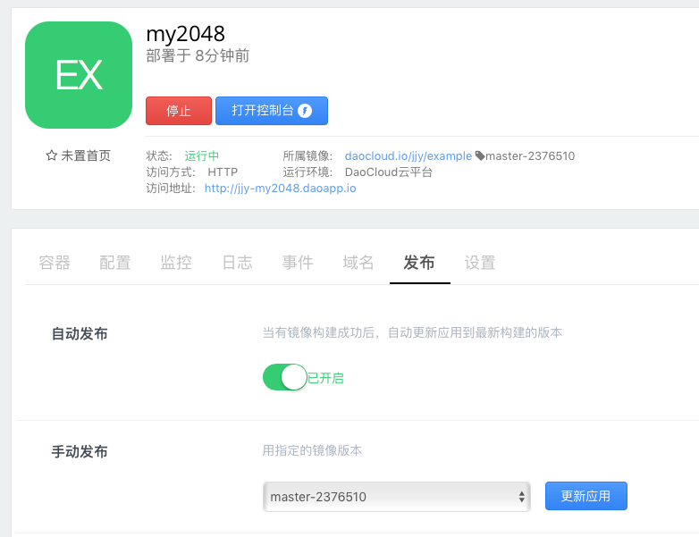

DaoCloud 提供从源码到最终应用的一站式交付能力。

在本教程中，我们将帮助您从接入代码仓库到自动构建镜像，发布应用。您可跟随示例体验自动化发布流程。

## 1 创建项目, 接入代码仓库

众所周知，镜像是 Docker 生态圈的重要组成，开源社区提供了数以万计的镜像供我们使用。

在这一步我们来创建一个 “项目”，并且关联代码源(repo)，开始在 DaoCloud 平台上构建镜像的旅程。

我们为您准备了示例代码仓库， 如果您是 github 用户请 fork [DaoCloud/dao-2048](http://github.com/DaoCloud/dao-2048), coding 用户请 fork [DaoCloud/dao-2048](https://coding.net/u/daocloud/p/dao-2048/git)

登录 DaoCloud， 点击 “代码构建”、“创建新项目”

选择之前 fork 的代码仓库(repo)，点击 “开始创建”

选择 master 分支，点击手动构建

耐心等待十几秒，我们的第一个镜像已经构建完成了！

## 2 部署应用

点击“查看镜像”，看一下镜像的详细信息

点击“部署最新版本”来将此镜像部署为应用

输入应用名后点击“基础设置”，随后点击“立即部署”

稍等几秒可以看到访问地址，点击访问地址看一看我们部署的第一个应用吧！

## 3 自动构建，自动发布新版本

回到我们的构建项目页，在“触发规则”中我们可以设置自动构建的规则。

回到刚刚部署的应用管理页面，打开“自动发布”开关

我们已经完成了自动构建／发布的设置，提交一个 git tag 试一试！DaoCloud 会根据您设置的规则自动开始构建新镜像，并且自动更新应用版本！

## 下一步

恭喜您完成了教程！您已掌握了在 DaoCloud 上进行 docker 镜像构建与启动应用的方法！

* [文档站](http://docs.daocloud.io)
* [如何接入我自己的机器到 DaoCloud 并发布应用](http://)
* [DaoCloud 开放 API](http://docs.daocloud.io/api/)
* [部署 Ghost Blog](http://docs.daocloud.io/daocloud-registry/ghost-blog)