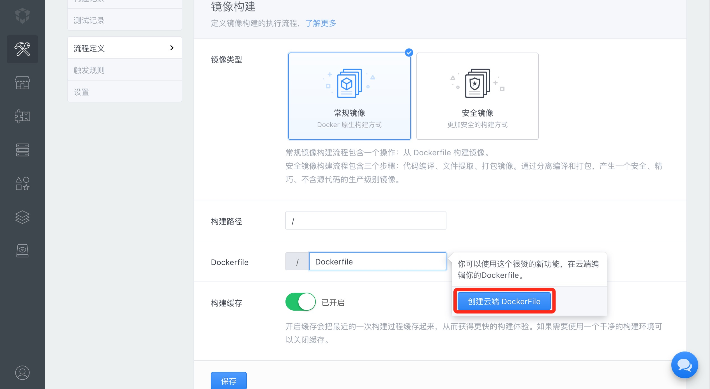
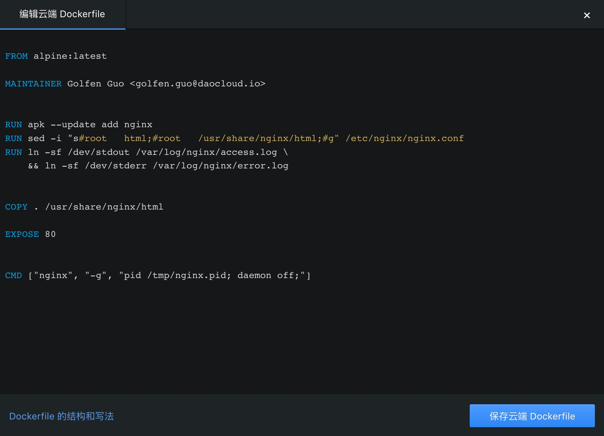
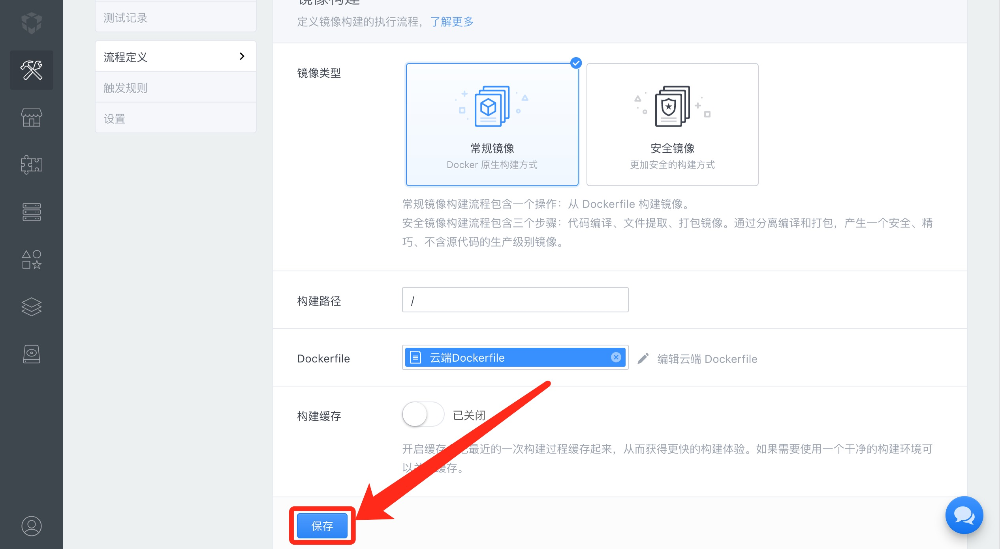
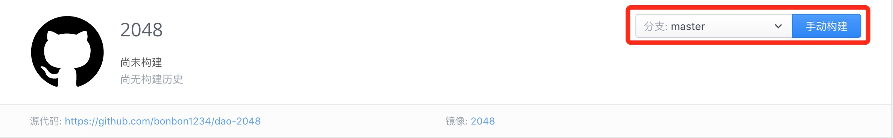
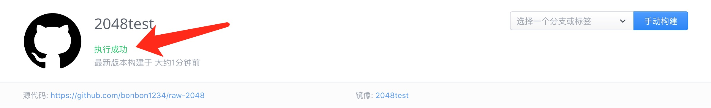

docker是通过读取Dockerfile文件的指令来生成自定义镜像的。

本章我们将一个示例项目构建为镜像，以此来学习如何实现正确的 Dockerfile 并在 DaoCloud 执行构建。


## 1 新建项目

我们为您准备了示例代码仓库， 如果您是 github 用户请 fork [DaoCloud/raw-2048](http://github.com/DaoCloud/raw-2048), coding 用户请 fork [DaoCloud/raw-2048](http://coding.net/u/daocloud/p/raw-2048/git)

点击“代码构建”  -> “创建新项目”

设置完代码源，点击“流程定义”

请注意“Dockerfile”选项，这是用来指定使用哪个Dockerfile进行构建，因为示例代码中并没有 Dockerfile文件，

因此我们点击，并选择“创建云端 Dockerfile”，此时会在DaoCloud上创建一个Dockerfile文件用来构建镜像，可以在此基础上进行修改





## 2 填写Dockerfile


我们在Dockerfile中填入以下内容：

```shell

#FROM 指令指定基础镜像
#比较常用的基础镜像有ubuntu，centos。这里使用了一个极小的基础镜像alpine
FROM alpine:latest

#MAINTAINER指令用于将镜像制作者相关的信息写入到镜像中
#您可以将您的信息填入name以及email
MAINTAINER name <email>

#RUN指令可以运行任何被基础image支持的命令，就像在操作系统上直接执行命令一样（如果使用ubuntu为基础镜像，这里应该用apt-get 命令安装）
#安装nginx
RUN apk --update add nginx

#配置Nginx，并设置在标准输出流输出日志（这样执行容器时才会看到日志）
RUN sed -i "s#root   html;#root   /usr/share/nginx/html;#g" /etc/nginx/nginx.conf

#Nginx日志输出到文件
RUN ln -sf /dev/stdout /var/log/nginx/access.log \
    && ln -sf /dev/stderr /var/log/nginx/error.log

#COPY指令复制主机的文件到镜像中 （在这里当前路径就是repo根目录）
#将2048项目的所有文件加入到Nginx静态资源目录里
COPY . /usr/share/nginx/html

#EXPOSE：指定容器监听的端口
EXPOSE 80

#CMD指令，容器启动时执行的命令
#启动Nginx并使其保持在前台运行
#CMD一般是保持运行的前台命令，命令退出时容器也会退出
CMD ["nginx", "-g", "pid /tmp/nginx.pid; daemon off;"]

```

写入结果如图：



点击“保存并使用云端Dockerfile”

温馨提示：最后一定要记得点击“保存”，使设置生效。




## 3 构建您的项目



选择master分支，点击“手动构建”，您的项目就被打包进入镜像啦!





恭喜您完成了教程！您已掌握了在 DaoCloud 上使用dockerfile进行 docker 镜像构建的方法！


更多：

[详细的dockerfile结构与写法](http://docs.daocloud.io/ci-image-build/dockerfile)

[云端dockerfile](http://docs.daocloud.io/ci-image-build/cloud-dockerfile)

[使用镜像构建与持续集成](http://docs.daocloud.io/ci-image-build/start-ci-and-build)

[写给开发者的例子（示例代码）](http://docs.daocloud.io/ci-on-daocloud/sample)


