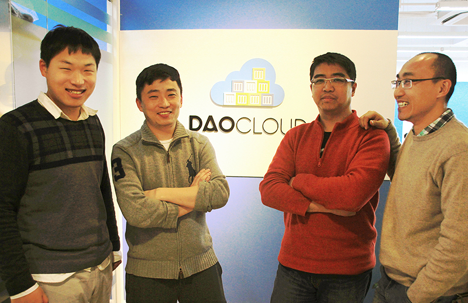

<!-- reviewed by fiona -->

## 公司简介

DaoCloud 是业界领先的企业级容器云平台和解决方案提供商，致力于以 Docker 为代表的容器技术，为企业打造面向下一代互联网应用的交付和运维平台，帮助客户实现云端持续创新。DaoCloud 采用公有云和混合云模式，以云端 SaaS 化容器管理平台，对接各类主机资源，构建跨云跨网的容器主机资源池，提供全流程标准化的应用持续集成、镜像构建、发布管理和容器运维服务。DaoCloud 在开发运维联动、渐进式混合云构建、大规模高并发集群、微服务架构设计、分布式应用运维等场景拥有丰富经验和成功案例。DaoCloud 总部位于中国上海，并在北京、武汉、北美等地设有分支机构。

---

## 创始团队

DaoCloud 创始团队，左起：颜开、陈齐彦、喻勇、郭峰

### 陈齐彦 （首席执行官，联合创始人）

负责 DaoCloud 整体战略、产品规划、技术方向和企业级客户营销。

曾在 EMC 和 Oracle 任职多年，EMC 中国研究院创始人，总架构师，拥有 30 几项美国专利，复旦大学计算机硕士。对云计算商业模式和技术有深入的理解，曾主导 EMC 多起并购案例的技术审核。陈齐彦曾是 EMC 公司全球范围内创新影响力排名第一的员工，获得过十多次年度创新大奖，拥有 30 多项美国专利申请。在加入 EMC 公司的八年内获得 EMC 中国研发集团技术部门内级别最高也是唯一的总架构师职位，并兼任 EMC 全球专利委员会委员及中国区主席，提名进入 EMC Distinguished Engineer 候选人列表。在 EMC 之前，陈齐彦在 Oracle 企业管理套件部门工作，期间拥有丰富的企业软件开发及交付经验，作为核心团队成员开发了当时 Oracle 亚太研发集团的第一款全球发布产品。

### 喻 勇（总裁，联合创始人）

负责 DaoCloud 市场战略、开发者社区、投资者关系和日常业务运营。

曾就职于微软和 VMware，从事技术布道师、开发者社区、ISV 渠道及市场战略负责人等工作，复旦大学 MBA。喻勇曾负责 Cloud Foundry、大数据、软件定义存储等前沿产品在开发者、技术社区及战略合作伙伴中的推广和应用，他主导了 Cloud Foundry 中国社区和生态系统的建设工作。喻勇在开发者市场战略方面有丰富的经验，善于通过线上线下的组合式市场行为，在开发者群体中推广平台级产品，并赢得口碑和用户。喻勇在系统架构、云计算和开发应用平台等方面有超过 10 年的经验，在加入 VMware 之前担任微软技术布道师和 IT 架构顾问，曾获得微软全球最有价值专家称号。

### 郭 峰（研发副总裁，联合创始人）

管理 DaoCloud 研发团队，把握产品开发进度、功能模块发布，并为企业级客户提供顾问服务。

曾就职于 EMC，担任中国研究院云平台主任工程师，在 PaaS 开源社区拥有很高的声誉，拥有 20 几项美国专利，同济大学计算机硕士。郭峰对 PaaS 内核及容器技术有深入研究，是 Java 和企业级微服务架构的业界专家。郭峰是中国最早接触 Cloud Foundry、OpenStack 及 Docker 的技术人员，在开源社区拥有很高的声誉。擅长云平台及服务构建，分布式系统及虚拟化技术，是该领域公认的专家。郭峰拥有二十多项美国专利申请，他曾在 EMC 全球创新影响力排名中位列前十。此外他还拥有丰富的企业应用及数据平台化的经验，是一名业内顶尖的 Java 和 Spring 专家。

### 颜 开（总架构师，联合创始人）

负责 DaoCloud 产品架构设计、技术选型、平台安全和运维管理工作。

曾在 EMC 和盛大游戏工作，负责核心产品的开发和技术架构工作，南京大学计算机学士。中国第一个 Cloud Foundry 平台的构建者，对容器和分布式集群有丰富的实战经验。颜开是圈内著名极客，在大学获编程比赛奖无数，人称「开叔「」。他在云平台、分布式系统和移动应用开发方面颇有建树，撰写的相关技术博客拥有很高的人气，并受邀在 CSDN 等专业杂志及网站发表。加入 EMC 之前，颜开曾在盛大游戏负责游戏计算平台的开发及运维，并在当年主导了游戏平台的 Hadoop 大数据分析平台的构建。

---

## 文化氛围

+ 工程师文化：全员全栈、技术驱动、参与感
+ 持续迭代，持续交付，持续创新
+ 从敏捷到精益：需求驱动、产品思维、小步试错、运营指导
+ DevOps，代码驱动的自动化运维
+ Talk is cheap，show me the code「空谈误国，实干兴邦」
+ Eat your own dogfood
+ DaoKer Day

---

## 大事记录

+ 2015 年 3 月，DaoCloud 获光速安振数百万美元投资 [媒体报道](http://www.prnasia.com/story/archive/1351306_ZH51306_1) 
+ 2015 年 3 月，DaoCloud 宣布 Docker Hub Mirror 服务永久免费 [文章链接](http://blog.daocloud.io/daocloud-mirror-free/) 
+ 2015 年 4 月，DaoCloud 发布容器持续交付云服务，全球首个一站式 Docker 云平台 [媒体报道](http://www.prnasia.com/story/119782-1.shtml) 
+ 2015 年 5 月，DaoCloud 首创混合式主机管理功能 [文章链接](http://blog.daocloud.io/daocloud_sr_alpha/) 
+ 2015 年 6 月，DaoCloud 登陆中国云计算大会，宣布开创容器云平台新模式 [媒体报道](http://www.prnasia.com/story/123542-1.shtml)
+ 2015 年 6 月，DaoCloud 出席 Docker 全球开发者大会，中国公司首度发表主题演讲 [媒体报道](http://www.prnasia.com/story/125142-1.shtml) 
+ 2015 年 7 月，共建「Container+ 联盟」，开启企业级云平台之门 [媒体报道](http://www.prnasia.com/story/125561-1.shtml)、[大会回顾](http://blog.daocloud.io/daocloud0630event/)、[联盟细节](http://blog.daocloud.io/daocloud_container_plus/) 
+ 2015 年 7 月，DaoCloud 正式推出商业版容器云服务 [媒体报道](http://www.prnasia.com/story/127720-1.shtml)
+ 2015 年 8 月，DaoCloud 登陆 U 市场，打造混合式容器管理平台 [文章链接](http://blog.daocloud.io/daocloud-umarket/) 
+ 2015 年 8 月，DaoCloud 与极客学院合作，推出 Docker 系列课程 [文章链接](http://blog.daocloud.io/jikexueyuan/)
+ 2015 年 8 月，DaoCloud 团队成员孙宏亮出版全球首本《 Docker 源码分析》[文章链接](http://blog.daocloud.io/docker_yuanma_fenxi_quanqiu_shoufa/)
+ 2015 年 8 月，DaoCloud 与 Docker 同步推出 Toolbox，提升用户体验，[文章链接](http://blog.daocloud.io/toolbox/)
+ 2015 年 9 月，2015 年 Q3 Forrester Wave 出炉，DaoCloud 成唯一入选的容器云平台 [媒体报道](http://www.prnasia.com/story/133321-1.shtml)
+ 2015 年 10 月，释放创新原力，DaoCloud 成功举办企业级容器技术峰会 [媒体报道](http://www.prnasia.com/story/133570-1.shtml)、[峰会总结](http://blog.daocloud.io/rongqijishufenghui/) 
+ 2015 年 10 月，开箱即用的「容器云」，DaoCloud 与宝德、赛凡发布容器一体机 [文章链接](http://blog.daocloud.io/yitiji/)
+ 2015 年 10 月，DaoCloud 与通联数据达成战略合作，共建金融大数据云服务 [文章链接](http://blog.daocloud.io/tonglianshuju/) 
+ 2015 年 10 月，DaoCloud 与 EMC、VMware 达成战略合作协议，全力拓展企业市场 [文章链接](http://blog.daocloud.io/hezuoxieyi/)
+ 2015 年 10 月，DaoCloud 发布「中国金融行业容器技术应用研究白皮书」 [文章链接](http://blog.daocloud.io/baipishu/)，[下载地址](http://7xi8kv.com5.z0.glb.qiniucdn.com/%E3%80%8A%E4%B8%AD%E5%9B%BD%E9%87%91%E8%9E%8D%E8%A1%8C%E4%B8%9A%E5%AE%B9%E5%99%A8%E6%8A%80%E6%9C%AF%E5%92%8C%E5%B9%B3%E5%8F%B0%E5%BA%94%E7%94%A8%E7%A0%94%E7%A9%B6%E3%80%8B%E7%99%BD%E7%9A%AE%E4%B9%A6update.pdf)

---

## 媒体专访

+ DaoCloud：[Docker 是企业互联网服务的入口平台](http://blog.daocloud.io/itvalue-zhuangao/)，作者：ITValue 吴宁川
+ DaoCloud 陈齐彦：[未来企业 IT 建设的核心是「原力」](http://blog.daocloud.io/roby_force/)
+ DaoCloud 郭峰：[分布式平台微服务架构演化实践](http://blog.daocloud.io/microservice-in-distributed-platform/)
+ DaoCloud 孙宏亮：[一个不喜欢玩黑盒的程序员](http://blog.daocloud.io/allen-interview/)
+ DaoCloud 陈齐彦：[DaoCloud 欲扛起国内 Docker 云生态大旗](http://blog.daocloud.io/roby_interview/)，作者：IT168 张苗苗
+ DaoCloud 喻勇：[基于 Docker 的创业成长之路](http://blog.daocloud.io/daocloud_frank_interview/)，作者：CSDN 魏伟
+ DaoCloud 喻勇：[InfoQ 专访](http://blog.daocloud.io/interview-with-frank-by-infoq/)，作者：InfoQ
+ DaoCloud 陈齐彦：[Docker 的技术优势](http://blog.daocloud.io/interview-to-roby-by-infoq/)，作者：InfoQ
+ DaoCloud 陈齐彦：[容器到魂器，云的交付件](http://blog.daocloud.io/ostc_robychen/)，作者：CSDN
+ DaoCloud 陈齐彦：[Docker，玫瑰还是枪炮？](http://blog.daocloud.io/csdn-interview-robychen/)，作者：CSDN
+ DaoCloud 喻勇：[搅局者 Docker](http://blog.daocloud.io/interview-to-frank-by-cnw/)，作者：网络世界 余翔

---

## 联系我们

* 总部地址：上海市杨浦区政府路 18 号 901 室，200433
* 电话号码：0086-21-61431590
* 电子邮件：[info@daocloud.io](mailto:info@daocloud.io?subject=FROM_DOCS_PAGES)
* 媒体垂询：[media@daocloud.io](mailto:media@daocloud.io?subject=FROM_DOCS_PAGES)
* Logo 标示：[点击下载](http://7xo6wp.dl1.z0.glb.clouddn.com/daocloud_press_kit.zip)
* [新浪微博](http://weibo.com/daocloud)
* [Facebook](https://www.facebook.com/pages/DaoCloudio/794434853974192)
* [Twitter](https://twitter.com/DaoCloudIO)
* [LinkedIn](https://www.linkedin.com/company/daocloud-network-technology-co-ltd-)
