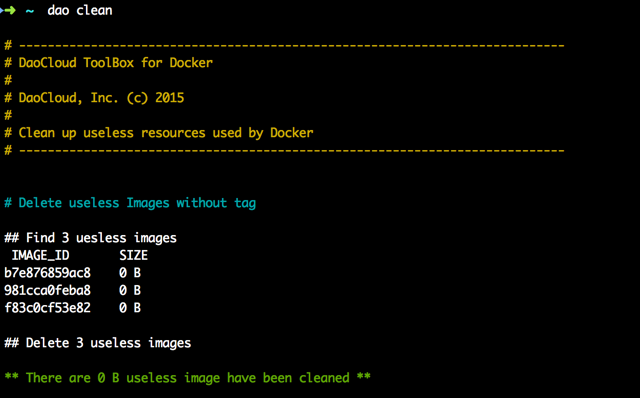

<!-- reviewed by fiona -->

DaoCloud 加速器是广受欢迎的 Docker 工具，解决了国内用户访问 Docker Hub 缓慢的问题。DaoCloud 加速器经历了两个版本，1.0 版本主要采用了 Docker Registry Mirror 的功能，结合国内的 CDN 服务，为用户提升镜像下载的速度；2.0 版本加入了 DaoCloud 大量自主研发的协议层优化，并提供了可以替代 Docker Pull 的客户端，完美解决国内获取 Docker 镜像 metadata 的问题，并再次成倍提升下载速度。

我们会在下面分别介绍这两个版本的具体细节。

#### Docker 加速器 2.0

Docker 加速器 2.0 是 DaoCloud Toolbox 的一部分。

#### DaoCloud Toolbox 是什么？

DaoCloud Toolbox 由一系列 Linux 下的命令行工具和后台服务组成，是一款集成了 Docker Hub 下载加速、Docker 宿主垃圾回收、混合式容器管理等多种功能于一身的工具软件。

##### 工具一：Docker 加速器升级版

DaoCloud 在 2015 年年初推出的 Docker 加速器提供 Docker Hub 镜像下载的加速功能，极大提升了国内网络访问 Docker Hub 的速度，拥有广泛的用户群体。然而，由于受 Docker Registry 原理所限，即使使用加速器，我们仍无法避免直接连接 Docker Hub Index 元数据服务器时链接缓慢甚至中断的问题（如下图的故障）。

DaoCloud Toolbox 包含了 Docker 加速器的升级版「Docker 超速器」，使用 dao pull 命令行工具下载 Docker Hub 镜像，可以获得类似迅雷、BT 一般的超高速下载体验。dao pull 可以完全替代 docker pull，并且具备以下特点：

1. 充分利用了我们最新投入生产的分布式 Docker 镜像分发网络，具有云端智能路由与缓存功能。
2. 采用 Docker 1.8 最新技术，实现多路并行下载，并在协议层优化，提升并发传输速度。
3. 无缝兼容各类私有 Docker 镜像仓库的下载操作。

##### 工具二：Docker 清道夫

随着 Docker 的使用和容器被创建、销毁， Docker 宿主机上往往会产生各类「垃圾」。DaoCloud Toolbox 提供了Docker 清道夫工具，可以有效地识别各类破损镜像、无主 Volume 等 Docker 运行过程中的垃圾，并且完成安全的清除工作。

1. 运行 sudo dao clean，即可完成宿主机上的垃圾清理工作。
2. 为了避免误删除，dao clean 命令还支持「试运行」功能，使用 –d 参数，可以列出所有已经被识别的垃圾，由用户决定是否需要清理。

##### 工具三：DaoCloud 自有主机管理

接入自有主机到 DaoCloud 平台是一项我们推出已久的功能，这次发布 DaoCloud Toolbox，我们决定把自有主机的宿主机监控 Agent 集成进入 DaoCloud Toolbox。

自有主机管理服务是 DaoCloud 的一项独创技术，使用这项功能，DaoCloud 用户可以通过一致的界面和流程，管理在公有云、私有云甚至是企业防火墙之后的各类物理和虚拟主机资源，把这些资源汇聚成跨云跨网的分布式容器主机资源池，实现容器化应用的高速部署和灵活调度。

##### DaoCloud Toolbox 使用指南

** DaoCloud Toolbox 如何试用？** 

请登录 DaoCloud 控制台，依次点击「我的主机」、「添加新主机」。点击「免费胶囊主机」，请根据提示，执行我们提供的安装命令。

备注：免费胶囊主机，是客户无需预付款，即可获得的容器主机，每天我们会通过合理计算调度，从数据中心节点中腾挪出闲散的计算资源组成「胶囊集群」。每台「胶囊主机」自带 Docker 运行环境，并自动接入 DaoCloud 容器管理平台。每颗「胶囊」的生命目前是 120 分钟，到期后会自动消失。装载到「胶囊」里的应用信息会保留并自动迁移。「胶囊主机」到期后可以重复创建。

** DaoCloud Toolbox 如何安装？** 

1. 请登录 DaoCloud 控制台，依次点击「我的主机」、「添加新主机」。
2. 请根据提示，在需要安装 DaoCloud Toolbox 的主机终端，执行我们提供的安装命令。
3. 安装完成后，可以在主机终端执行 `sudo dao –version`，验证安装成功与否。
4. 您也可以在 DaoCloud 控制台的「我的主机」界面，看到刚才完成安装的主机信息。您可以在 DaoCloud 控制台，管理这台主机，具体方法，可以参考我们的帮助文档。

** 使用DaoCloud Toolbox 对 Docker 客户端有什么要求？** 

DaoCloud Toolbox 中的 dao 命令，会调用本机 Docker 客户端的 API，来完成各类操作。DaoCloud Toolbox 支持包括最新 Docker 1.8 在内的各个版本 Docker 客户端。

** 是否支持 Boot2Docker、Kitematic？** 

支持。安装时，请确保Boot2Docker、Kitematic 已经正确配置，Docker 客户端已经安装并且运行正常。

** 之前推出的 Docker Hub 加速器是否会有变化？** 

Docker 公司新近推出了 Docker 1.8，和 Docker Hub Registry V2 升级版本，我们的 Docker Hub 加速器已经完成了对新版本的支持工作。DaoCloud Toolbox 内置了加速器升级版本，不需要 VPN 网络环境，下载速度更快。DaoCloud 将继续运营旧版本的 Docker Hub 加速器，但是我们推荐用户使用 DaoCloud Toolbox 中的升级版本。这两个版本的服务，我们都将保持永久免费的形态。

** DaoCloud 加速器是否提供离线安装版？** 

DaoCloud 加速器整合了宿主机工具包和自有主机监控管理，需要与用户的 DaoCloud ID 绑定，目前我们不提供离线单独安装的版本。

** DaoCloud Toolbox 今后会提供什么工具？** 

我们将不断扩充 DaoCloud Toolbox，并且会考虑接纳各类第三方开发的工具。如果您有好的想法，欢迎与我们联系，请发送邮件到 [support@daocloud.io](mailto:support@daocloud.io)。

##### 常见问题

**Docker 加速器是什么，我需要使用吗？**

> 使用 Docker 的时候，需要经常从官方获取镜像，但是由于显而易见的网络原因，拉取镜像的过程非常耗时，严重影响使用 Docker 的体验。因此 DaoCloud 推出 Docker 加速器解决这个难题，通过智能路由和缓存机制，极大提升了国内网络访问 Docker Hub 的速度，目前已经拥有了广泛的用户群体，并得到了 Docker 官方的大力推荐。如果您是在国内的网络环境使用 Docker，那么 Docker 加速器一定能帮到您。

**Docker 加速器 2.0 与 1.0 相比，有什么提升？**

> DaoCloud 在 2015 年年初推出的 Docker 加速器 1.0，它基于 Docker Registry 原生的 Mirror 机制，是国内首个 Docker Hub 镜像下载加速产品，受到了广泛的关注和好评。然而，由于受 Docker Registry 原理所限，即使使用了加速器 1.0，我们仍无法避免直接连接 Docker Hub 元数据服务器时连接缓慢甚至中断的问题。因此，我们又进一步推出了加速器 2.0，通过采用智能路由和缓存机制，结合Docker 1.8 最新技术，实现多路并行下载，使得国内网络拉取 Docker Hub 镜像的速度，较之使用加速器 1.0，又有了极大的提升。

**为什么要接入 DaoCloud 自有主机才能安装加速器 2.0 ？**

> Docker 加速器 2.0 整合了自有主机工具包，需要与 DaoCloud ID 绑定才能正常工作。接入 DaoCloud 自有主机的过程中会自动在主机上安装加速器并绑定您的 DaoCloud ID，极大地简化了安装过程，同时还提供给用户更方便管理和监控 Docker 主机的能力。

**Docker 加速器 1.0 是否还能正常工作？**

> DaoCloud 将继续维护和运营 Docker 加速器 1.0，但是我们强烈推荐用户使用加速器 2.0 获得更卓越的体验。

**Docker 加速器的总使用量是如何计算的？可以申请更多吗？**

> 加速器的使用量是每月重置清零的，由于 Docker 镜像的分层存储特性，绝大多数情况下，用户的使用量是不会超过我们设置的阈值的，页面上显示的用量数据主要起到统计作用。有更大需求的用户可以联系客服免费申请更多的额度。

**Docker 加速器是否收费？**

> 我们承诺 DaoCloud 加速器服务是永久免费的，请放心使用。

---

#### Docker 加速器 1.0

>>> Docker 加速器 1.0 仍在正常运行。我们列出以下文章内容的主要原因是帮助您了解 Docekr 加速器 1.0 的技术实现原理。我们推荐您使用 Docker 加速器 2.0，以获得更好的用户体验。

Docker 加速器是 DaoCloud 推出的 Docker Hub Mirror 服务的官方名称。

Docker 官方对 Mirror 的定义：

> Such a registry is provided by a third-party hosting infrastructure but is targeted at their customers only. Some mechanism ensures that public images are pulled from a sponsor registry to the mirror registry, to make sure that the customers of the third-party provider can docker pull those images locally.

Mirror 是 Docker Registry 的一种特殊类型，它起到了类似代理服务器的缓存角色，在用户和 Docker Hub 之间做镜像的缓存。这个功能的设计目的是为了企业客户访问 Docker Hub 时降低网络开销。

##### 加速器是什么？

DaoCloud 加速器是我们为中国开发者提供的 Docker Hub Mirror 服务。DaoCloud 的博客有两篇文章非常详细的介绍了 Docker Hub Mirror 的工作机制，和 DaoCloud 加速器的后台架构：

* **[玩转 Docker 镜像](http://blog.daocloud.io/how-to-master-docker-image/)**
* **[DaoCloud 宣布 Docker Hub Mirror 服务永久免费](http://blog.daocloud.io/daocloud-mirror-free/)**

Docker 镜像的分层文件系统是非常有趣的创新，作为 Docker 用户，大家如果感兴趣，可以阅读 DaoCloud 成员孙宏亮撰写的 Docker 源码分析系列中有关 **[Docker镜像](http://blog.daocloud.io/docker-source-code-analysis-part9/)** 的文章。

##### 使用加速器的必要性

* 使用 Docker 的时候，需要经常从官方获取镜像。由于显而易见的网络原因，获取镜像的过程较慢，令人非常痛苦。因此 DaoCloud 推出 Docker 加速器解决这个难题。Docker 加速器利用 Docker 官方的 Mirror 机制，一次配置，无缝使用。
* 值得一提的是，DaoCloud 系统本身也是加速器的重度用户。我们在运行 Docker 的机器上都配置了加速器服务，有效地节省了抓取镜像的时间。

##### 加速方法

请先确定您的 Docker 版本高于 1.3.2。

然后请参考 **[控制台中加速器](https://dashboard.daocloud.io/mirror)** 的操作手册。

##### Mirror 与 Private Registry 的区别

二者有着本质的差别。

* Private Registry 是开发者或者企业自建的镜像存储库，通常用来保存企业内部的 Docker 镜像，用于内部开发流程和产品的发布、版本控制。
* Mirror 是一种代理中转服务，我们提供的 Mirror 服务，直接对接 Docker Hub 的官方 Registry。Docker Hub 上有数以十万计的各类 Docker 镜像。
* 在使用 Private Registry 时，需要在 Docker Pull 或 Dockerfile 中直接键入 Private Registry 的地址，通常这样会导致与 Private Registry 的绑定，缺乏灵活性。
* 使用 Mirror 服务，只需要在 Docker 守护进程（Daemon）的配置文件中加入 Mirror 参数，即可在全局范围内透明的访问官方的 Docker Hub，避免了对 Dockerfile 镜像引用来源的修改。

##### 加速器与其他第三方提供的镜像有何区别？

* 加速器机制（Mirror 机制）是 Docker 的官方机制，兼容性好，方便，安全，高效。
* 加速器机制是由 Docker 官方推出，在 1.3.2 版本之后提供长期的稳定支持，今后官方会在 Mirror 之上做更多的功能。
* 加速器可以与 Docker 无缝集成，无需修改 Dockerfile，也无需修改命令。
* 加速器直接使用 Docker 官方的镜像，由于有 Docker 内置安全机制，可以确保不会有任何篡改。与其他第三方镜像相比，不会有安全隐患更不会留有后门。

##### 为什么我使用加速器后，没有明显提速？

* 请确保您的 Docker 版本是 1.3.2 及以上，您可以使用 `docker -v` 查看您当前的版本。并且确保当您启动 `Docker Deamon` 进程时指定了 `–-registry-mirror` 参数，您可以参考加速器页面的「操作手册」获得详尽的配置帮助。

##### 工作原理

Mirror 是 Docker 的官方机制，它是 Registry 的一种特殊类型，在部署了 Registry 之后，需要开启 Mirror 模式并做一定的配置。具体的流程如下图：

##### 准备工作

* 在公有云环境部署 Mirror Registry，并优化存储和网络访问（后文会详述）。
* 在客户端，修改 Docker 的配置文件，添加 `--registry-mirror` 参数（Mirror 控制台中有详细的配置步骤）。

##### Docker 加速器云端部署架构

下图是 DaoCloud 在搭建 Mirror 服务时，采用的架构：

我们选择了 UCloud 和七牛云存储。这样的架构是基于以下的几个考虑：

* 我们的 Mirror 服务主节点位于 UCloud 北京 BGP 机房。BGP 机房网络上行下行的速度都非常快，有助于获得稳定高速的对外访问带宽，在 Docker Hub Regsitry 下载镜像，获得不错的速度。
* 我们扩展了 Mirror 的 Registry Disk Driver，使它可以支持 UCloud 的 UDisk 服务。
* BGP 机房的云主机需要绑定外网 IP，并且是根据带宽收费。考虑到提供类似镜像下载服务，开销巨大；我们把下载缓存完成后的静态镜像文件，定期同步到七牛云，既降低了带宽成本，同时也享受到了 CDN 的加速。

##### 工作流程

Docker Hub 由 Index 和 Registry 构成，Index 保存镜像层（Image Layer）的散列值（Hash）和关联关系等元数据（Metadata），Registry 用于存储镜像层的实际二进制数据。在客户端没有配置 `--registry-mirror` 参数的情况下，每一次镜像抓取，客户端都会先连接 Index 获取元数据，然后再连接 Registry 获取实际的 Image 文件。由于 Docker Hub 的 Index 节点和 Regsitry 都部署在国外，国内用户访问，经常遭遇连接超时或中断的情况，下载速度也极其缓慢。

在启用了 Mirror 之后，访问流程如下：

* 客户端的 Docker 守护进程（Daemon）连接 Index 获取元数据，这一部分的数据量极小，直连国外的速度可以忍受。
* 根据元数据的信息，Docker 的守护进程与 Mirror 服务器建立连接。如果抓取的镜像在 Mirror 上已经有缓存，就直接在 Mirror 上返回地址并下载。
* 如果镜像在 Mirror 并无缓存，Mirror 会与 Docker Hub Registry 建立连接，下载镜像，提供给用户的同时，在本地缓存。
* Mirror 下载 Docker Hub 镜像采用流传输的方式，即可以一边下载，一边提供给客户端的 Docker 守护进程，不必等待镜像完成下载。

通过以上的描述，可以发现，对于常用的镜像，Mirror 缓存命中率会非常高，如 Ubuntu 等基础镜像，这会极大地提高下载速度。同时 Docker 镜像采用分层的结构，即使镜像被更新，也只会下载被更新的数据层。

Mirror 服务亦可以通过网络优化，加速对远端 Docker Hub Registry 的访问速度，如采用高速的商业 VPN 建立从 Mirror 到 Docker Hub Registry 的访问。通过七牛的云存储和 CDN 分发网络，会进一步提高国内客户端的下载速度。